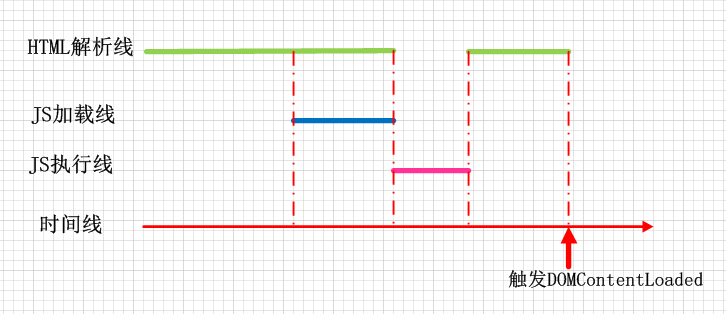
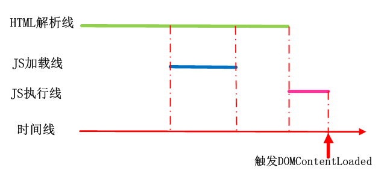
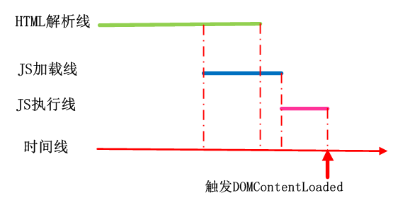

# HTML

# 基础篇

## Web 标准

Web 标准是制作网页要遵循的 **规范** ，由 W3C 和其他 标准化组织制定的 **一系列标准的集合**。

> W3C  
  > The World Wild Web Consortium  
> 对网络标准制定的一个非盈利组织

Web 标准包括三个方面：

- 结构标准（HTML）：用于对网页元素进行整理和分类。

- 表现标准（CSS）：用于设置网页元素的板式、颜色、大小等外观样式。

- 行为标准（JS）：用于定义网页的交互与行为。

依据 Web 标准，可以将 Web 前端分为三层：

- HTML（HyperText Markup Language）：超文本标记语言，从语义的角度描述页面结构。

- CSS（Cascading Style Sheets）：层叠样式表，从审美的角度美化页面的样式。

- JS：（Javascript）：从交互角度描述页面行为。

## HTML 概述

HTML 全称为 HyperText Markup Language 超文本标记语言。

HTML 属于一个描述性的标记语言，负责描述 **文档语义**。

HyperText 可以从两层来讲解：

- 图片、音频、视频、动画、多媒体等均可称为超文本，即 超出了文本的限制

- 从一个资源跳转到另一个资源，与世界各地主机的资源进行连接，即 超链接文本

Markup Language 也可以从两层来讲解：

- 标记语言是一套标记标签，浏览器解析 HTML 规格的标签，就可以显示给用户看了

- 编程语言是由编译这个步骤的，而标记语言没有编译过程，直接通过浏览器解析渲染

HTML 格式的文件是一个纯文本文件，用一些标签来描述语义，这些标签在浏览器上无法直观看到，可以将其看做 不同展示效果的占位符 ，最终通过浏览器的解析渲染出真实效果。

> 注意：HTML 负责表示 **文档语义** ，例如， `<h1>` 标签表示的应该是给文本增加主标题，而不是文字加粗、加黑、变大， 每个标签所带来的效果只是附加的东西， 对 HTML 文档的编写更加要关注的是 `语义` ，不同的标签有不同的 `语义` ， 良好的语义有利于 `SEO` 这个会在后续讲到。

## HTML 相关名词

- 网页：由各种标记组成的一个文档页面就叫做网页。

- 主页 / 首页：一个网站的 `index.html` ，也可以成为网站起始页码 / 导航页面。

- 标签： 诸如 `<p>` 我们成为 p 标签开始标签， `</p>` 成为 p 标签结束标签，每个标签有不同的 语义 。

- 元素：开始标签、结束标签与内容相结合，便是一个完整的元素。

- 内容：元素的内容，本例中就是所输入的文本本身。

- 属性：每一个标签上都可以通过属性携带标签的额外信息。

- XML：Extensible Markup Language，可扩展标记语言，用于 结构化、传输 和 存储 数据。

- XHTML：符合 XML 规范的 HTML。

- HTTP： HyperText Transmision Protocol 超文本传输协议，规定两台主机进程交互时数据的格式。

> XHTML：Extensible HyperText Markup Language ，可扩展超文本标记语言。  
> XHTML 的主要目的是为了取代 HTML ，也可以理解为 HTML Upgrade Version。  
> XHTML 有比 HTML 更严格、纯净的语法，与 HTML 4.0 基本相同。

## HTML 结构

一个最基本的 HTML 页面如下：

```html
<!DOCTYPE html>
<html>
  <head>
    <meta charset="utf-8" />
    <title>Title</title>
  </head>
  <body></body>
</html>
```

可以拆分为以下部分：

1. `<!DOCTYPE html>`—— 文档类型。

2. `<html></html>` —— `<html>` 元素。包含整个页面的内容，也称为根元素。

3. `<head></head>` —— `<head>` 元素。对用户不可见，规定文档相关配置信息（元数据）。

4. `<meta charset="utf-8">` —— 指定文档的字符编码。

5. `<title></title>` —— `<title>` 元素。定义文档的标题，标签页的名称。

6. `<body></body>` —— `<body>` 元素。文档的内容。

## HTML 规范

HTML 不区分大小写，但 HTML 标签名、类名、标签属性等一些属性值都建议采用 **小写** 。

HTML 页面的后缀名是 html 或 html （有一些系统不支持后缀名长度超过 3 个字符，比如 dos 系统）。

编写 XHTML 的规范：

- 所有标签都需要正确的嵌套，不能交叉嵌套。

- 所有标签名必须采用小写。

- 所有标签都必须闭合（HTML 中标签不闭合也不会报错）。

- 所有属性值必须加引号， `<font color="red"></font>`。

- 所有属性只要写了，必须有值，`<hr noshade="noshade">`。

- XHTML 文档开头必须要有 DTD 文档类型定义。

HTML 的语法特性：

- 对 换行、tab 不敏感。

  HTML 只在乎 标签 的嵌套结构。标签的嵌套结构和 换行 / tab 无关。  
  HTML 不依赖缩进来表示嵌套，而是依赖于标签的嵌套关系。缩进只为了增强代码的可读性。

- 多个 空格 / 换行 / tab 折叠为一个 空格 显示。

- 标签要严格封闭

> 补充： class 属性值的规范
>
> 1.  必须以字母 A-Z 或 a-z 开头
> 2.  类名中只能有 字母、数字、\_、\- ，可以通过 `/^[a-zA-Z]\w*$/` 来匹配
> 3.  区分大小写

## DOCTYPE 声明头标签

任何一个标准的 HTML 页面，第一行一定是一个以`<!DOCTYPE ……>`开头的语句。这一行，就是文档声明头，即 DocType Declaration，简称 DTD。

DTD 用于告诉浏览器应用以什么样的文档类型解析文档。

`<!doctype html>` 的作用就是让浏览器进入标准模式，使用最新的 `HTML5` 标准来解析渲染页面；如果不写，浏览器就会进入混杂模式，我们需要避免此类情况发生。

- 严格模式： 为标准模式，指浏览器按照 W3C 标准解析代码

- 混杂模式： 怪异模式、兼容模式，是指浏览器用自己的方式解析代码。混杂模式通常模拟老式浏览器的行为，以防止老站点无法工作

对于如下声明头：

```html
<!DOCTYPE html PUBLIC "-//W3C//DTD XHTML 1.0 Transitional//EN" "http://www.w3.org/TR/xhtml1/DTD/xhtml1-transitional.dtd">
```

这是一个 `HTML 4.01` 或 `XHTML 1.0` 的声明头，其中 `XHTML 1.0` 也可选为 `HTML 4.01` ， `Transitional` 字段可选为 `Strict` 、 `Transitional` 、`Frameset` 。

在 `HTML5` 中就没有 XHTML 了， HTML5 极大地简化了 DTD 。

## html 标签

html 标签是整个页面最大的标签，可以称为根元素，也可以称为文档。

html 标签支持 `lang` 属性，用于指定文档的语言，主要的值如 `en` 、 `zh-CN` 。

用法：`<html lang="en"></html>` 。

## head 标签

head 标签位于文档的头部，一般在 head 标签中我们必须要设置的是 '标签页' 的 `title` 。

## meta 标签

meta 表示 “元” ，`<meta>` 标签用于表示那些不能由其他 HTML 元相关元素（`<base>`、`<link>`、`<script>`、`<style>`、`<title>`）之一表示的任何 `元数据` 信息。`元数据` 就是描述数据的数据，例如一个 HTML 文件是一种数据，但 HTML 文件也能在 `head` 元素中包含描述该文档的 `元数据`，如文件的作者、概要。

### `meta` 元素定义的元数据类型包括以下几种：

- 设置了 `name` 属性，`meta` 元素提供的是文档级别的元数据，应用于整个页面。

- 设置了 `http-equiv` 属性，`meta` 元素则是编译指令，提供的信息与类似命名的 HTTP 头部相同。

- 设置了 `charset` 属性，`meta` 元素是一个字符集的声明，告诉文档使用哪种字符编码。

- 设置了 [`itemprop`](https://developer.mozilla.org/zh-CN/docs/Web/HTML/Global_attributes#attr-itemprop) 属性， `meta` 元素提供用户定义的元数据。

### meta 属性

- name

  name 和 content 属性可以一起使用，以名 - 值对的方式给文档提供元数据，其中 name 作为元数据的名称，content 作为元数据的值。

- content

  包含 http-equiv 或 name 属性的值，具体取决于 name / http-equiv 所使用的的值。

- http-equiv

  定义一个编译指示指令，http-equiv 所有运行的值都是特定 HTTP 头部的名称，如：

  - content-security-policy

    允许页面作者定义当前页的 [内容安全策略](https://developer.mozilla.org/en-US/docs/Web/HTTP/Headers/Content-Security-Policy) 。

  - content-type

    如果使用了这个属性，那么 content 指定的值必须是 `text/html; charset=utf-8`。这个属性只能用于 媒体类型([MIME](https://developer.mozilla.org/zh-CN/docs/Web/HTTP/Basics_of_HTTP/MIME_types)) 为 `text/html` 的文档，不适用于 XML。

  - x-ua-compatible

    指定该属性后， content 属性值必须具有值 "IE=edge"

  - refresh

    - 如果 content 只包含一个正整数，则为重新载入页面的时间间隔(s)；

    - 如果 content 包含一个正整数，并且后面跟着字符串 `;url=` 和一个合法的 URL ，则是重定向到指定链接的时间间隔(s)。

本部分引用于：[<meta>：文档级元数据元素](https://developer.mozilla.org/zh-CN/docs/Web/HTML/Element/meta)

### 常见的 meta 标签常场景

1. 字符集 charset

   ```html
   <meta http-equiv="Content-Type" content="text/html;charset=UTF-8" />
   ```

   指定文档的编码方式，也可以简写为：

   ```html
   <meta charset="UTF-8" />
   ```

   其他常用的字符集编码方式还有 GBK 和 GB2312 等。

2. 关键词 keywords

   定义一些关键词，就是告诉搜索引擎，这个网页是干嘛的，能够提高搜索命中率。

   ```html
   <meta name="Keywords" content="网易,邮箱,游戏,新闻,体育,娱乐,女性,亚运,论坛,短信" />
   ```

3. 页面描述 description

   只要设置 Description 页面描述，那么百度搜索结果，就能够显示这些语句，这个技术叫做 SEO（search engine optimization，搜索引擎优化）。

   ```html
   <meta name="Description" content="网易是中国领先的互联网技术公司，为用户提供免费邮箱、游戏、搜索引擎服务，开设新闻、娱乐、体育等30多个内容频道，及博客、视频、论坛等互动交流，网聚人的力量。" />
   ```

4. 视口 viewport

   ```html
   <meta name="viewport" content="width=device-width, initial-scale=1, maximum-scale=1,user-scalable=yes/no" />
   ```

   width=device-width 表示视口宽度等于屏幕宽度。适配移动端，控制视口大小和比例。

5. 自动跳转

   ```html
   <meta http-equiv="refresh" content="3;http://www.baidu.com" />
   ```

   3 秒后跳转到百度主页。

   基本格式：http-equiv="refresh" content="0;url="。

6. 文档 / 超链接的搜索引擎检索

   ```html
   <meta name="robots" content="index,follow" />
   ```

   - all，检索文件和查询页面链接
   - none，不检索文件和查询链接
   - index，检索文件
   - follow，查询链接
   - noindex，不检索文件
   - nofollow，不查询链接

## base 标签

用于指定基础的路径。指定之后，所有的 a 链接都是以这个路径为基准。

```html
<base href="/" />
```

## link 标签

link 是 外部资源链接元素，规定了当前文档与外部资源的关系。

最长用于链接 样式表 ，以及指定站点图标。

链接样式表：

```html
<link href="main.css" rel="stylesheet" />
```

指定 网站图标的链接 ：

如 PC 端的 “favicon” 图标和移动设备上用以显示在主屏幕的图标

```html
<link rel="icon" href="favicon.ico" />
```

### 属性：

- type

  定义链接的内容的类型，如 text/html、text/css 等 MIME 类型。

- rel

  rel 是 `<link>` 元素中的关键特性，表示 `<link>` 链接方式与包含它的文档之间的关系

  - preload ，表示用户十分有可能需要 **在当前浏览中** 加载目标资源，所以浏览器必须预先获取和缓存对应资源。

  - prefetch ，提示浏览器，用户 **未来的** 浏览有可能需要加载目标资源，所以浏览器有可能通过事先获取和缓存对应资源，优化用户体验。

- disabled

  仅针对于 rel="stylesheet" ，指示是否应加载所描述的样式表并应用于文档

  设为 true 时，页面加载期间不会加载样式表

- as

  仅在 `<link>` 元素设置了 `rel="preload"` 或者 `rel="prefetch"` 时才能使用。

  规定了 `<link>` 元素加载的内容的类型，对于内容的优先级、请求匹配、正确的内容安全策略的选择以及正确的 Accept 请求头的设置，这个属性是必需的。

- crossorigin

  指定在加载相关资源时是否必须使用 CORS

  - anonymous

    发起一个跨域请求 (包含 Origin Header 字段). 但不会发送任何认证信息

  - use-credentials

    发起一个带有认证信息 (cookie、X.509 证书、HTTP 基本认证信息) 的跨域请求

- importance

  指示资源的优先级

  - auto，表示没有偏好，浏览器可以使用自己的启发式方法来确定资源优先级

  - high，向浏览器指示资源具有高优先级

  - low， 向浏览器指示资源具有低优先级

## body 标签

文档的主体：包含文档的所有真实内容。

属性：

- bgcolor：设置整个网页的背景颜色

- background：设置整个网页的背景图片

- text：设置网页中的文本颜色(使用 CSS 的 color 属性替代)

- left|top|right|bottom margin：网页的边距，IE 浏览器默认是 8 个像素，使用 CSS 的 margin 属性替代。

- link：表示网页上的链接默认显示的颜色，对应 :link 伪类

- alink：表示鼠标点击链接但是还没有松开时的颜色，对应 :active 伪类

- vlink：表示点击完成之后链接显示的颜色，对应 :visited 伪类

## 排版 标签

在 HTML 我们只注重排版，而不注重元素自身带有的样式。

常见的排班标签有 h1 ~ h6、p、div、span、hr、br。

其他一些排版标签如 center 已经废弃，并且诸如 center、br、hr 这类标签的效果我们往往通过 css 实现。

### h(1-6) 标签

h1-6 的标签我们常用于指定内容中的标题。

h1-6 每一个标签都有不同的 seo 优先级，关于 seo 在后面进阶篇会详细讲到。

### p 标签

p 标签可以把 HTML 文档分为若干段落。在网络中如果要把文章有条理地显示出来，离不开段落标签。

p 标签是一个文本级标签，里面只能放文字、图片、表单元素。其他元素向 标题 h 就不能放入。

> <span id="container">补充：</span>  
> **文本级标签：** p、span、a、b、i、u、em。文本级标签里只能放文字、图片、表单元素。（a 标签里不能放 a | input）  
> **容器级标签：** div、h(1-6)、li、dt、dd。容器级标签里可以放置任何东西。

### hr 标签

hr 标签为水平分隔线可以在视觉上将文档分隔成各个部分。  
在网页中常常看到一些水平线将段落与段落之间隔开，使得文档结构清晰，层次分明。

### br 标签

换行标签，使某段文本强制换行显示。

### div & span 标签

- division（分割），常用于把标签中的内容分割为独立的区块，默认占据一行。

- span（范围、跨度），和 div 作用一致，但大小由内容撑开，且不换行

我们常用这两个标签配合 css 来布局，这两个标签不会对页面产生任何副作用(默认的布局|样式)。

div 在浏览器中默认不增加任何效果，但是语义变了， div 中所有元素都是一个小区域， div 是一个[容器级标签](#container)，里面可以放任何元素。

span 在浏览器中默认也不增加任何效果，但是是一个文本级标签

### pre 标签

预定义标签，在真正排网页过程中，`<pre>` 标签几乎不用。常用于标签内的内容需要保留标签内部所有的空白字符（空格、换行符），原封不动地输出结果（告诉浏览器不要忽略空格和空行）的场景。

## 字体 标签

`<font>`、 `<b>`、`<strong>`、`<s>`、`<i>`、`<em>`

`<del>`、 `<u>` 、`<sup>` 、`<sub>`、`<ins>`。

这些标签现在往往很少使用，因为我们通过 css 来改变字体样式，而不是通过静态的标签。

不过诸如 `<strong>`、`<del>`、`<em>` 这些标签有利于 SEO 。

## 功能 标签

像页面组件一样提供一些特殊功能的标签，如：

- 列表标签：ul、ol、dl
- 表格标签：table
- 框架标签：iframe
- 表单标签：form
- 多媒体标签
- 滚动字幕标签：marquee

### 列表 标签

#### 无序&有序 列表

无序列表 &lt;ul>，无序列表中的每一项是&lt;li>

- li 不能单独存在，必须包裹在 ul 里面；反过来说，ul 的“儿子”不能是别的东西，只能有 li。

- ul 的作用，并不是给文字增加小圆点的，而是增加无序列表的“语义”的。

有序列表 &lt;ol>，无序列表中的每一项是&lt;li>

有序列表与无序列表的区别是无序列表用项目符号标记一个项目，而有序列表将自动为项目编号。

#### 自定义列表

定义列表是<dl>标签，没有属性。dl 的子元素只能是 dt 和 dd。

在一个 dl 中，有若干条目 dt，而 dd 是描述 dt 的。

dt、dd 都是容器级标签，想放什么都可以。因此，用什么标签，不是根据样子来决定，而是语义（语义本质上是逻辑结构）。

### 表格 标签

表格标签用 `<table>` 表示，一个表格 `<table>` 由 `<thead>` 、 `<tbody>` 、`<tfoot>` 组成，也可以省略，直接每行由 `<tr>` 表示，并且每行由每个单元格 `<td>` 组成。

表格使用场景有限但，具有的属性非常多。

**table 的属性：**

- border：边框。像素为单位。
- width：宽度。像素为单位。
- height：高度。像素为单位。
- bordercolor：表格的边框颜色。
- align：表格的水平对齐方式。属性值可以填：left right center。 注意：这里不是设置表格里内容的对齐方式，如果想设置内容的对齐方式，要对单元格标签`<td>`进行设置。
- cellpadding：单元格内容到边的距离，像素为单位。默认情况下，文字是紧挨着左边那条线的，即默认情况下的值为 0。 注意不是单元格内容到四条边的距离哈，而是到一条边的距离，默认是与左边那条线的距离。如果设置属性 dir=”rtl”，那就指的是内容到右边那条线的距离。
- cellspacing：单元格和单元格之间的距离（外边距），像素为单位。默认情况下的值为 0。
- bgcolor=”#99cc66”：表格的背景颜色。
- background=”路径 src/…”：背景图片。 背景图片的优先级大于背景颜色。
- bordercolorlight：表格的上、左边框，以及单元格的右、下边框的颜色。
- bordercolordark：表格的右、下边框，以及单元格的上、左的边框的颜色 这两个属性的目的是为了设置 3D 的效果。
- dir：公有属性，单元格内容的排列方式(direction)。 可以 取值：ltr：从左到右（left to - right，默认），rtl：从右到左（right to left） 既然说 dir 是共有属性，如果把这个属性放在任意标签中，那表明这个标签的位置可能会从右开始排列。

**tr 的属性：**

- dir：公有属性，设置这一行单元格内容的排列方式。可以取值：
- ltr：从左到右（left to right，默认）
- rtl：从右到左（right to left）
- bgcolor：设置这一行的单元格的背景色。 注：没有 background 属性，即：无法设置这一行的背景图片，如果非要设置，可以用 css 实现。
- height：一行的高度。
- align=”center”：一行的内容水平居中显示，取值：left、center、right。
- valign=”center”：一行的内容垂直居中，取值：top、middle、bottom。

**td 的属性：**

- align：内容的横向对齐方式。属性值有：left、right、center。如果想让每个单元格的内容都居中，这个属性太麻烦，可以用 CSS 来解决。
- valign：内容的纵向对齐方式。属性值有：top、middle、bottom。
- width：绝对值或者相对值(%)。
- height：单元格的高度。
- bgcolor：设置这个单元格的背景色。
- background：设置这个单元格的背景图片。
- colspan：横向合并。例如 colspan=”2”表示当前单元格在水平方向上要占据两个单元格的位置。
- rowspan：纵向合并。例如 rowspan=”2”表示当前单元格在垂直方向上要占据两个单元格的位置。

此外还有`<th>`标签，即加粗的单元格，相当于`<td> + <b>`，属性同 `td` 标签。

capition 标签：表格的标题，作为 table 标签的第一个子标签出现。

表格的`<thead>`标签、`<tbody>`标签、`<tfoot>`标签可有可无，即表格头、表格体、表格脚。

这三部分的代码书写顺序不会影响显示顺序，可以打乱书写，但是显示时依然按照 `<thead>` 标签、 `<tbody>` 标签、 `<tfoot>` 标签的顺序来显示内容，并且三部分内容分批加载，如果没有使用这三个标签，则会等所有表格内容加载完了再一起显示。

### 表单类 标签

#### form 标签

form 表单标签用 `<form>` 表示，收集用户信息，用于与服务器的交互。

属性：

- name：表单的名称，必须是所有表单中独一无二的，而且不能是空字符串。

- autocomplete：是否允许 input 元素的自动填充，off | on。

- novalidate：表示提交表单时无需验证表单。可被 formnovalidate 属性覆盖。

- target：指定表单提交后，在哪里显示响应信息。可被 formtarget 属性覆盖

  - \_self：默认值。在相同浏览上下文中加载。

  - \_blank：在新的未命名的浏览上下文中加载。

  - \_parent：在当前上下文的父级浏览上下文中加载，如果没有父级，则与 \_self 表现一致。

  - \_top：在最顶级的浏览上下文中（即当前上下文的一个没有父级的祖先浏览上下文），如果没有父级，则与 \_self 表现一致。

- method：表单数据的提交方式，一般取值：get（默认）、 post 或 dialog。取值为 dialog 时如果表单在 `<dialog>` 中，提交时关闭对话框。可被 formmethod 属性覆盖。

- action：指定表单数据的处理程序，一般是 PHP，如：action=”login.php”。可被 formaction 属性覆盖。

- enctype：表单数据的编码方式(加密方式)，取值可以是：application/x-www-form-urlencoded、multipart/form-data。该属性只能在 POST 方式下使用，GET 方式只能为 url 编码。可被 formenctype 属性覆盖。

#### input 标签

输入标签（文本框），作为 form 的子标签使用，用于接收用户输入

属性：

- type，input 类型

  - text：文本
  - password：密码，输入后变 `·`
  - radio：单选按钮，通过 name 互斥
  - checkbox：多选按钮，name 相同为一组
  - hidden：隐藏框，不希望用户看见信息
  - button：普通按钮
  - submit：提交按钮，触发所在表单 submit 事件
  - reset：重置按钮，清空表单内容
  - image：图片按钮，与 submit 功能一致，可以用图片来替代 "提交"
  - file：文件选择框，配合不同的事件对文件检查

- checked：将单选按钮或多选按钮默认处于选中状态。当 input 标签设置为 type=”radio” 或者 type="checkbox" 时，可以用这个属性。属性值也是 checked，可以省略。

- readonly：文本框只读，不能编辑。因为它的属性值也是 readonly，所以属性值可以不写。 用了这个属性之后，在 google 浏览器中，光标点不进去；在 IE 浏览器中，光标可以点进去，但是文字不能编辑。

- disabled：文本框只读，不能编辑，光标点不进去。属性值可以不写。

#### select 标签

下拉列表标签

select 标签里面的每一项用 option 表示。select 标签和 ul、ol、dl 一样，都是组标签。

select 属性：

- multiple：对下拉列表中的选项进行多选。属性值为 multiple，也可以没有属性值。也就是说，既可以写成 multiple=””，也可以写成 multiple=”multiple”。

- size=”3”：如果属性值大于 1，则列表为滚动视图。默认属性值为 1，即下拉视图。

option 属性：

- selected：预选中。没有属性值。

#### textarea 标签

多行文本输入框

属性：

- rows：指定文本区域行数
- cols：指定文本区域列数
- readonly：只读

该输入框内的默认值不是通过 value 属性指定的，它是一对标签，它的默认显示的文本是标签内的文本

```html
<textarea name="txtInfo" rows="4" cols="20">多行文本框</textarea>
```

> 注意：标签内的文本不像其他的 HTML 代码一样会忽略/合并空白符，标签内文本包含的空白符（包括换行）都会原封不动作为文本框的内容。

#### fieldset 标签

用于表单语义化，将部分表单内容整合进一个域中，同时用 legend 标签标记域的标题

```html
<form>
  <fieldset>
    <legend>账号信息</legend>
    姓名：<input value="Seauning" /><br />
    密码：<input type="password" value="pwd" /><br />
  </fieldset>
  <fieldset>
    <legend>其他信息</legend>
    性别：<input type="radio" name="gender" value="male" checked="" />男 <input type="radio" name="gender" value="female" />女<br />
    爱好：<input type="checkbox" name="love" value="eat" />吃饭 <input type="checkbox" name="love" value="sleep" />睡觉 <input type="checkbox" name="love" value="bat" />打豆豆
  </fieldset>
</form>
```

#### label 标签

作为选框的说明文字

可以通过 label 的 for 属性配合 id 属性，实现点击 label 内容聚焦 表单元素 。

```html
<input type="radio" name="sex" id="male" /> <label for="male">男</label> <br />
<input type="radio" name="sex" id="female" /> <label for="female">女</label>
```

### 框架 标签

因为 `frameset、frame` 已经被废弃，感兴趣的可以查阅 mdn。

#### iframe 标签

内嵌框架 `<iframe>` 能够将另一个 HTML 页面嵌入到当前页面中。

**属性：**

- src，被嵌套的页面的 URL 地址。使用 about:blank 值可以嵌入一个遵从同源策略的空白页。

- name，用于定位嵌入的 iframe 的名称，可以用作 a 标签与 form 标签的 target，也可以用作 input 标签和 button 标签的 formtarget 属性值，还可以用作 window.open() 方法的 windowName 参数值。

- allow

  通过 allow 属性指定 iframe 的特征策略，可以启用、禁用和修改确切的特征和 API ，比如内容安全策略，但它控制的是浏览器的特征非安全行为。

  - fullscreen，可以通过调用 `<iframe>` 的 `requestFullscreen()` 方法激活全屏模式。

  - payment，跨域的 `<iframe>` 就可以调用 [Payment Request API](https://developer.mozilla.org/zh-CN/docs/Web/API/Payment_Request_API)

- csp，对嵌入的资源配置内容安全策略。

- importance，设定 src 属性指定的资源的加载优先级

  - auto，不指定优先级

  - high，资源加载的优先级较高

  - low，资源加载的优先级较低

- referrerpolicy，指定获取 iframe 资源时如何发送 referrer 首部

  - no-referrer：不发送 referrer

  - no-referrer-when-downgrade：向不受 TLS 保护的 origin 发送请求时，不携带 referrer

  - origin：referrer 首部中仅包含来源页面的源(scheme、host、port)

  - origin-when-cross-origin: 发起跨域请求时，仅在 referrer 中包含来源页面的源

  - same-origin: 对于 same origin（同源）请求，发送 referrer 首部，否则不发送

  - strict-origin: 仅当被请求页面和来源页面具有 **相同的协议安全等级时** 才发送 referrer 首部

  - strict-origin-when-cross-origin: 当发起同源请求时，在 referrer 首部中包含完整的 URL

  - unsafe-url: 始终在 referrer 首部中包含源以及路径（但不包括 fragment，密码，或用户名）。这个值是不安全的, 因为这样做会暴露受 TLS 保护的资源的源和路径信息。

**优点：**

1. iframe 能够原封不动的把嵌入的网页展现出来
2. 多个网页引用同一 iframe，只需要修改一个 iframe 的内容
3. 网页为了统一风格，头部版本都是一样的，就可以写成一个页面，用 iframe 嵌套，可以增加代码的可重用;

**弊端：**

1. iframe 会阻塞主页面 onload 事件
2. 产生很多页面，不容易管理
3. 无法被一些搜索引擎索识别，不利于 SEO

**iframe 通讯：**

- 同域
- 跨域
  - 父向子
    ```javascript
    // 父
    iframe.contentWindow.postMessage("msg", "孩子");
    // 子
    window.addEventListener("message", function (e) {
      if (e.data === "msg") {
        console.log(e);
      }
    });
    ```
  - 子向父
    ```javascript
    // 子
    window.parent.postMessage("msg", "父亲");
    // 父
    window.addEventListener("message", function (e) {
      if (e.data === "msg") {
        console.log(e);
      }
    });
    ```

注意：

1. 父向子，需要用 iframe 的 contentWindow 作主体；
2. 子向父，需要用 window 的 window.parent；
3. 多层 iframe 使用 window.frameElement,获取顶层窗口可以用 window.top；
4. 要确保在 iframe 加载完成，如 iframe 还未加载完成就开始调用里面的方法或变量，会报错。可以用 onload 事件或者用 document.readyState=="complete"来判断是否加载完成

---

> [特征策略](https://developer.mozilla.org/zh-CN/docs/Web/HTTP/Feature_Policy)：
>
> - 改变手机和第三方视频自动播放的默认行为
> - 限制网站使用敏感的 api ，如摄像头或麦克风
> - 允许 iframe 使用全屏 API
> - 确保图像的大小正确，对于视口来说不会太大

### 多媒体 标签

如 bgsound、embed、object ，但大多数使用比较少，常用的多媒体标签如 video、audio 在 HTML5 中讲。

## 其他 标签

### 超链接 标签

1. 外部链接

链接到另一个路径，点击超链接文本跳转到指定路径。

```html
<a href="02页面.html">点击进入另外一个文件</a>

<a href="http://www.baidu.com" target="_blank">百度</a>
```

2. 锚链接

为页面元素指定 name 属性，使用锚链接可以跳转到页面的指定位置。

```html
<a href="#top">回到顶部</a>
```

3. 邮件链接

点击之后，会弹出 outlook，实际较少使用邮件链接。

```html
<a href="mailto:xxx@163.com">点击进入我的邮箱</a>
```

属性：

- href：目标 URL
- title：悬停文本。
- name：主要用于设置一个锚点的名称。
- target：告诉浏览器用什么方式来打开目标页面。

  - \_self：在同一个网页中显示（默认值）。
  - \_blank：在新的窗口中打开。
  - \_parent：在父窗口中显示
  - \_top：在顶级窗口中显示

### 图片 标签

```html

```

- width：图像的宽度。

- height：图像的高度。

- alt：当图片不可用（无法显示）的时候，代替图片显示的内容。alt 是英语 alternate “替代”的意思，代表替换资源。

- title：提示性文本。鼠标悬停时出现的文本。

- srcet：根据屏幕密度设置不同的图片

- align：图片和文字混排时的对齐方式。属性取值可以是：bottom（默认）、center、top、left、right。

  - align="：图片和文字底端对齐。
  - align="center"：图片和文字水平方向上居中对齐。
  - align="top"：图片与文字顶端对齐。
  - align="left"：图片在文字的左边。
  - align="right"：图片在文字的右边。

## 转义字符

- &nbsp;：空格 （non-breaking spacing，不断打空格）。
- &lt;：小于号<。
- &gt;：大于号>。
- &amp;：符号&。
- &quot;：双引号。
- &apos;：单引号。
- &copy;：版权 ©。
- &trade;：商标 ™。
- &yen;：人民币￥。
- &deg;：度 °。
- &plusmn;：正负号 ±。
- &times;：乘号 ×。
- &divide;：除号 ÷。
- &sup;：上标 x，x 可以为 1、2、3。
- &#32464;：Unicode 字符，#32464 是汉字“绐”的 Unicode 编码。

## 补充：废弃标签

HTML 现在只负责语义，而不负责样式。但是 HTML 一开始，连样式也包办了。因此被废弃的标签，都是这些的样式标签。比如 font 标签、水平线标签 `<hr />` 、换行标签 `<br />` 。

网页中 99.9999%需要换行的时候，是因为另起了一个段落，所以要用 p，而不要用 `<br />` 。不到万不得已，不要用 br 标签。

标准的 div+css 页面，只会用到种类很少的标签，如：div、p、h1、span、a、img、ul、ol、dl、input。关于样式的一切都交给 CSS 来控制。

# 进阶篇

## HTML5 有哪些更新

1. [语义化标签](#language)

2. 媒体标签

   - video

     - autoplay，自动播放
     - controls，控制条
     - loop，循环播放
     - src，路径
     - preload：预先加载视频(有 autoplay 忽略此属性)
     - poster：加载等待时画面(默认是第一帧)
     - muted：静音播放
     - width
     - height

   - audio

     - autoplay
     - controls
     - loop
     - src
     - 兼容写法：
       ```html
       <audio controls="controls">
         <source src="happy.mp3" type="audio/mpeg" />
         <source src="happy.ogg" type="audio/ogg" />
         您的浏览器暂不支持 <audio>标签。</audio>
       </audio>
       ```

3. 表单类型

   - email：邮箱
   - number：数字
   - tel：手机号
   - url：url 格式
   - search：搜索框
   - range：滑动条
   - color：拾色器
   - time：时间
   - date：日期
   - datatime：时间日期
   - week：星期
   - month：月份

   部分类型只针对移动设备生效，有一定兼容性问题。

4. 表单属性

   - autocomplete="on/off"，自动填充
   - autofocus，自动获取焦点
   - placeholder，提示文字
   - required，必填项
   - pattern， 自定义正则校验
   - multiple， 选择多个文件
   - form， 指定所属 form 表单 ID
   - novalidate，关闭验证功能（覆盖 form 上的 novalidate）

5. 表单事件

   input、invalid(验证不通过触发)

6. 表单元素

   - datalist 数据列表

     ```html
     <input type="text" list="myData" />
     <datalist id="myData">
       <option>本科</option>
       <option>研究生</option>
       <option>不明</option>
     </datalist>
     ```

     将输入框 input 的 list 属性与数据列表的 id 绑定，给输入框加入下拉菜单提供一些提示值。

   - meter 度量器

     ```html
     <meter value="81" min="0" max="100" low="60" high="80" />
     ```

     value 是当前值，min 是最小值也就是左端点，max 是最大值也就是右端点， low 表示低于这个值将会警告， high 表示高于这个值将会警告。

     可以作为进度条表示表单的填写进度。

7. DOM 查询操作

   - document.querySelector
   - document.querySeletorAll

8. web 存储

   - localStorage，没有时间限制的数据存储
   - sessionStorage，针对一个 session 的数据存储

9. draggable 元素拖放、canvas 画布、SVG 可伸缩矢量图、Geolocation 地理位置、全屏

总结：
（1）新增语义化标签：nav、header、footer、aside、section、article
（2）音频、视频标签：audio、video
（3）数据存储：localStorage、sessionStorage
（4）canvas（画布）、Geolocation（地理定位）、websocket（通信协议）
（5）input 标签新增属性：placeholder、autocomplete、autofocus、required
（6）history API：go、forward、back、pushstate
（7）单标签不需要写关闭符号

## drag API

HTML5 中可以通过 draggable 实现元素的拖动，它的取值有 true(可拖动) 和 false(不可拖动) ，它的值是默认值 auto ，表示使用浏览器定义的默认行为。

draggable 属性值枚举类型而非布尔类型，必须显示地指定值为 true 或 false 。如果我们想尝试使用如 autocomplete 省略值的写法是行不通的，如 `<label draggable></label>` 这是不合法的。

draggable 在图像和超链接默认是 true ，所以图像和链接只有在**禁用拖拽**时会用到 draggable。

关于 draggable API 的使用，最好手动实现一个小案例来属性相关的 API 。

### 一些 drap 事件的描述：

| event     | description                                        |
| --------- | -------------------------------------------------- |
| drag      | 当拖拽元素或选中文本时触发                         |
| dragstart | 开始拖拽一个元素或选中的文本时触发                 |
| dragenter | 拖拽元素或选中的文本被拖到一个 `可释放目标` 时触发 |
| dragover  | 拖拽元素选中的文本被拖到一个 `可释放目标` 时触发   |
| dragleave | 拖拽元素或选中的文本离开可释放目标时触发           |
| dragend   | 拖拽操作结束时触发（松开鼠标 or 敲击 `ESC`）       |
| drop      | 元素或选中的文本在 `可释放目标` 上被释放时触发     |

注意：从操作系统向浏览器中拖拽文件时，不会触发 `dragstart` 和 `dragend` 事件。

### [用法](https://developer.mozilla.org/zh-CN/docs/Web/API/HTML_Drag_and_Drop_API/Drag_operations)

HTML 中，除了图像、超链接以及选中的文本默认可以拖拽，其他的元素默认均不可拖拽。

想让一个不可拖拽的元素可拖拽，必须满足以下三个条件：

1. 元素添加 draggable 属性，且值必须为 true
2. 给元素 dragstart 事件添加监听器
3. 在 dragstart 的事件监听器中定义拖拽数据

注意：当我们让一个元素变得可拖拽后，元素中的文本及子元素不能直接选中，需要按住 `alt` 才能选中。

这是一个简单的 [example](./test/drag.html)

## Geolocation API

- navigator.geolocation.getCurrentPosition(success, error, options)

  获取当前地理信息

  - success ，获取位置信息成功的回调，传入一个 position 对象。position 具体的属性如下

    - coords(坐标)

      - latitude ，所在位置经度

      - longitude ，所在位置的纬度

      - altitude ，所在位置的海拔

      - accuracy ，longitude & latitude 的准确度

      - altitudeAccuracy ，altitude 的准确度

      - heading ，设备正在前进的方向

      - speed ，设备正在前进的速度

    - timestamp，获取到的位置时的时间戳

  - error ，获取位置信息出错的回调，传入一个 positionError 对象。positionError 具体属性如下

    - code

      - 1 PERMISSION_DENIED ，无权限获取信息

      - 2 POSITION_UNAVAILABLE ，内部位置源错误

      - 3 TIMEOUT ，超时（通过定义 PositionOptions.timeout 来设置获取地理位置的超时时长）

    - message ，错误的详细信息

  - options

    - timeout ，设置获取地理位置能花费的最长时间，默认 Infinity

    - maximumAge ，可以返回多长时间（即最长年龄，单位毫秒）内的可获取的缓存位置，默认 0 。0 说明设备不能使用一个缓存位置，而且必须去获取一个真实的当前位置。Infinity 不管设置的最长年龄是多少，设备都必须返回一个缓存位置。

    - enableHighAccuracy ，应用是否使用其最高精度来表示结果。true 可以提供一个更精确的位置，会导致响应较慢。 false 更快的响应、更少的资源消耗，精度相对较差。

- navigator.watchPosition(successCallback, errorCallback, options)

  监听当前地理信息变化，在设备的地理位置发生改变的时候自动被调用，会返回一个 ID 可以通过 ID 来取消监听。(参数和 getCurrentPosition 相同)

## fullscreen API

允许任一元素全屏显示。

- element.requestFullscreen(options) 发出异步请求使元素进入全屏模式

  返回一个 Promise ，如果是 resolved 的 Promise 收到一个 fullscreenchange 事件

  如果是 rejected 的 promise 收到一个 fullscreenerror 事件

  - options

    - navigationUI ， 控制是否在元素处于全屏模式时显示导航条 UI ，默认值 auto ，表示由浏览器决定

- element.exitFullscreen() 让当前文档退出全屏模式，通过弹出全屏元素栈的方式让文档回退到上一个调用 element.exitFullscreen 方法进入全屏模式之前的状态

- document.fullscreenEnabled 表示是否允许全屏模式

- DocumentOrShadowRoot.fullscreenElement 当前在 DOM | shadow DOM 里被展示为全屏模式的 Element，如果这个值为 null，文档不处于全屏模式。

## web 存储

- sessionStorage 会话存储

  - 保存在内存中
  - 生命周期为关闭当前标签页
  - 同一个标签页内共享

- localStorage 本地存储

  - 有可能保存在浏览器内存也有可能在硬盘中
  - 生命周期为永久，除非手动删除
  - 多标签页共享

特性：

1. 遵循同源策略，源：协议、域名、端口
2. 容量较大，sessionStorage 约 5M 、localStorage 约 20 M 取决于浏览器
3. 只能存储字符串，需要配合 JSON.stringify / JSON.parse

## HTML 语义化

- 增强代码可读性

- 让搜索引擎更容易读懂，有助于爬虫抓取更多有效的信息，爬虫依赖于标签来确定上下文和各个关键字的权重

- 在没有 CSS 样式下，页面也能呈现出很好地内容结构

## <span id="language">语义化标签</span>

- header ，页眉
- nav ，导航
- main ，主体
- aside ，侧边栏
- article ，文章
- section ，区块
- footer ，页脚
- figuer ，媒介内容分组
- mark ，标记（不常用）
- progress ，进度（不常用）
- time ，日期

## SEO

## src 与 href 区别

- href 是 Hypertext Reference 的缩写，表示超文本引用。用来建立当前文档和引用资源之间的联系；文档中添加 href，浏览器会识别该文档为 CSS 文件，就会并行下载资源并且不会停止对当前文档的处理。这也是建议使用 link 方式加载 CSS，不是使用 @import 方式的原因。

- 当浏览器解析到 src ，会暂停其他资源的下载和处理，直到将该资源加载、编译、执行完毕，将其指向的资源下载并应用到文档中。

## defer 和 async 区别

[load/domContentLoaded 事件、异步/延迟 Js 与 DOM 解析](https://www.cnblogs.com/Bonnie3449/p/8419609.html)

- 普通的 script 标签，在每次解析 HTML 时一解析到 script 会阻塞 HTML 的解析，只有在加载并执行完脚本后才会继续解析 HTML

- async 和 defer 都是异步加载，不会阻塞浏览器解析 HTML

- async 在加载完后，如果 HTML 还没有解析完会暂停解析 HTML，立即执行脚本，直到执行完脚本再解析 html,解析完 html 再触发 DOMContentLoaded 事件

  

- 如果 HTML 解析完了之后，async 脚本才加载完，然后执行脚本，那么在 HTML 解析完毕、async 脚本还没加载完的时候就会触发 DOMContentLoaded 事件。

  

- defer 脚本在加载完后会等到 HTML 解析完毕再执行，并且在 defer 脚本执行完毕后触发 DOMContentLoad 事件；

  

- 即使 html 在 defer 脚本加载完毕前已经解析完毕，DOMContentLoaded 事件也会等待 defer 脚本加载并执行完才触发

  

- 多个 defer 脚本会按照他们在页面出现的顺序加载执行，而多个 async 脚本不能保证执行顺序

## 行内元素、块元素、行内块元素

- 行内元素：a b span select strong label

- 块级元素：div ul ol li dl dt dd h1 h2 h3 h4 h5 h6 p

- 空元素：没有内容的 HTML 元素，单标签

  br hr img input link meta

# 总览

## 标签与属性

### 基础

- &lt;!DOCTYPE>：定义文档类型。

- &lt;html>：定义 HTML 文档。

  - manifest
  - xmlns

- &lt;head>：定义关于文档的信息。

  - profile

- &lt;title>：定义文档的标题。

  - dir
    - rtl
    - ltr
  - lang

- &lt;body>：定义文档的主体。

- &lt;h1> to &lt;h6>：定义 HTML 标题。

- &lt;p>：定义段落。

- align：不建议使用，建议使用 CSS。

- &lt;br>：定义简单的折行。

- &lt;hr>：定义水平线。

  - 有一些定义样式的属性，但都不建议使用，建议使用 CSS 样式。

- &lt;!–…–>：定义注释。

### 元信息

- &lt;head>：定义关于文档的信息。

  - profile：一个由空格分隔的 URL 列表，配置文件 URL。

- &lt;meta>：定义关于 HTML 文档的元信息。

  - content：（必需）定义与 http-equiv 或 name 属性相关的元信息。

  - http-equiv：把 content 属性关联到 HTTP 头部。

    - content-type
    - expires
    - refresh
    - set-cookie

  - name：把 content 属性关联到一个名称。

    - author
    - description
    - keywords
    - generator
    - revised
    - others

  - scheme：定义用于翻译 content 属性值的格式。

- &lt;base>：定义页面中所有链接的默认地址或默认目标。

  - href：（必需）规定页面中所有相对链接的基准 URL。
  - target：在何处打开页面中所有的链接。
    - \_blank
    - \_parent
    - \_self
    - \_top
    - framename

### 格式化

- &lt;abbr>：定义缩写。

  - title：在鼠标指针移动到元素上时显示出简称/缩写的完整版本。

- &lt;address>：定义文档作者或拥有者的联系信息。

- &lt;b>：定义粗体文本。

- &lt;bdi>：定义文本的文本方向，使其脱离其周围文本的方向设置。

  - dir

    - auto
    - ltr
    - rtl

- &lt;bdo>：定义文字方向。

  - dir

    - rtl
    - ltr

- &lt;blockquote>：定义长的引用。

  - cite：引用来源 URL

- &lt;cite>：（语义）定义引用(citation)。

- &lt;code>：（语义）定义计算机代码文本。

- &lt;del>：定义被删除文本。与 &lt;ins> 标签配合使用，来描述文档中的更新和修正。

  - cite：解释删除原因的 URL。

  - datetime：YYYYMMDD，文本被删除的日期和时间。

- &lt;dfn>：（语义）定义定义项目。

- &lt;em>：（语义）定义强调文本。

- &lt;i>：（样式，建议用 CSS 替代）定义斜体文本。

- &lt;ins>：定义被插入文本。

  - cite：解释插入原因的 URL。

  - datetime：YYYYMMDD，文本被插入的日期和时间。

- &lt;kbd>：（语义）定义键盘文本。

- &lt;mark>：定义有记号的文本。

- &lt;meter>：定义预定义范围内的度量。

  - form：规定元素所属的表单的 id。
  - high：规定被视作高的值的范围。
  - low：规定被视作低的值的范围。
  - max：规定范围的最大值。
  - min：规定范围的最小值。
  - optimum：规定最佳值。
  - value：必需。规定度量的当前值。

- &lt;pre>：定义预格式文本。保留空格和换行符，文本呈现为等宽字体。常用来表示计算机的源代码。

  - width：每行最大字符数。

- &lt;progress>：定义任何类型的任务的进度（进度条）。

  - max：任务一共需要多少工作。
  - value：已经完成多少任务。

- &lt;q>：定义短的引用。

  - cite：出处、来源。

- &lt;ruby>：定义注音文字。

- &lt;rb>：定义要被注音的文本。

- &lt;rt>：定义文本的注音。

- &lt;rp>：定义若浏览器不支持 ruby 元素时显示的内容。

- &lt;s>：（样式，不推荐）定义加删除线的文本，建议用 CSS 替代它的样式或用 del 标签替代它的语义。

- &lt;samp>：（语义）定义计算机代码样本。

- &lt;small>：（样式，建议用 CSS 替代）定义小号文本。

- &lt;strong>：（语义）定义语气更为强烈的强调文本。

- &lt;sup>：定义上标文本。

- &lt;sub>：定义下标文本。

- &lt;template>：定义用作容纳页面加载时隐藏内容的容器，其中的内容可以稍后使用 JavaScript 呈现。

- &lt;time>：定义日期/时间。

  - datetime：规定日期 / 时间，如”2008-02-14”，否则由元素的内容给定日期 / 时间。
  - pubdate：指示 &lt;time> 元素中的日期 / 时间是文档（或 &lt;article> 元素）的发布日期。

- &lt;u>：定义下划线文本。

- &lt;var>：（语义）定义文本的变量部分。

- &lt;wbr>：定义可能的换行符，规定在文本中的何处适合添加换行符，适用于太长的英文断行。

### 表单

- &lt;form>：定义供用户输入的 HTML 表单。

  - accept-charset：规定服务器可处理的表单数据字符集，如 UTF-8。

  - action：规定当提交表单时向何处发送表单数据（URL）。

  - autocomplete：规定是否启用表单的自动完成功能。

    - on
    - off

  - enctype：规定在发送表单数据之前如何对其进行编码。

  - application/x-www-form-urlencoded：在发送前编码所有字符（默认）

  - multipart/form-data：不对字符编码。在使用包含文件上传控件的表单时，必须使用该值。

  - text/plain：空格转换为 “+” 加号，但不对特殊字符编码。

  - method：规定用于发送 form-data 的 HTTP 方法。

    - get
    - post

  - name：规定表单的名称。

  - novalidate：如果使用该属性，则提交表单时不进行验证。

  - rel：规定链接资源和当前文档之间的关系。

    - external
    - help
    - license
    - next
    - nofollow
    - noopener
    - noreferrer
    - opener
    - prev
    - search

  - target：规定在何处打开 action URL。

    - \_blank
    - \_self
    - \_parent
    - \_top
    - framename

- &lt;input>：定义输入控件。

  - accept mime_type：规定通过文件上传来提交的文件的类型。

  - align：不赞成使用。规定图像输入的对齐方式。

    - left
    - right
    - top
    - middle
    - bottom

  - alt：定义图像输入的替代文本。

  - autocomplete：规定是否使用输入字段的自动完成功能。

    - on
    - off

  - autofocus：规定输入字段在页面加载时是否获得焦点。（不适用于 type=”hidden”）

  - checked：规定此 input 元素首次加载时应当被选中。

  - disabled：当 input 元素加载时禁用此元素。

  - form：规定输入字段所属的一个或多个表单的 id。

  - formaction：URL，覆盖表单的 action 属性。（适用于 type=”submit” 和 type=”image”）

  - formenctype：覆盖表单的 enctype 属性。（适用于 type=”submit” 和 type=”image”）

  - formmethod：覆盖表单的 method 属性。（适用于 type=”submit” 和 type=”image”）

    - get
    - post

  - formnovalidate：覆盖表单的 novalidate 属性。如果使用该属性，则提交表单时不进行验证。

  - formtarget：覆盖表单的 target 属性。（适用于 type=”submit” 和 type=”image”）

    - \_blank
    - \_self
    - \_parent
    - \_top
    - framename

  - height：定义 input 字段的高度。（适用于 type=”image”）（像素或百分比）

  - list：引用包含输入字段的预定义选项的 datalist （的 id）。

  - max：规定输入字段的最大值。与 “min” 属性配合使用，来创建合法值的范围。

  - maxlength：规定输入字段中的字符的最大长度。

  - min：规定输入字段的最小值。与 “max” 属性配合使用，来创建合法值的范围。

  - multiple：如果使用该属性，则允许一个以上的值。

  - name：定义 input 元素的名称。

  - pattern：规定输入字段的值的模式或格式。（正则表达式）

  - placeholder：规定帮助用户填写输入字段的提示。

  - readonly：规定输入字段为只读。

  - required：指示输入字段的值是必需的。

  - size：定义输入字段的宽度。

  - src：定义以提交按钮形式显示的图像的 URL。

  - step：规定输入字的的合法数字间隔。

  - type：规定 input 元素的类型。

    - button
    - checkbox
    - color
    - date
    - datetime
    - datetime-local
    - email
    - file
    - hidden
    - image
    - month
    - number
    - password
    - radio
    - range
    - reset
    - search
    - submit
    - tel
    - text
    - time
    - url
    - week

  - value：规定 input 元素的值。

  - width：定义 input 字段的宽度。（适用于 type=”image”）（像素或百分比）

- &lt;textarea>：定义多行的文本输入控件。

  - autofocus：规定在页面加载后文本区域自动获得焦点。

  - cols：规定文本区内的可见宽度。

  - disabled：规定禁用该文本区。

  - form：规定文本区域所属的一个或多个表单 id。

  - maxlength：规定文本区域的最大字符数。

  - name：规定文本区的名称。

  - placeholder：规定描述文本区域预期值的简短提示。

  - readonly：规定文本区为只读。

  - required：规定文本区域是必填的。

  - rows：规定文本区内的可见行数。

  - wrap：规定当在表单中提交时，文本区域中的文本如何换行。

    - hard
    - soft

- &lt;button>：定义按钮。

  - autofocus：规定当页面加载时按钮应当自动地获得焦点。

  - disabled：规定应该禁用该按钮。

  - form：规定按钮属于一个或多个表单 id。

  - formaction：覆盖 form 元素的 action 属性。与 type=”submit” 配合使用。

  - formenctype：覆盖 form 元素的 enctype 属性。与 type=”submit” 配合使用。

  - formmethod：覆盖 form 元素的 method 属性。与 type=”submit” 配合使用。

    - get
    - post

  - formnovalidate：覆盖 form 元素的 novalidate 属性。与 type=”submit” 配合使用。

  - formtarget：覆盖 form 元素的 target 属性。与 type=”submit” 配合使用。

    - \_blank
    - \_self
    - \_parent
    - \_top
    - framename

  - name：规定按钮的名称。

  - type：规定按钮的类型。

    - button
    - reset
    - submit

  - value：规定按钮的初始值。可由脚本进行修改。

- &lt;select>：定义选择列表（下拉列表）。

  - autofocus：规定在页面加载后文本区域自动获得焦点。
  - disabled：规定禁用该下拉列表。
  - form：规定文本区域所属的一个或多个表单 id。
  - multiple：规定可选择多个选项。
  - name：规定下拉列表的名称。
  - required：规定文本区域是必填的。
  - size：规定下拉列表中可见选项的数目。

- &lt;optgroup>：定义 select 选择列表中相关选项的组合（选项分组）。

  - label：（必需）为选项组规定描述。
  - disabled：规定禁用该选项组。

- &lt;option>：定义选择列表中的选项。

  - disabled：规定此选项应在首次加载时被禁用。
  - label：定义当使用 &lt;optgroup> 时所使用的标注。
  - selected：规定选项（在首次显示在列表中时）表现为选中状态。
  - value：定义送往服务器的选项值。

- &lt;label>：定义 input 元素的标注。

  - for：规定 label 绑定到哪个表单元素。
  - form：规定 label 字段所属的一个或多个表单 id。

- &lt;fieldset>：定义围绕表单中元素的边框。也就是给表单内容分组。

  - disabled：规定应该禁用 fieldset。
  - form：规定 fieldset 所属的一个或多个表单 id。
  - name：规定 fieldset 的名称。

- &lt;legend>：定义 fieldset 元素的标题。

- &lt;datalist>：定义下拉列表（input 可能的值的集合）。

- &lt;output>：定义输出的一些类型。

  - for：定义输出域相关的一个或多个元素 id。
  - form：定义输入字段所属的一个或多个表单 id。
  - name：定义对象的唯一名称。（表单提交时使用）

### 框架

- &lt;iframe>：定义内联框架。

  - align：对齐方式。应当使用样式代替。

  - frameborder：规定是否显示框架周围的边框。

    - 1：有边框（默认）。
    - 0：无边框。

  - height：规定 iframe 的高度。支持像素和百分比。

  - marginheight：定义 iframe 的顶部和底部的边距。

  - marginwidth：定义 iframe 的左侧和右侧的边距。

  - name： iframe 的名称。

  - sandbox：启用一系列对 &lt;iframe> 中内容的额外限制。

    - “”：应用以下所有限制。
    - allow-forms：允许表单提交。
    - allow-same-origin：允许 iframe 内容被视为与包含文档有相同的来源。
    - allow-scripts：允许脚本执行。
    - allow-top-navigation：允许 iframe 内容从包含文档导航（加载）内容。

  - scrolling：规定是否在 iframe 中显示滚动条。

    - yes
    - no
    - auto

  - seamless：规定 &lt;iframe> 看上去像是包含文档的一部分。

  - src：规定在 iframe 中显示的文档的 URL。

  - srcdoc：规定在 &lt;iframe> 中显示的页面的 HTML 内容。

  - width：定义 iframe 的宽度。支持像素和百分比。

### 图像

- &lt;img>：定义图像。

  - alt：（必需）规定图像的替代文本。
  - src：（必需）规定显示图像的 URL。
  - align：不推荐使用。规定如何根据周围的文本来排列图像。
  - border pixels：不推荐使用。定义图像周围的边框。
  - height：定义图像的高度。支持像素和百分比。
  - hspace：不推荐使用。定义图像左侧和右侧的空白。
  - ismap：URL，将图像定义为服务器端图像映射。只有当 &lt;img> 元素属于带有有效 href 属性的 &lt;a> 元素的后代时，才允许 ismap 属性。
  - usemap：将图像定义为客户器端图像映射，值为 map 元素的锚点。
  - vspace pixels：不推荐使用。定义图像顶部和底部的空白。
  - width：设置图像的宽度。支持像素和百分比。

- &lt;map>：定义带有可点击区域的图像映射。

  - id：（必需）为 map 标签定义唯一的名称。
  - name：为 image-map 规定的名称。

- &lt;area>：定义图像地图内部的区域。

  - alt：（必需）定义此区域的替换文本。
  - coords：定义可点击区域（对鼠标敏感的区域）的坐标。
  - href：定义此区域的目标 URL。
  - nohref：从图像映射排除某个区域。
  - shape：定义区域的形状。
  - default
  - rect
  - circ
  - poly
  - target：规定在何处打开 href 属性指定的目标 URL。
  - \_blank
  - \_parent
  - \_self
  - \_top

- &lt;canvas>：定义图形。&lt;canvas> 标签只是图形容器，您必须使用脚本来绘制图形。

  - height：设置 canvas 的高度。
  - width：设置 canvas 的宽度。

- &lt;figure>：规定独立的流内容（图像、图表、照片、代码等等）。

- &lt;figcaption>：定义 figure 元素的标题。

- &lt;svg>：定义 SVG 图形的容器。

### 音视频

- &lt;audio>：定义声音内容。

  - autoplay：如果出现该属性，则音频在就绪后马上播放。
  - controls：如果出现该属性，则向用户显示控件，比如播放按钮。
  - loop：如果出现该属性，则每当音频结束时重新开始播放。
  - muted：规定视频输出应该被静音。
  - preload：如果出现该属性，则音频在页面加载时进行加载，并预备播放。如果使用 “autoplay”，则- 忽略该属性。
  - src：要播放的音频的 URL。

- &lt;source>：定义媒介源。为媒介元素（比如 &lt;video> 和 &lt;audio>）定义媒介资源。

  - media：规定媒体资源的类型。
  - src：规定媒体文件的 URL。
  - type：规定媒体资源的 MIME 类型。

- &lt;track>：定义用在媒体播放器中的文本轨道。为诸如 video 元素之类的媒介规定外部文本轨道。

  - default：规定该轨道是默认的，假如没有选择任何轨道。
  - kind：表示轨道属于什么文本类型。
  - captions
  - chapters
  - descriptions
  - metadata
  - subtitles
  - label：轨道的标签或标题。
  - src：轨道的 URL。
  - srclang：轨道的语言，若 kind 属性值是 “subtitles”，则该属性必需的。

- &lt;video>：定义视频。

  - autoplay：如果出现该属性，则视频在就绪后马上播放。
  - controls：如果出现该属性，则向用户显示控件，比如播放按钮。
  - height：设置视频播放器的高度。
  - loop：如果出现该属性，则当媒介文件完成播放后再次开始播放。
  - muted：规定视频的音频输出应该被静音。
  - poster：URL，规定视频下载时显示的图像，或者在用户点击播放按钮前显示的图像。
  - preload：如果出现该属性，则视频在页面加载时进行加载，并预备播放。如果使用 “autoplay”，则- 忽略该属性。
  - src：要播放的视频的 URL。
  - width：设置视频播放器的宽度。

### 链接

- &lt;a>：定义超链接。

  - href：规定链接指向的页面的 URL。如果不使用 href 属性，则不可以使用 download, hreflang, - media, rel, target 以及 type 属性。
  - download：规定被下载的超链接目标。
  - hreflang：规定被链接文档的语言。
  - media：规定被链接文档是为何种媒介/设备优化的。
  - rel：规定当前文档与被链接文档之间的关系。
  - target：规定在何处打开链接文档。
  - \_blank
  - \_parent
  - \_self
  - \_top
  - framename
  - type：规定被链接文档的的 MIME 类型。

- &lt;link>：定义文档与外部资源的关系。常用于链接样式表。

  - href：被链接文档的 URL。
  - hreflang：规定被链接文档中文本的语言。
  - media：规定被链接文档将被显示在什么设备上。
  - rel：规定当前文档与被链接文档之间的关系。
  - alternate
  - author
  - help
  - icon
  - licence
  - next
  - pingback
  - prefetch
  - prev
  - search
  - sidebar
  - stylesheet
  - tag
  - sizes：规定被链接资源的尺寸。仅适用于 rel=”icon”。
  - heightxwidth
  - any
  - type MIME_type 规定被链接文档的 MIME 类型。

- &lt;nav>：定义导航链接。

### 列表

- &lt;ul>：定义无序列表。

- &lt;ol>：定义有序列表。

  - compact：使列表呈现的效果比正常情况更小巧。HTML5 中不支持。HTML 4.01 中不赞成使用。

  - reversed：规定列表顺序为降序。(9,8,7…)

  - start：规定有序列表的起始值。

  - type：规定在列表中使用的标记类型。（不赞成使用，应当用 CSS）

    - 1：数字。
    - A：大写英文字母。
    - a：小写英文字母。
    - I：大写罗马数字。
    - i：小写罗马数字。

- &lt;li>：定义列表的项目。

- &lt;dl>：定义定义列表。

- &lt;dt>：定义定义列表中的项目。

- &lt;dd>：定义定义列表中项目的描述。

### 表格

- &lt;table>：定义表格

- &lt;caption>：定义表格标题。

- &lt;th>：定义表格中的表头单元格。

  - colspan：设置单元格可横跨的列数。

  - headers：由空格分隔的表头单元格 ID 列表，为数据单元格提供表头信息。

  - height：规定表格单元格的高度。支持像素值及百分比。不推荐使用。

  - nowrap：规定单元格中的内容是否折行。不推荐使用。

  - rowspan：规定单元格可横跨的行数。

  - scope：定义将表头数据与单元数据相关联的方法。

    - col
    - colgroup
    - row
    - rowgroup

- &lt;tr>：定义表格中的行。

- &lt;td>：定义表格中的单元。

  - colspan：规定单元格可横跨的列数。

  - headers：规定与单元格相关的表头 id。

  - nowrap：规定单元格中的内容是否折行。不赞成使用。

  - rowspan：规定单元格可横跨的行数。

- &lt;thead>：定义表格中的表头内容。

- &lt;tbody>：定义表格中的主体内容。

- &lt;tfoot>：定义表格中的表注内容。

- &lt;col>：定义表格中一个或多个列的属性值。为每个列规定不同的属性值。为 &lt;col> 标签添加 - class 属性就可以使用 CSS 来负责对齐方式、宽度和颜色等等。

  - span：规定 col 元素应该横跨的列数。

- &lt;colgroup>：定义表格中供格式化的列组。&lt;colgroup>标签是对表格中的列进行组合，从而实现对表- 格的格式化。&lt;col>标签一般会放在&lt;colgroup>标签中使用，对&lt;colgroup>标签组合的列分别设置样- 式。&lt;colgroup>标签也可以有样式属性，是对组合的列设置相同的样式，&lt;colgroup>标签设置的样式- 会被&lt;col>标签设置的样式覆盖。

  - span：规定列组应该横跨的列数。

### 样式和语义

- &lt;style>：定义文档的样式信息。位于文档 head 部分中。

  - type：（必需）规定样式表的 MIME 类型。值只能是”text/css”。

  - media：为样式表规定不同的媒介类型。

    - screen
    - tty
    - tv
    - projection
    - handheld
    - print
    - braille
    - aural
    - all

- &lt;div>：定义文档中的节。

- &lt;span>：定义文档中的节。

- &lt;header>：定义 section 或 page 的页眉。

- &lt;footer>：定义 section 或 page 的页脚。

- &lt;main>：定义文档的主要内容。在一个文档中，不能出现一个以上的 &lt;main> 元素。&lt;main> 元素不- 能是以下元素的后代：&lt;article>、&lt;aside>、&lt;footer>、&lt;header> 或 &lt;nav>。

- &lt;section>：定义 section。

  - cite：section 的 URL，假如 section 摘自 web 的话。

- &lt;article>：定义文章。

- &lt;aside>：定义页面内容之外的内容。

- &lt;details>：定义元素的细节。

  - open：定义 details 是否可见。

- &lt;summary>：为 &lt;details> 元素定义可见的标题。”summary” 元素应该是 “details” 元素的第一- 个子元素。

- &lt;dialog>：定义对话框或窗口。

  - open：规定 dialog 元素是活动的，用户可与之交互。

- &lt;data>：添加给定内容的机器可读翻译。

  - value：规定元素内容的机器可读翻译。

### 编程

- &lt;script>：定义客户端脚本。

  - type：（必需）指示脚本的 MIME 类型。
  - async：规定异步执行脚本（仅适用于外部脚本）。
  - charset：规定在外部脚本文件中使用的字符编码。
  - defer：规定是否对脚本执行进行延迟，直到页面加载为止。
  - language：不赞成使用。规定脚本语言。请使用 type 属性代替它。
  - src：规定外部脚本文件的 URL。

- &lt;noscript>：定义针对不支持客户端脚本的用户的替代内容。

- &lt;embed>：为外部应用程序（非 HTML）定义容器。

  - height：设置嵌入内容的高度（像素）。
  - src：嵌入内容的 URL。
  - type：定义嵌入内容的类型。
  - width：设置嵌入内容的宽度（像素）。

- &lt;object>：定义嵌入的对象。

- &lt;param>：定义对象的参数。

  - name：（必需）定义参数的名称（用在脚本中）。
  - type：规定参数的 MIME 类型（internet media type）。
  - value：规定参数的值。
  - valuetype：规定值的 MIME 类型。
  - data
  - ref
  - object

## 全局属性

- accesskey：规定激活元素的快捷键。

- class：规定元素的一个或多个类名（引用样式表中的类）。

- contenteditable：规定元素内容是否可编辑。

  - true：规定元素可编辑。
  - false：规定元素不可编辑。

- contextmenu：规定元素的上下文菜单。上下文菜单在用户点击元素时显示。大多浏览器都不支持。

- data-\*：用于存储页面或应用程序的私有定制数据。

  - somevalue：规定属性的值（以字符串）。

- dir：规定元素中内容的文本方向。

  - ltr：默认。从左向右的文本方向。
  - rtl：从右向左的文本方向。

- draggable：规定元素是否可拖动。

  - true：规定元素的可拖动的。
  - false：规定元素不可拖动。
  - auto：使用浏览器的默认行为。

- hidden：浏览器不显示已规定 hidden 属性的元素。

- id：规定元素的唯一 id。

- lang：规定元素内容的语言。

- spellcheck：规定是否对元素进行拼写和语法检查。

  - true：对元素进行拼写和语法检查
  - false：不检查元素。

- style：规定元素的行内 CSS 样式。

- tabindex：规定元素的 tab 键次序（1 是第一个）。

- title：规定有关元素的额外信息。

## 事件

### window 事件

针对 window 对象触发的事件（应用到 &lt;body> 标签）：

- onafterprint：文档打印之后运行的脚本。
- onbeforeprint：文档打印之前运行的脚本。
- onbeforeunload：文档卸载之前运行的脚本。
- onerror：在错误发生时运行的脚本。
- onhaschange：当文档已改变时运行的脚本。
- onload：页面结束加载之后触发。
- onmessage：在消息被触发时运行的脚本。
- onoffline：当文档离线时运行的脚本。
- ononline：当文档上线时运行的脚本。
- onpagehide：当窗口隐藏时运行的脚本。
- onpageshow：当窗口成为可见时运行的脚本。
- onpopstate：当窗口历史记录改变时运行的脚本。
- onredo：当文档执行撤销（redo）时运行的脚本。
- onresize：当浏览器窗口被调整大小时触发。
- onstorage：在 Web Storage 区域更新后运行的脚本。
- onundo：在文档执行 undo 时运行的脚本。
- onunload：一旦页面已下载时触发（或者浏览器窗口已被关闭）。

### form 事件

由 HTML 表单内的动作触发的事件（应用到几乎所有 HTML 元素，但最常用在 form 元素中）：

- onblur：元素失去焦点时运行的脚本。
- onchange：在元素值被改变时运行的脚本。
- oncontextmenu：当上下文菜单被触发时运行的脚本。
- onfocus：当元素获得焦点时运行的脚本。
- onformchange：在表单改变时运行的脚本。
- onforminput：当表单获得用户输入时运行的脚本。
- oninput：当元素获得用户输入时运行的脚本。
- oninvalid：当元素无效时运行的脚本。
- onreset：当表单中的重置按钮被点击时触发。HTML5 中不支持。
- onselect：在元素中文本被选中后触发。
- onsubmit：在提交表单时触发。

### 键盘事件

用户按下键盘时触发：

- onkeydown：在用户按下按键时触发。
- onkeypress：在用户敲击按钮时触发。
- onkeyup：当用户释放按键时触发。

### 鼠标事件

由鼠标或类似用户动作触发的事件：

- onclick：元素上发生鼠标点击时触发。
- ondblclick：元素上发生鼠标双击时触发。
- ondrag：元素被拖动时运行的脚本。
- ondragend：在拖动操作末端运行的脚本。
- ondragenter：当元素元素已被拖动到有效拖放区域时运行的脚本。
- ondragleave：当元素离开有效拖放目标时运行的脚本。
- ondragover：当元素在有效拖放目标上正在被拖动时运行的脚本。
- ondragstart：在拖动操作开端运行的脚本。
- ondrop：当被拖元素正在被拖放时运行的脚本。
- onmousedown：当元素上按下鼠标按钮时触发。
- onmousemove：当鼠标指针移动到元素上时触发。
- onmouseout：当鼠标指针移出元素时触发。
- onmouseover：当鼠标指针移动到元素上时触发。
- onmouseup：当在元素上释放鼠标按钮时触发。
- onmousewheel：当鼠标滚轮正在被滚动时运行的脚本。
- onscroll：当元素滚动条被滚动时运行的脚本。

### 媒体事件

由媒体（比如视频、图像和音频）触发的事件（适用于所有 HTML 元素，但常见于媒介元素中，比如 &lt;audio>、&lt;embed>、&lt;img>、&lt;object> 以及 &lt;video>）:

- onabort：在退出时运行的脚本。
- oncanplay：当文件就绪可以开始播放时运行的脚本（缓冲已足够开始时）。
- oncanplaythrough：当媒介能够无需因缓冲而停止即可播放至结尾时运行的脚本。
- ondurationchange：当媒介长度改变时运行的脚本。
- onemptied：当发生故障并且文件突然不可用时运行的脚本（比如连接意外断开时）。
- onended：当媒介已到达结尾时运行的脚本（可发送类似“感谢观看”之类的消息）。
- onerror：当在文件加载期间发生错误时运行的脚本。
- onloadeddata：当媒介数据已加载时运行的脚本。
- onloadedmetadata：当元数据（比如分辨率和时长）被加载时运行的脚本。
- onloadstart：在文件开始加载且未实际加载任何数据前运行的脚本。
- onpause：当媒介被用户或程序暂停时运行的脚本。
- onplay：当媒介已就绪可以开始播放时运行的脚本。
- onplaying：当媒介已开始播放时运行的脚本。
- onprogress：当浏览器正在获取媒介数据时运行的脚本。
- onratechange：每当回放速率改变时运行的脚本（比如当用户切换到慢动作或快进模式）。
- onreadystatechange：每当就绪状态改变时运行的脚本（就绪状态监测媒介数据的状态）。
- onseeked：当 seeking 属性设置为 false（指示定位已结束）时运行的脚本。
- onseeking：当 seeking 属性设置为 true（指示定位是活动的）时运行的脚本。
- onstalled：在浏览器不论何种原因未能取回媒介数据时运行的脚本。
- onsuspend：在媒介数据完全加载之前不论何种原因终止取回媒介数据时运行的脚本。
- ontimeupdate：当播放位置改变时（比如当用户快进到媒介中一个不同的位置时）运行的脚本。
- onvolumechange：每当音量改变时（包括将音量设置为静音）时运行的脚本。
- onwaiting：当媒介已停止播放但打算继续播放时（比如当媒介暂停已缓冲更多数据）运行脚本。
