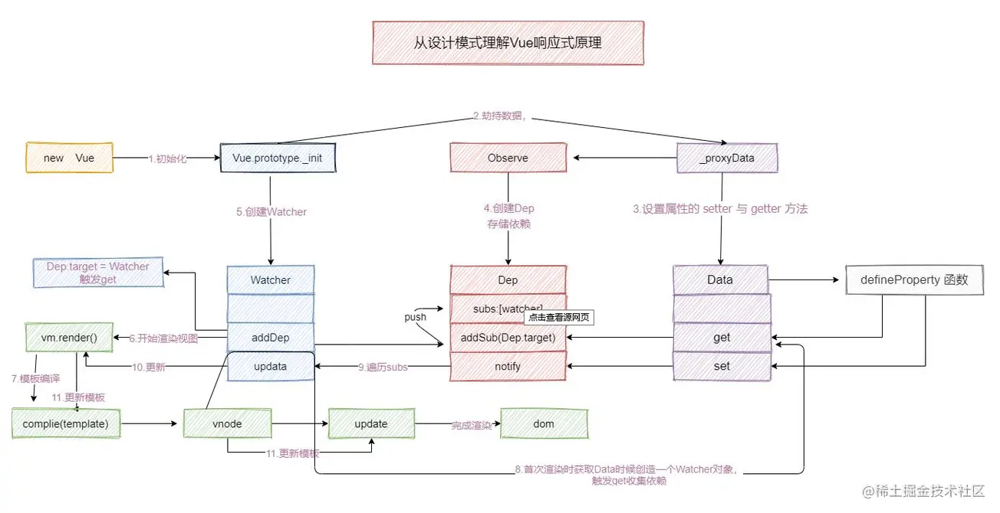
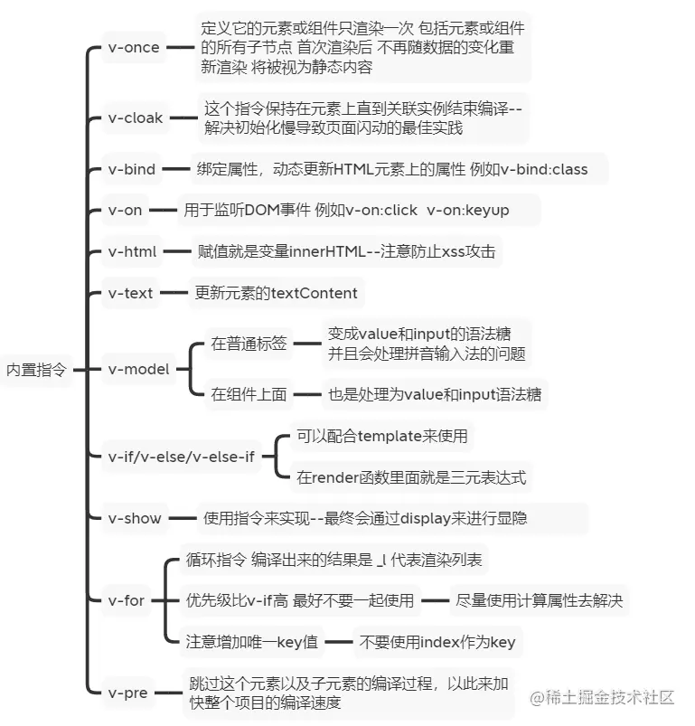
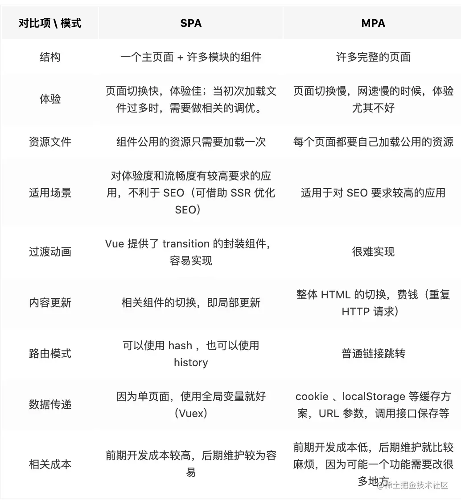

## 除了特别注明，全篇均为!!!!

# Vue2

## 1 MVVM、MVC、MVP !!!

#### MVC

MVC 全名是 Model View Controller，分别表示模型、视图、控制器。

- 模型是应用程序中用于处理应用程序应用程序数据逻辑的部分。通常模型对象负责在数据库中存取数据。

- 视图是应用程序中处理数据显示的部分，通常 MVC 的视图是依据模型数据创建的。

- 控制器是应用程序中处理业务的部分，通常控制器负责从视图中读取数据控制用户输入向模型发送数据。

#### MVVM !!!!

MVVM 是 Model、View、ViewModel 的缩写，ViewModel 层就像一个中转站，负责转换 Model 层中的数据并交付给视图层显示，View 层实际上展示的不是 Model 层的数据而是 ViewModel 层处理后的数据，由 ViewModel 层负责与 Model 层交互，实现 View 层与 Model 层的解耦。MVVM 与 MVC 最大的区别就是它实现了视图和模型的自动同步，也就是当模型的属性改变时，不用再自己手动操作 DOM 元素，不用再自己手动操作 DOM 元素，来改变视图的显示，而是改变属性后该属性对应视图层会自动改变，也就是常说的数据驱动视图。

MVVM 简化了业务与界面的依赖，也解决了数据频繁更新的问题，在 MVVM 中，视图不需要知道 Model 的存在，这种低耦合模式提高了代码的可重用性。

实际上 Vue 并没有完全遵循 MVVM 的思想，因为严格意义上 MVVM 要求视图和模型不能直接通信，而 Vue 提供了 ref ，让模型可以直接操作视图，所以 Vue 并没有完全遵循 MVVM。

#### MVP

MVP 模式用 Presenter 来实现对 View 层和 Model 层的解耦，MVP 模式中，View 层的接口暴露给 Presenter 因此可以在 Presenter 中将 Model 的变换和 View 的变换绑定在一起，以此实现 View 和 Model 同步更新，通过这样实现了对 View 和 Model 解耦。

MVC 的核心思想就是控制器负责将模型的数据用视图显示出来，换句话说就是在控制器里面把模型的数据赋值给视图。MVC 模式中使用观察者模式，实现 Model 层数据发生改变就通知 View 层更新。这样数据和视图就耦合在一起，当项目变得复杂时可能会造成代码混乱，影响代码的复用性。

## 2 实例(vm)初始化流程 !!!!

### initLifecycle

初始化组件实例上的一些层级属性

如果组件添加了 parent 选项，vue 会递归找到这个父实例的根实例，并设置组件实例的父实例为根实例，并设置组件的根实例为父实例的根实例。初始化实例的 children 、 refs 、等属性。

### initEvents

初始化事件对象，如果选项上存在父级的附加事件，就更新根实例的组件

### initRender

在这里完成了虚拟 dom 的初始化

### 前三阶段称为组件实例的生命周期和事件的初始化，在初始化完渲染函数后，就会调用 beforeCreate 钩子

### initInjections

在初始化注入时，会拿到选项上的 inject ，并且生成一个结果集对象，结果集是该 inject 及其相应的父节点 provide 的键值对。inject 选项中的每一个数据 key 都是由其上游父级组件提供的，所以 vue 会把每一个数据 key 从当前组件起，不断的向上游父级组件中查找该数据 key 对应的值，直到找到为止。如果在上游所有父级组件中没找到，那么就看在 inject 选项是否为该数据 key 设置了默认值，如果设置了就使用默认值，如果没有设置，则抛出异常。

并且遍历结果集上的每一个属性，调用 defineReactive 将每一个键值对定义到当前实例上。在把 result 中键值 defineReactive 到实例上时会先调用 toggleObserving(false) ，这个函数内部把 shouldObserve = false 这是为了告诉 defineReactive 函数仅仅把键值添加到当前实例上，而无需将其转换成响应式。

之所以要在 initState 之前先初始化注入，是因为 inject 选项接收到注入的值有可能被，initState 中的数据使用到，所以要在初始化完注入后初始化数据和属性。

### initState

在这里开始选项上 props、methods、data、computed、watch 的初始化。并且在初始化的阶段就解决属性名相同的问题，所有的方法名、数据名、计算属性名、侦听器名都是不允许与 prop 属性相同的。

vue 会校验每个字段的合法性如果是 props 和 data 会将其定义为响应式的数据，并且会在 vue 实例上代理所有数据，这样便可以通过 this.属性名 直接获取到数据，不用去实例的私有属性上查找。

在初始化 methods 里面的方法时，vue 会将所有由 vue 管理的方法也就是 methods 定义的方法的 this 指向绑定为当前实例。

初始化 data 的时候会校验 data 属性是否是一个函数，如果是就会调用它拿到返回的 data 对象，如果不是便会直接用 data ，如果是在开发环境下会对 data 的数据类型进行一个校验，如果 data 不是对象类型便会报错。vue 在将 data 代理到 vue 实例上时，会对定义的 data 属性进行判断，判断其是否为一个私有的不想暴露在 vue 实例上的属性，也就是以\_开头的属性，如果是就不会将其代理到 vue 实例上。接下来就是 vue 对数据的响应式定义，vue 通过调用 observe 触发响应式数据的递归定义，并且为 data 对象及 data 上的每一个属性创建一个 Observer 观察者，这个递归创建的过程实质上是在 new Observer 也就是创建观察者的过程中，创建的过程会判断 data 对象上的每一个属性类型，如果是对象类型就会拿到这个对象上的所有键并且通过 defineReactive 定义响应式数据，如果是数组类型会遍历的数组上的每一个元素对它 observe 因为数组类型的每一个值也可能是一个对象类型或数组类型，响应式数据的定义实际上是通过 defineReactive 这个 vue 封装的方法进行定义的，在这个方法中，会尝试性的去拿每一个属性上的 getter 和 setter 方法，并且如果属性值是一个对象，又会通过调用 observe 为这个对象创建一个观察者，这就是 vue 递归 data 中每一个属性及每一个属性的属性为其创建响应式数据的地方，响应式数据的定义其实是通过 Object.defineProperty 这个 API 去定义的，vue 会为每一个属性创建 getter 和 setter，并包装 getter 和 setter 方法，在每次访问数据时，会收集数据上的依赖，而在每次更新数据值时，会未新的值创建新的观察者，并且通知这个数据的所有申请者更新。

vue 初始化计算属性会对计算属性的格式进行处理，简写形式属性值就是 getter ，对象形式会拿到对象上的 getter，并且为每个计算属性创建一个惰性的 Watcher 侦听器，最后将其定义到 vue 实例上，如果 vue 实例上存有同名的 props 和 data 定义的过程会失败，并且开发环境下会报错。定义计算属性的过程会对计算属性的每一种写法进行完善，例如简写形式下并没有 setter ，这时候 vue 就会为这个属性的 setter 创建一个空函数，最后通过 Object.defineProperty 将这个计算属性结合处理后的描述对象定义到 vue 实例上。

初始化 Watch 侦听器会对不同写法的 watch 进行监听，由于一个 watch 可能会有多个 handler，所以每个侦听器实例都会维护一个该侦听器的回调队列，在 new Watcher 中如果侦听器侦听的属性的表达式不是一个 getter，会解析侦听器的表达式获得获取表达式路径的 getter 。

在 vue 中如果数据发生修改会通知每个依赖的申请者进行更新，而这个申请者就是 Watcher 。可以把 Watcher 当做观察者，它需要观察数据的变动数据变动时，在每次数据修改时 Watcher 会触发自己申请的依赖去通知更新，将数据更新通知到每一个依赖的申请者，并更新视图上的相关数据。



### initProvide

因为在初始化注入的时候就进行了处理，所有在初始化 provide 时只需要将选项上的 provide 调用并复制到实例的属性上 \_provided

### 在注入完数据后，调用 create 钩子，标记着实例的初始化创建结束

### create 后便开始 mount 在 $mount 中进行实例的挂载

### mountComponent

## 3 options

el 是 vue 为根实例对象创绑定视图上的挂载点，在初始化配置项时可以暂时不在配置项中添加挂载点，通过 $mount 这个 api 手动挂载。传入的的参数可以是 dom 元素的选择器，也可以是一个 dom 元素的引用。

在使用组件复用时， data 只能采用函数形式，如果 data 采用对象形式那么引入该组件的其他组件获得的是同一个 data 对象，这就有可能因为引用关系造成数据污染，实际上其他组件引入该组件时获取的会是同一个引用对象的原因是因为 import 引入组件时只是一个只读的引用，所以每当被引用的组件中原始属性的值更改时，import 拿到的这个只读引用的值也会更改。所以组件复用时 data 只能采用函数形式，在 vue 底层会调用这个函数形式的 data 并拿到它返回的对象，每次调用返回的都是一个对象初始值的拷贝。

## 4 vue 双向数据绑定

利用 Object.defineProperty 实现数据的拦截，在属性发生变化后通知订阅者。解析器 Compiler 解析模板中的 directive 指令，收集指令所依赖的方法和数据，等待数据变化然后进行渲染。Watcher 属于 Observer 和 Compiler 之间的桥梁，他会收到来自 Observer 产生的数据变化，并去通知视图进行更新。

当一个 Vue 实例创建时，Vue 会遍历 data 中的属性，用 Object.defineProperty (vue3.0 使用 proxy) 将它们转为 getter/setter，并且在内部追踪相关依赖，每一项数据就是一个依赖，在属性被访问和修改时通知依赖发生变化。每个组件实例都有相应的 watcher 实例，它会在组件渲染的过程中把属性记录为依赖，之后当依赖项的 setter 被调用时，会通知 watcher 重新计算，从而致使它关联的组件得以更新。


Vue.js 是采用数据劫持结合发布者-订阅者模式的方式，通过 Object.defineProperty 来劫持各个属性的 setter，getter，在数据变动时发布消息给订阅者，触发相应的监听回调。主要分为以下几个步骤：

需要 observe 数据对象进行递归遍历，包括子属性对象的属性，都加上 setter 和 getter 这样的话，给这个对象的某个值赋值，就会触发 setter，那么就能监听到了数据变化
compile 解析模板指令，将模板中的变量替换成数据，然后初始化渲染页面视图，并将每个指令对应的节点绑定更新函数，添加监听数据的订阅者，一旦数据有变动，收到通知，更新视图

Watcher 订阅者是 Observer 和 Compile 之间通信的桥梁，主要做的事情是:

1. 在自身实例化时往属性订阅器(dep)里面添加自己
2. 自身必须有一个 update 方法
3. 待属性变动 dep.notice() 通知时，能调用自身的 update()方法，并触发 Compile 中绑定的回调。

MVVM 作为数据绑定的入口，整合 Observer、Compile 和 Watcher 三者，通过 Observer 来监听自己的 model 数据变化，通过 Compile 来解析编译模板指令，最终利用 Watcher 搭起 Observer 和 Compile 之间的通信桥梁。数据变化 -> 视图更新；视图交互变化(input) -> 数据 model 变更的双向绑定效果。

## 5 v-model

v-model 在内部为不同的输入元素使用不同的 property 并抛出不同的事件：

- text 和 textarea 元素使用 value property 和 input 事件；
- checkbox 和 radio 使用 checked property 和 change 事件；
- select 字段将 value 作为 prop 并将 change 作为事件。

v-model 双向数据绑定只能用在表单类元素上，如 form、input、select ，因为往往只有表单类元素需要有数据的交互传递。v-model 默认收集的为 value 属性的值，若收集的是复选框并且没有配置 value 属性，那么默认收集的就是 checked 属性，如果 v-model 绑定的复选框的 value 属性初始值是数组类型，那么收集的就是由 value 组成的数组。

vue 会为每一个 dom 元素创建一个 watch 侦听器，通过侦听器侦听页面变化，当 dom 元素的变化会影响到依赖数据的变化时，就会通过这个依赖项去通知所有的申请者让他们同步更新。

v-model 可以用在表单元素上作为双向数据绑定，也能用在组件上进行父子组件通信，这个方法其实是一个父子通信的语法糖本质上还是通过 prop 向子组件通信，和在父组件绑定事件名为 input，并自定义接收数据的事件接收子组件信息，在子组件通过 $emit 配合 $event.target.value 传参。

```vue
// 父
<template>
  <!-- 应用在 input 标签上时 -->
  <input v-model="searchText" />
  <!-- 与上面等价 -->
  <input :value="searchText" @input="searchText = $event.target.value" />
  <!-- 应用在子组件上时 -->
  <custom-input v-model="searchText"></custom-input>
  <!-- 与上面等价 -->
  <custom-input v-bind:value="searchText" @input="searchText = $event"></custom-input>
</template>
// 子
<script>
Vue.component("custom-input", {
  props: ["value"],
  template: `
    <input
      v-bind:value="value"
      @input="$emit('input', $event.target.value)"
    >
  `
});
</script>
```

## 6 Computed 、 Watch 、 Methods

### Computed

- 初始解析模板读取计算属性值时执行一次、依赖数据发生变化时执行
- 支持缓存，只有在依赖的数据发生变化，才会重新计算
- 不支持异步，无法监听异步事件变化而返回值
- 当需要进行数值计算,并且依赖于其它数据时，应该使用 computed，因为可以利用 computed 的缓存特性，避免每次获取值时都要重新计算。

### watch

- 初次解析模板时调用，被侦听的属性变化时回调函数自动调用
- 不支持缓存，数据变化时，就会触发 handler
- 支持异步监听
- 监听函数接收两个参数，最新值和旧值
- 当监听的一个属性发生变化时，就需要执行相应操作
- 监听数据必须是 data 中声明的或者父组件传递过来的 props 中的数据
  - watch 可以采用对象形式有两个属性 immediate 表明组件加载时立即触发回调函数
  - deep 深度监听复杂数据类型的所有内部属性，例如数组中的对象发生变化。deep 无法监听到数组和对象内部的变化
- 当需要在数据变化时执行异步或开销较大的操作时，应该使用 watch，使用 watch 选项允许执行异步操作 ( 访问一个 API )，限制执行该操作的频率，并在得到最终结果前，设置中间状态。
- computed 能做的事情 watch 都能实现，不过 watch 没有缓存

可以通过 $watch 这个 api 为实例添加侦听器。

### Methods

可以将同一函数定义为一个 method 或者一个计算属性。对于最终的结果，两种方式是相同的。
method 调用总会执行该函数。

### 关于 computed 和 watch 的详解

虽然计算属性和侦听属性都创建了侦听器 Watcher ，但这两者求值和传值的方式并不相同。

当计算属性的依赖数据发生变化时，它的依赖数据会触发侦听器的 update 函数通知计算属性的侦听器依赖数据发生变动，它并没有立即调用 get 重新收集依赖求值，而只是标记这个侦听数据已经发生了更改将自身的 dirty 属性改为 true。它只有在访问计算属性的值时会判断当前数据是否已经修改也就是 dirty 属性是否为 true，如果是就通过 evaluate 函数调用 get 重新收集依赖求值，并在求值完后将最新的值放到计算属性的 value 属性上并作为最新的值返回。

evaluate 函数是针对于计算属性使用的函数。可以看的出计算属性采用了一种惰性求值的方法，只有在真正需要访问到数据时，才会重新收集依赖并更新。

而当侦听属性的依赖数据发生变化时，它的依赖数据也会触发侦听器的 update 函数通知侦听属性的侦听器依赖数据发生变动，这时也并没有立即 get 收集依赖，而是将侦听器通过 queueWatcher 加入到侦听器队列中，它会将当前要加入的侦听器按照侦听器的 id 升序添加到侦听器队列中，并且通过 nextTick 在下一次清空微任务队列时执行侦听器依赖收集的任务。通过这样的方式批量处理侦听器重新收集依赖的任务，并且按照一定的优先级处理任务(父组件>子组件)，实际上处理侦听器任务的过程中存在两个互斥锁，当调度程序在执行侦听器队列的任务时会让刷新锁变为 true，而另一个锁则是控制是否将执行侦听器队列的任务添加到 nextTick 的回调队列的等待锁，只有在该组侦听器队列的任务全部执行完毕，才会重置刷新锁和等待锁的状态。

对于侦听属性他也有一个 run 方法，这个方法只适用于侦听属性，run 方法会在 get 方法重新收集完依赖后拿到新的值，将新值和旧值传入到侦听器的回调函数 handler 中，并用新值替换侦听器上的旧值。

## 7 slot

```vue
<template>
  <slot name="test"></slot>
</template>
<template>
  <child-component>
    <template v-slot:test="变量">
      {{ 变量 }}
    </template>
  </child-component>
</template>
```

- 默认插槽，默认插槽就是匿名插槽，当组件中的 slot 没有指定 name 属性的值时，它的 name 属性的值默认是 default，一个组件内只能有一个匿名插槽。

- 具名插槽，具名插槽就是由具体 name 属性值的 slot ，一个组件可以有多个具名插槽，

- 作用域插槽，子组件可以通过作用域插槽将内部的数据传递给父组件，让父组件根据子组件传递过来的值决定如何渲染该插槽。

在组件被引用并放入到模板中时，可以在被引用的组件标签内通过 template 标签并通过 v-slot 指令指定具名插槽的名称将 template 内的这部分内容放入到被引用的组件中设置的具名插槽或默认插槽相应位置。而如果是直接在组件标签内放入了元素，这部分内容将会替换子组件插槽中的默认插槽。

当子组件实例初始化时，会解析所有的渲染子节点，将父节点作为它的上下文，并将父节点传入的内容，存放在相应的插槽中，默认插槽存放在 $slot.default 属性中，具名插槽则存放在相应的$slot.插槽名 中，当子组件执行渲染函数的时候遇到 slot 标签，使用 $slot 中的内容进行替换。因此可以为插槽传递数据，若存在数据，则可称该插槽为作用域插槽。

## 8 自定义指令

- 全局

  Vue.directive(指令名，配置对象)、Vue.directive(指令名，回调函数)

- 局部

  directives:{
  指令名: 配置对象|回调函数
  }

- vue2

  配置对象中存在 3 个钩子，分别是 bind、inserted、update、ComponentUpdated、unbind

  bind 只在指令与元素绑定时调用

  inserted 在指令所在元素插入到页面中时调用

  update 所在组建的 VNode 更新时调用

  自定义指令如果采用简写形式回调函数只会在 bind 和 update 时触发，当然如果想在回调函数中延迟修改的事件，可以通过 $nextTick 调用。

- vue3

  - created 在元素的 attribute 或事件监听器被应用之前调用
  - bind -> beforeMount
  - inserted -> mounted
  - beforeUpdate 新增，在元素本身被更新之前调用
  - update 移除，ComponentUpdated 替换为 updated
  - beforeUnmounted 新增，元素卸载前调用
  - unbind->unmounted

自定义指令钩子函数的参数：

- el：绑定元素
- binding： 指令核心对象，描述指令全部信息属性

  - instance
  - value，传给自定义指令的值 `v-bundle="{fn, event, delay}"`
  - oldValue
  - arg，传给指令的参数，`v-my-directive:foo 中，arg 为 "foo"`
  - modifers，包含修饰符的对象，`v-my-directive.foo.bar` 中，modifers 为 `{foo: true，bar: true}`

- vnode 虚拟节点
- oldVnode：上一个虚拟节点（更新钩子函数中才有用）

- 场景：表单聚焦、图片懒加载、防抖、节流

  ```js
  import Vue from "vue";
  /***
   * 防抖 单位时间只触发最后一次
   *  @param {?Number|300} time - 间隔时间
   *  @param {Function} fn - 执行事件
   *  @param {?String|"click"} event - 事件类型 例："click"
   *  @param {Array} binding.value - {fn,event,time}
   *  例：<el-button v-debounce="{reset,event:`click`,time:300}">刷新</el-button>
   *  也可简写成：<el-button v-debounce="{reset}">刷新</el-button>
   */
  Vue.directive("debounce", {
    mounted(el, binding) {
      let { fn, event = "click", time = 300 } = binding.value;
      let timer;
      el.addEventListener(event, () => {
        timer && clearTimeout(timer);
        timer = setTimeout(() => fn(), time);
      });
    },
    unmounted(el, binding) {
      let { fn, event = "click" } = binding.value;
      el.removeEventListenr(event, fn);
    }
  });

  /***
   *  节流 每单位时间可触发一次
   *  第一次瞬间触发，最后一次不管是否达到间隔时间依然触发
   * 【考虑到input的change事件】
   *  @param {?Number|300} time - 间隔时间
   *  @param {Function} fn - 执行事件
   *  @param {?String|"click"} event - 事件类型 例："click"
   *  @param {Array} binding.value - {fn,event,time}
   *  例：<el-button v-throttle="{reset,event:`click`,time:300}">刷新</el-button>
   *  传递参数则：<el-button v-throttle="{()=>reset(param),`click`,300}">刷新</el-button>
   */
  Vue.directive("throttle", {
    mounted(el, binding) {
      let { fn, event = "click", time = 300 } = binding.value;
      let timer = null,
        timerEnd = null;
      el.addEventListener(event, () => {
        if (timer) {
          clearTimeout(timerEnd);
          return (timerEnd = setTimeout(() => fn(), time));
        }
        fn();
        timer = setTimeout(() => (timer = null), time);
      });
    },
    unmounted(el, binding) {
      let { fn, event = "click" } = binding.value;
      el.removeEventListenr(event, fn);
    }
  });
  ```

  ```js
  <input type="text" v-model="messageInputV" v-debounce="[searchV,`keyup`,2000]">
  searchV() {
      console.log(this.messageInputV)
    },
  ```

- 内置指令



使用 vue 时，在 vue 初始化之前，由于 div 是不归 vue 管的，所以我们写的代码在还没有解析的情况下会容易出现花屏现象，看到类似于{{message}}的字样。

在 css 里加上以下代码：
`[v-cloak] { display: none;}`
并给根元素添加 v-cloak 属性，在 vue 接管后会将这个属性删除也就不会有这个问题了。

如果没有彻底解决问题，则在根元素加上 style="display: none;" :style="{display: 'block'}"

## 9 生命周期

**beforeCreate** 在实例初始化之后，数据观测(data observer) 和 event/watcher 事件配置之前被调用。在当前阶段 data、methods、computed 以及 watch 上的数据和方法都不能被访问

**created** 实例已经创建完成之后被调用。在这一步，实例已完成以下的配置：数据观测(data observer)，属性和方法的运算， watch/event 事件回调。这里没有$el,如果非要想与 Dom 进行交互，可以通过 vm.$nextTick 来访问 Dom

**beforeMount** 在挂载开始之前被调用：相关的 render 函数首次被调用。

**mounted** 在挂载完成后发生，在当前阶段，真实的 Dom 挂载完毕，数据完成双向绑定，可以访问到 Dom 节点

**beforeUpdate** 数据更新时调用，发生在虚拟 DOM 重新渲染和打补丁（patch）之前。可以在这个钩子中进一步地更改状态，这不会触发附加的重渲染过程

**updated** 发生在更新完成之后，当前阶段组件 Dom 已完成更新。要注意的是避免在此期间更改数据，因为这可能会导致无限循环的更新，该钩子在服务器端渲染期间不被调用。

**beforeDestroy** 实例销毁之前调用。在这一步，实例仍然完全可用。我们可以在这时进行善后收尾工作，比如清除计时器。

**destroyed** Vue 实例销毁后调用。调用后，Vue 实例指示的所有东西都会解绑定，所有的事件监听器会被移除，所有的子实例也会被销毁。 该钩子在服务器端渲染期间不被调用。

异步请求可以在发起 created、beforeMount、mounted 中进行，因为在这三个钩子函数中，data 已经创建，可以将服务端端返回的数据进行赋值。如果异步请求不需要依赖 DOM 更适合在 created 钩子中进行，这样可以更快获取到服务器数据，减少页面加载的时间。
(ssr 不支持 beforeMount 、mounted 钩子函数，所以放在 created 中有助于一致性。)


## 10 methods

### 事件修饰符

1. prevent：阻止默认事件（常用），如页面跳转、表单提交，原生采用 e.preventDefault()阻止 ；

2. stop：阻止事件冒泡（常用），原生采用 e.stopPropagation() 阻止；

3. once：事件只触发一次（常用）；

4. capture：使用事件的捕获模式 ；
   事件分为捕获、冒泡两阶段，即从元素外层到内层、内层到外层触发事件的两阶段。

5. self：只有 event.target 是当前操作的元素时才触发事件；
   通过 self 也能实现 stop 能实现的功能，不过代码更为繁琐。

6. passive：事件的默认行为立即执行，无需等待事件回调执行完毕；
   如拖动滚动条的事件，一种是边拖动边触发事件，另一种是执行完之间回调再移动拖动。第二种事件如果不处理可能会导致页面卡死的情况。

### 键盘事件

1.  Vue 中常用的按键别名：

    回车 => enter
    删除 => delete (捕获“删除”和“退格”键)
    退出 => esc
    空格 => space
    换行 => tab (特殊，必须配合 keydown 去使用)
    上 => up
    下 => down
    左 => left
    右 => right

2.  Vue 未提供别名的按键，可以使用按键原始的 key 值去绑定，但注意要转为短横线命名
    如， caps-lock(大小写切换)

3.  系统修饰键（用法特殊）：ctrl、alt、shift、meta

    1. 配合 keyup 使用：按下修饰键的同时，再按下其他键，随后释放其他键，事件才被触发。
       `@ctrl.keyup.1`
    2. 配合 keydown 使用：正常触发事件。

4.  也可以使用 keyCode 去指定具体的按键（不推荐）
    因为不同浏览器所的 keyCode 规格可能不同，并且 keyCode 已经被废除，最好采用 key|code

5.  Vue.config.keyCodes.自定义键名 = 键码，可以去定制按键别名

## 11 v-if、v-show

v-if 是动态的向 DOM 树中添加或删除 DOM 元素，v-show 通过设置 DOM 元素的 display 样式属性控制显示和隐藏。

v-if 是惰性的，如果初始条件为假就什么也不做，只有在第一次条件变为真时开始局部编译。

v-show 是在任何条件下，无论首次条件是否为真，都会被编译然后缓存，元素的虚拟 dom 和真实 dom 都会被保留。

v-if 有更高的切换消耗，而 v-show 有更高的初始渲染消耗，v-if 适合条件不大可能改变的场景下，比如初始时数据还未请求到可以通过 v-if 让元素先不显示在数据到达后才进行局部加载。而 v-show 适合用于频繁切换的场景。

## 12 v-text、v-html

v-text 会替换绑定的标签内部所有元素，并且 v-text 的内容是字符串。v-text 指令实质上是通过 textContent 替换元素。

v-html 也会替换标签内的所有元素，不过 v-html 可以渲染 标签元素。v-html 通过 innerHTML 替换元素。

## 13 v-for、key

key 作为虚拟 DOM 对象的标识，当数据发生变化时，Vue 会根据新数据生成新的虚拟 DOM。Vue 会比较新虚拟 DOM 和旧虚拟 DOM 的差异也就是 diff 算法。

Vue 会从旧的虚拟 DOM 中找到与新的虚拟 DOM 相同 key 值的旧虚拟 DOM，如果虚拟 DOM 中内容没有更改，就直接复用之前的真实 DOM，而若虚拟 DOM 中的内容修改了，则会生成新的真实 DOM。如果没有找到相同 key 值的虚拟 DOM 会认为这是一个新的元素，便会创建新的真实 DOM，随后渲染到页面。

如果使用 index 作为 key，在顺序添加删除时不会有问题。而如果对数据进行逆序添加、逆序删除等破坏顺序的操作会产生没有必要的真实 DOM 的更新，造成性能的损耗，而如果结构中存在表单类的 DOM 会产生错误的渲染结果，例如动态从头部添加一个带输入框的元素并且用 index 作为 key 值，这会导致原本输入框中的内容与预期结果不符合。造成这个现象的原因是因为用 index 作为 key 并不能唯一标识这个元素，导致 diff 算法进行比较时，误认为这是正确的结果，从而复用了原本的真实 DOM。

由于 vue 会尽可能高效的渲染元素，因此就会复用切换前和切换后相同类型的元素。如同是相同的表单类元素，那么切换前后用户输入将不会被清除，直接复用，这就不符合预期的渲染结果，因此可以通过使用 key 来唯一标识一个元素，这种情况下就算元素类型相同，但因为 key 是不同的也就不会造成错误的复用。

## 14 虚拟 dom

浏览器中频繁的操作 DOM 元素会导致页面的重新渲染，发生回流和重绘，因此引入了虚拟 DOM 。虚拟 DOM 是一个 Javascript 对象，通过对象的方式来表示 DOM 节点，是对真实 DOM 的抽象表示。

通过虚拟 DOM，将 DOM 的对比操作放在 JS 层，减少浏览器不必要的回流与重绘，这个对比操作就是常说的 diff 算法。在首次渲染大量 DOM 时，由于多了一层生成虚拟 DOM 的流程，会比直接操作真实 DOM 来的慢。虽然虚拟 DOM 的性能不是最优的，但相比直接对 DOM 进行操作，它减少了发生回流和重绘的次数。虚拟 DOM 适用于在大量数据渲染且改变的数据只是一小部分的情况。

虚拟 DOM 本质上是 Javascript 对象，而 DOM 与平台强相关，相比之下虚拟 DOM 可以进行更方便的跨平台操作，如 SSR 渲染。

Vue 在解析模板生成 ast 抽象语法树后，会通过抽象语法树生成一个 render 函数，而这个 render 函数就是最终生成虚拟 DOM 的函数，render 函数在之后初始化和重新渲染都会用到。而之后会利用 render 函数初始化虚拟 DOM，并通过 patch 方法把真实 DOM 渲染到页面中，patch 方法就是通过原生的 DOM 操作将虚拟 DOM 转化为真实 DOM 后放入页面中。

## 15 diff 算法

key 是虚拟 DOM 的唯一标识，diff 算法会比较相同 key 值的虚拟 DOM 是否发生变化，如果没有发生变化就对比新旧虚拟 DOM ，复用未变化的结构。

diff 算法会根据 key 值找到旧的虚拟 dom 树，然后进行平级比较两个根节点。

1. 先是判断比较的两个节点是否为同一个，也就是比较 key、tag、comment 等是否相同。 `(sameVnode)`

2. 如果是同一个节点，将这两个节点作为根节点平行比较 `(patchVnode)`

   1. 先判断新旧虚拟 DOM 是否是静态节点，如果是静态节点这不用比较

   2. 新的虚拟 DOM 是否有文本，如果有，判断文本是否一致，不一致的话更新文本

   3. 如果没有，再去判断新旧虚拟 DOM 是否有子节点

      1. 都有子节点，比较子节点 `(updateChildren)`

      2. 新的虚拟 DOM 有子节点，旧的虚拟 DOM 有文本吗，有的话清除，接着添加新的虚拟 DOM 的子节点

      3. 旧的虚拟 DOM 有子节点，移除所有子节点

子节点的比较采用首尾指针法 `(updateChildren)` 进行优化

1. 循环比较子节点

   1. 判断旧虚拟 DOM 的子节点首指针是否有值，没有，右移

   2. 有值，判断旧虚拟 DOM 的子节点尾指针是否有值，没有，左移

   3. 有值，判断新旧虚拟 DOM 的子节点首指针指向节点是否相同 `(sameVnode)` ，相同则进行 `(patchVnode)`

   4. 不相同，判断新旧虚拟 DOM 的子节点尾指针指向节点是否相同 `(sameVnode)` 相同则进行 `(patchVnode)`

   5. 不相同，判断旧的虚拟 DOM 的子节点首指针与新的虚拟 DOM 的子节点尾指针各自指向的节点是否相同 `(sameVnode)` ，相同则进行 `(patchVnode)`

   6. 不相同，判断旧的虚拟 DOM 的子节点尾指针与新的虚拟 DOM 的子节点首指针各自指向的节点是否相同 `(sameVnode)` ，相同则进行 `(patchVnode)`

   7. 以上首尾指针均不成立，在旧的虚拟的子节点中找是否存在新的虚拟 DOM 的子节点首指针指向元素 `(findIdxInOld)`

   8. 不存在，这是一个新的子节点，执行 `(createElm)`

   9. 存在，比较这两个子节点是否为为同一个 `(sameVnode)`

      1. 是同一个，对这两个子节点进行 `(patchVnode)`，并移动子节点位置

      2. 不是同一个，这是一个新的子节点，执行 `(createElm)`

2. 旧的子节点的首指针大于旧的子节点的尾指针，说明有新增子节点，直接添加新增的子节点

3. 新的子节点的首指针大于旧的子节点的尾指针，说明有删除子节点，直接删除旧的子节点首指针到尾指针直接的余下节点


## 16 keep-alive

[keep-alive](https://www.cnblogs.com/chanwahfung/p/13523396.html)

keep-alive 常用在组件切换，需要保存组件的状态防止重复渲染的场景。keep-alive 与 component 配合使用，可以通过切换 component 标签 is 属性的值来切换组件。

可以通过 include 属性编写正则表达式指定需要缓存的组件、exclude 指定不需要缓存的组件；通过 max 属性指定最多缓存的组件实例数量。

如果一个组件被 keep-alive 包裹，那么它会有另外两个生命周期钩子，deactivated 和 activated。同时，mounted 和 unmounted 生命周期钩子也就不会再触发，因为组件被缓存了不会真正销毁。deactivated 在组件被替换掉时触发，activated 在组件被切换回来时触发。

## 17 $nextTick

[异步更新原理](https://juejin.cn/post/6939704519668432910)

vue 的 $nextTick 函数实际上是对 nextTick 函数调用的一个包装，当我们使用 $nextTick 函数时本质上是传入了一个回调函数并通过 nextTick 进行调用。

vue 的 nextTick 函数是对浏览器的事件循环的一种应用。核心是用了 Promise.then、MutationObserver 这两种微任务，因为微任务队列总会在这一轮的宏任务执行完后清空执行，vue 利用了微任务的这种特性。vue 会判断运行环境是否支持这些 api，通过优雅降级的方式进行判断，如果不支持就会采用 setTimeout(()=>{},0) 来模拟延迟调用。vue 会运用前面支持的方法包装一个 timerFunc 函数，timeFunc 函数是对所有用户添加的回调函数的调用的包装用于后面执行。

在源码中 nextTick 接收一个立即执行函数的返回值，这个返回值是一个 queueNextTick 函数，所以我们调用的 $nextTick 最终是执行的这个函数，这个函数会将我们要执行的函数进行包装并添加到回调队列中，并判断是否有任务正在推送到任务队列中，如果没有正在处理就会调用之前包装好的 timeFunc 函数，通过这个函数执行回调函数队列中的所有任务，并且将回调函数队列的推送状态 pending 更改为 false。$nextTick 函数执行后会返回一个 promise 对象，用户可以通过 then 方法来确定添加进入的任务所处状态。

## 18 $set

因为 vue 无法监测普通新增到的属性，所以提供了 $set 这个 api，通过这个 api 为当前实例新增响应式的属性。本质上是调用了 defineReactive 这个方法，并且会在定义的同时触发依赖的更新通知。

也可以通过这个 api 进行一些数据的更改操作，当我们想要修改值为数组类型的属性时可以通过这个 api 修改，因为数组类型的属性是通过监测一些原生的方法而实现的，可以通过 $set 这个 api 来修改原数组，通过 this.$set(arr, 下标, value) 的方式，其实这个方法的本质还是使用了 vue 包装的数组原生方法 splice ，通过 splice 删除和添加元素并且包装后的 splice 会触发依赖的更新通知。

而如果不是数组类型，且更改的目标对象上已经有了相应的键，就会直接修改属性值，因为在初始化时就已经将属性定义为响应式了，所以修改它的值会触发这个属性上的 setter 方法，通过 setter 触发依赖的更新通知。而如果修改的目标对象不是一个响应式的对象，就会当做一个普通对象直接修改它的值并返回。

另外 vue 是不允许为根实例新增响应式属性的，如果仍通过 $set 去添加也只会得到一个警告并不会有属性的新增操作.

## 19 数组的监听

vue 获取了 Array 的原型，并对原型上一些原生方法并重新进行了包装，通过拦截原生的方法，并对新加入的数组元素 observeArray 为每个对象类型的值创建 Observer，然后通过当前数组的 depend 依赖项通知所有的 Watcher 进行更新。这里的 Observer 就是每个依赖数据的拦截者也可以称为观察者，而 depend 依赖项则是观察者观察的每个数据，Watcher 则是对数据的申请者，每当依赖数据更新时，该依赖的所有申请者都会触发回调。

包装的方法有 push、pop、shift、unshift、splice、sort、reverse，只有 push、unshift 和 splice 会有数据的添加操作，需要对新添加的值进行观察定义响应式。

## 20 单页面应用程序 SPA 和多页面应用程序 MPA 的区别 !!!!

SPA 单页面应用（SinglePage Web Application），指只有一个主页面的应用，一开始只需要加载一次 js、css 等相关资源。所有内容都包含在主页面，对每一个功能模块组件化。单页应用跳转，就是切换相关组件，仅仅刷新局部资源。

MPA 多页面应用 （MultiPage Application），指有多个独立页面的应用，每个页面必须重复加载 js、css 等相关资源。多页应用跳转，需要整页资源刷新。

单页面应用程序不利于 SEO 路由的切换通过 hash 或 history。多页面应用程序路由的切换则是链接的跳转。

单页面应用程序可以通过 Vuex ，相当于创建了全局变量，而多页面应用程序往往通过 cookie、localStorage 等缓存机制，或者 URL 参数来保持状态。



## 21 vue 模板编译生成 render 函数

[模板编译生成 render 函数](https://juejin.cn/post/6936024530016010276##refetch)

编译模板生成 render 函数通过 compile 这个函数，这个函数会进行一些选项的合并操作，并将最终合并的选项即模板通过 baseCompile 编译。编译过程首先将 html 代码转换成 ast 抽象语法树，并对生成的抽象语法树进行优化，最后通过抽象语法树生成 render 函数的代码。生成的代码是一串字符串，还需要通过 with 语法改变作用域为 this ，通过 new Function 这个 api 生成函数，之后调用 render 函数可以使用 call 改变 this ，方便代码里的变量取值。

```js
// src/compiler/index.js

import { parse } from "./parse";
import { generate } from "./codegen";
export function compileToFunctions(template) {
  // 我们需要把html字符串变成render函数
  // 1.把html代码转成ast语法树  ast用来描述代码本身形成树结构 不仅可以描述html 也能描述css以及js语法
  // 很多库都运用到了ast 比如 webpack babel eslint等等
  let ast = parse(template);
  // 2.优化静态节点
  // 这个有兴趣的可以去看源码  不影响核心功能就不实现了
  //   if (options.optimize !== false) {
  //     optimize(ast, options);
  //   }

  // 3.通过ast 重新生成代码
  // 我们最后生成的代码需要和render函数一样
  // 类似_c('div',{id:"app"},_c('div',undefined,_v("hello"+_s(name)),_c('span',undefined,_v("world"))))
  // _c代表创建元素 _v代表创建文本 _s代表文Json.stringify--把对象解析成文本
  let code = generate(ast);
  //   使用with语法改变作用域为this  之后调用render函数可以使用call改变this 方便code里面的变量取值
  let renderFn = new Function(`with(this){return ${code}}`);
  return renderFn;
}
```

1. 生成 ast 抽象语法树

生成抽象语法树的过程就是利用正则匹配 html 字符串，遇到开始标签、结束标签和文本，解析生成对应的抽象语法树并建立相应的父子关联，不断的 advance 截取剩余的字符串，直到模板全部解析完毕。在拿到生成好的抽象语法树后会生成一串字符串并且会将这串字符串用 with 语法改变作用域为 this。

2. 优化静态节点

3. 根据 ast 生成 render 函数


## 22 Vue data 中某一个属性的值发生改变后，视图会立即同步执行重新渲染吗？

不会立即同步执行重新渲染。Vue 实现响应式并不是数据发生变化之后 DOM 立即变化，而是按一定的策略进行 DOM 的更新。Vue 在更新 DOM 时是异步执行的。只要侦听到数据变化， Vue 将开启一个队列，并缓冲在同一事件循环中发生的所有数据变更。

如果同一个 watcher 被多次触发，只会被推入到队列中一次。这种在缓冲时去除重复数据对于避免不必要的计算和 DOM 操作是非常重要的。然后，在下一个的事件循环 tick 中，Vue 刷新队列并执行实际（已去重的）工作。

## 23 vue 的 mixin、extend 的覆盖策略模式

组件的选项上有一个 mixins 属性，可以通过这个属性混入一些可重用的`配置项`，vue 在底层会获取这个属性的值，并将 mixins 上的这组配置项混入现有的配置项。

Vue.mixin 是 vue 提供的一个可以混入选项的全局 api ，如果想要在多个组件之间重用一组选项，可以通过 Vue.mixin 混入这组选项。本质是调用了 mergeOption 合并选项，并将合并后的选项重新赋值给需要混入的组件实例的 options 属性。

选项上有个 extends 属性，这个属性允许扩展`另一个组件`，这个组件可以是一个简单的选项对象也可以是一个构造函数。实际上所有封装的组件默认导出的都是一个选项，vue 底层帮我们将 extends 上的这组组件扩展到当前组件。

Vue.extend 是 vue 提供的一个可以创建子组件的全局 api ，在这个函数内会创建一个子组件的构造函数，这个构造函数内部会调用全局的 \_init 方法也就是 vue 实例的初始化方法。并且 extend 函数内会对子组件的构造函数作一些初始化操作，例如让子组件继承父组件、添加子组件的构造函数编号、将父子组件的选项合并作为子组件的选项等。

Vue.mixin 和 Vue.extend 都会调用到 vue 中合并选项的函数 mergeOptions，但 mixin 只是简单的调用 mergeOptions 进行选项合并，而 extend 会生成一个构造函数，再将这个构造函数的 options 属性设置为 mergeOptions 后的值。mergeOptions 函数中主要是对选项上的每一个属性规范化，并且合并传入的两组选项，mergeOptions 合并选项采用策略模式，对选项上不同类型的属性采用不同的策略，先解决冲突的选项合并问题，再合并剩余的不冲突的选项，如果该类型的属性不存在相应的策略就会采取默认策略，默认策略子选项的优先级大于父选项，会优先合并子选项的属性。Vue 中封装了一个工具方法 extend 用于将一个对象上的属性和合并到另一个对象上，这个合并是一种浅拷贝而不是深拷贝。

基本所有 vue 中的选项都做了合并策略，例如数据对象会进行递归合并，并且发生冲突时组件自身的数据优先。同名的钩子函数将合并为一个数组，都将被调用，并且父组件钩子将在子组件钩子调用前被调用。侦听器属性如果有冲突会合并为一个数组。

## 24 $mount

[挂载原理](https://juejin.cn/post/6937120983765483528##heading-3)

组件挂载可以通过 $mount 这个 api 手动挂载，如果通过配置项去挂载，vue 底层会帮我们调用 $mount 这个 api。在调用 $mount 时有一个核心的挂载组件的方法 mountComponent，这个方法会返回一个挂载后的组件实例。通过 mountComponent 挂载组件时，会包装一个更新组件的函数 updateComponent ，这个函数调用了当前实例的实例的 \_update 函数并传入 \_render 用于生产新的虚拟 dom 节点用于重新渲染，这个方法在初始化渲染和后续更新都会用到。另外会创建一个的 Watcher 用于执行渲染页面的方法，也就是之前包装的 updateComponent ，在创建 Watcher 时初始化页面的渲染也就是常说的挂载。

在 \_update 函数中传入的 \_render 函数是将 render 函数转化成虚拟 dom 的核心方法，在这个函数中会将组件初始化时解析的 slot 插槽给复制到组件实例上，并且通过这个方法执行了由模板编译出来的 render 函数并生成虚拟 dom，因为 render 函数生成了一个字符串，这个字符串上的一些方法在渲染混入时定义需要定义这些函数最终才能调用 render 函数转化成虚拟 dom。

\_update 是将虚拟 dom 转化成真实 dom 的核心方法，这个方法中会执行 patch 函数，patch 函数是用来渲染和更新视图的核心方法，初始化渲染和后续的更新都共用这一个方法只是传入的参数不同，初始化渲染的思路就是根据虚拟 dom 调用原生的 js 方法创建真实 dom 节点并替换掉 el 选项的位置。


## 25 组件通信

- 父向子通过 props 传值，子向父通过 $emit 配合自定义事件或 $on 传值

- 祖孙传值可以通过 provide/inject 依赖注入，依赖注入提供的属性是`非响应式`的。可以通过 provide 祖先组件的实例，然后在子孙组件中注入依赖，这样就可以在子孙组件中直接修改祖先组件的实例属性，不过这样的缺点就是实例上会挂载一些没有必要的 props、methods 。

- 也可以通过 ref 绑定子组件，这样就可以通过 $ref 获取实例来访问组件的数据和方法

- (vue2)$attrs/$listeners，(vue3)$attrs。可以通过 inheritAttrs 禁止根元素继承 attrs，再通过在子组件中指定 $attrs 将非 props 的属性(也不包括 class、style)继承到非根元素上。

  $listener 包含了父作用域中非 .native 修饰的 v-on 事件监听器.

  当我们在父组件中引入子组件时，在子组件上定义了一些非 prop 类型的属性，这些属性会继承到子组件的根元素上，如果要改变在子组件中继承属性的元素，可以设置 inheritAttrs 为 false 禁用根元素继承 attrs ，再给我们想绑定元素添加 $attrs 属性，这样属性就会继承到该元素上。

- 通过 $parent 可以让子组件访问父组件的实例，$children 可以访问所有子组件实例，是一个无序数组，在根组件上通过 $parent 拿到的是 new Vue() 的实例

- eventBus 事件总线，作为事件的中转站，创建一个 Vue 实例作为事件中心管理组件通信，在需要通信的组件引入事件总线，通过事件 EventBus 的 $emits 和 $on 发送和接收事件。

  eventBus 事件总线实际上是通过新 new 一个 Vue 实例，通过这个 Vue 实例进行事件的创建和触发，采用发布订阅的设计模式。

- Vuex 状态管理

## 26 Vue 父子组件生命周期钩子执行顺序

beforeCreate 父->created 父->beforeMount 父->beforeCreate 子->created 子->beforeMount 子->mounted 子->mounted 父

子组件的更新会触发父组件的更新（因为子组件在父组件中挂载）
beforeUpdate 父->beforeUpdate 子->updated 子->updated 父

父组件更新不触发子组件更新。
销毁也是从父组件向子组件销毁。

## 27 vue 中使用了哪些设计模式

- 单例模式 new 多次，只有一个 Vue 根实例
- 观察者模式 Dep、Watcher
- 策略模式 mergeOptions
- 代理模式 proxy 将 props、data、methods 等代理到实例上
- 发布订阅模式 eventBus 事件总线

## 28 React 和 Vue 异同

Vue 和 React 都采用了虚拟 DOM。

Vue 支持双向数据绑定，而 React 提倡单向数据流。

composition API,组合式 API 就是将业务逻辑分离，避免因为选项式的原因造成所有业务逻辑的代码混合在一起。

函数式编程，React 的组件本身就是存储的函数，采用了高阶函数，Vue3 也借鉴了这一思想。

## 29 函数式编程

- 函数柯里化 curring、部分函数应用

  ```js
  // 柯里化
  f(a, b, c) => f(a)(b)(c)
  // 部分函数调用
  f(a, b, c) => f(a)(b, c) / f(a, b)(c)
  ```

- 函数组合 compose

  类似于管道，但是管道是从左向右(reduce)，函数组合式从右向左(reduceRight)

像函数柯里化、函数组合这些就属于函数式编程的思想。函数式编程的核心概念就是数据无副作用，输入的对象总是不可变的、无状态，相同的输入总是能给出相同的输出。函数式编程代码更加简洁、开发速度更快，逻辑清晰更接近于自然语言，能减少代码出错的概率易于测试和优化。但相对于命令式编程，性能开销更大，并且为了不产生副作用频繁的创建新的对象会有更多的资源占用。

## 30 scoped、:deep() 原理

vue 会为每一个组件生成一个组件实例的唯一标识，并且给组件模板中的每一个标签添加一个自定义属性，格式为 data-v-标识，给开启了 scoped 作用域样式的样式中每一个选择器的最后一个选择器单元增加一个属性选择器，例如 `.a ##b > div ` 会编译为 `.a ##b > div[data-v-标识]` 。通过属性选择器将样式的作用返回限制在了组件自身的标签。

如果想要在开启了 scoped 作用域样式的父组件中，让部分样式也作用到子组件上，可以通过 :deep(选择器) 的方式实现，vue 会为这个选择器添加该父实例的属性选择器，例如 `:deep(.red)` 会被编译为 `[data-v-父组件标识] .red`。

# Vue3

## 生命周期

### Vue3

**setup** 替换 beforeCreate 和 created

**beforeUnmount** 替换 beforeDestory

**unmounted** 替换 destroyed

## Vue3

1. Vue3 用 TS 重构了项目，获得更好的类型支持 1

2. 重构了响应式系统，Proxy 替换了 Object.defineProperty

3. 引入了 Composition API 组合式 API

4. 优化了 Virtual DOM， diff 算法增加了 patchFlag 静态标识，只对比有静态标识的 dom 元素

5. 利用 ES6 模块化语法实现更好的 tree shaking

6. `<script setup>` ，setup 是 Vue3 新增的一个选项替换了 Vue2 的 beforeCreate 和 created，(不过 vue3 仍然支持 vue2 选项 API 的写法，可以在选项中添加 beforeCreate 和 created 这两个选项)。

## Proxy 数据拦截

通过 Proxy 实现了对象的全方位变化检测，解决了 Vue2 中数组类型只能通过重写数组原生 api 的方式来监听响应式数据变化(测试过了可以)。并且 Proxy 可以对其他一些数据的操作进行拦截，如 in 、delete、new、apply、defineProperty 等。例如通过 Object.defineProperty 对 proxy 对象新增加属性，可以被 defineProperty 拦截到，因此可以通过拦截属性定义将该属性也变为响应式属性，而 vue2 中只能通过 $set 定义响应式的属性。另外 proxy 支持 Map、Set、WeakMap、WeakSet。

```js
// proxy
import { mutableHandlers } from "./baseHandlers"; // 代理相关逻辑
import { isObject } from "./util"; // 工具方法

export function reactive(target) {
  // 根据不同参数创建不同响应式对象
  return createReactiveObject(target, mutableHandlers);
}
function createReactiveObject(target, baseHandler) {
  if (!isObject(target)) {
    return target;
  }
  const observed = new Proxy(target, baseHandler);
  return observed;
}

const get = createGetter();
const set = createSetter();

function createGetter() {
  return function get(target, key, receiver) {
    // 对获取的值进行放射
    const res = Reflect.get(target, key, receiver);
    console.log("属性获取", key);
    if (isObject(res)) {
      // 如果获取的值是对象类型，则返回当前对象的代理对象
      return reactive(res);
    }
    return res;
  };
}
function createSetter() {
  return function set(target, key, value, receiver) {
    const oldValue = target[key];
    const hadKey = hasOwn(target, key);
    const result = Reflect.set(target, key, value, receiver);
    if (!hadKey) {
      console.log("属性新增", key, value);
    } else if (hasChanged(value, oldValue)) {
      console.log("属性值被修改", key, value);
    }
    return result;
  };
}
export const mutableHandlers = {
  get, // 当获取属性时调用此方法
  set // 当修改属性时调用此方法
};
```

# Vue-Router

## hash 模式

hash 模式通过 URL 中的 hash 值，实现路由的切换。 hash 值会出现在 URL 里面但是，不会出现在 HTTP 请求中，改变 hash 值不会重新加载页面。因此 hash 路由模式通常用在 SPA 单页面应用程序上。

hash 模式的原理是监听 hashchange 事件，当每次页面 hash 值发生改变时，无需向后端发起请求获取 html 资源，window 全局对象就可以监听事件的改变。

另外 hash 值变化对应的 URL 都会被浏览器记录下来，这样浏览器就能实现页面的前进和后退。

## history 模式

history 模式中没有 \# ，使用的是传统的路由分发模式，也就是在用户每输入一个 URL 时，服务器就会接受这个请求，并解析这和 URL，然后做出相应的逻辑处理。注意：仅改变网址，网页不会真的跳转，也不会获取到新的内容，本质上网页还停留在原页面。

history 分为切换历史状态和修改历史状态，修改历史状态，用到了 HTML5 新增的 pushState 和 replaceState 方法。

这两个方法应用于浏览器的历史记录栈，提供了对历史记录进行修改的功能。只是当历史记录进行修改时，虽然修改了 URL，但是浏览器并不会立即向后端发送请求。

切换历史状态使用的就是 forward、back、go 这三个方法，对应浏览器的前进后退和跳转。

history 模式虽然更美观，但是因为是单页面应用程序，如果没有适当的服务器配置，在浏览时直接访问一个不存在的 url 路径，就会得到 404 的错误。可以在服务器上添加一个简单的回退路由，如果这个 URL 不匹配任何静态资源，它应该提供与 index.html 相同的页面。

## hash、history 对比

pushState 设置的新的 URL 可以是与当前 URL 同源的任意 URL，而 hash 模式修改 hash 值只能设置与当前 URL 同文档的 URL。

pushState 设置的新的 URL 可以与当前 URL 一模一样，并且也会添加到历史栈中，而 hash 设置的新值必须与原来不一样才会触发动作将记录添加到栈中.

pushState 通过 stateObject 参数可以添加任意类型的数据到记录中，而 hash 只可添加短字符串。

hash 模式下，## 号符之前的 URL 会被包含在请求中，history 模式下前端 URL 必须与实际向后端发送请求的 URL 一致，如果没有对用的路由处理，将返回 404 错误。

hash 模式不利于 SEO，history 使用 BOM 对象 history 的 API 实现，但是刷新有时候会出现 404。

## route 和 router

route 指的是路由信息对象，包括 path、params、hash、query、fullPath、name 等路由信息

router 是路由实例对象，可以通过路由实例对象实现路由跳转，钩子函数。

## 路由的钩子函数

1. 全局守卫

   - 全局前置守卫，beforeEach

     两个参数，to、from、next，to 是即将要进入的目标、from 是导航当前正要离开的路由、可以通过 next 方法在用户没有权限时跳转至登录页面。

   - 全局解析守卫，beforeResolve

     全局解析守卫在所有`组件守卫`和`异步路由组件`被解析后调用。

   - 全局后置钩子，afterEach

     只有 to 和 next 两参数，常用页面跳转后滚动到顶部。

2. 路由守卫

   路由守卫是路由独有的守卫，可以在路由配置上定义 beforeEnter 守卫。  
   beforeEnter 守卫只有在进入路由时触发，不会在 params 、query 或 hash 改变时触发。

   如果不想配置全局守卫，可以给某些路由单独配置守卫，同样也有 beforeEach 的上参数。

3. 组件守卫

   可以在组件内定义路由导航守卫，传递给路由配置。

   - beforeRouteEnter

     beforeRouteEnter 不能访问 this，因为该守卫在导航确认前被调用，因此这个时候组件实例还没有创建。可以通过传入一个回调给 next 来访问组件实例，这个回调会在导航被确认时执行，并且把实例作为回调方法的参数。

   - beforeRouteUpdate

     ```js
     import { onBeforeRouteUpdate } from "vue-router";
     export default {
       setup() {
         const articleData = ref();
         onBeforeRouteUpdate(async (to, from) => {
           const pid = to.params.id;
           if (pid !== from.params.id) {
             // 只有当 id 更新时才重新获取数据信息
             articleData.value = await fetchArticle(pid);
           }
         });
       }
     };
     ```

     beforeRouteUpdate 在当前路由改变，但是该组件被复用时调用。例如，一个用户从一篇文章跳转到另一篇文章，这时候会渲染同一的 Article 组件，因此组件实例会被复用。这时候组件已经挂载好了，导航守卫可以访问组件实例的。

   - beforeRouteLeave

     ```js
     beforeRouteLeave (to, from) {
       const answer = window.confirm('Do you exit!')
       if (!answer) return false
     }
     ```

     beforeRouteLeave 通常用来在用户还未保存修改前突然离开。例如草稿箱，如果用户已经新增了草稿，但是还没有保存，可以在用户要跳转离开时弹框提示，确定用户是否不保存直接退出。

## 导航解析流程

1. 导航被触发
2. 在失活的组件里调用 beforeRouteLeave 守卫
3. 调用全局的 beforeEach 守卫
4. 在重用的组件里调用 beforeRouteUpdate 守卫
5. 调用路由独享的 beforeEnter 守卫
6. 解析异步路由组件
7. 在被激活的组件里调用 beforeRouteEnter
8. 调用全局 beforeResolve 守卫
9. 导航被确认
10. 调用全局 afterEach 钩子

...中间这里就是生命周期的流程，需要注意，只有在挂载完后
也就是 mounted 后才会触发 DOM 更新，调用 patch 算法。

11. 触发 DOM 更新。
12. 调用 beforeRouteEnter 守卫中传给 next 的回调函数。

## 结合路由、keep-alive 和组件生命周期钩子的顺序

- 导航被触发
- 失活组件的组件守卫 beforeRouteLeave 触发，此时可以取消离开，防止编辑的信息未保存。
- 全局前置守卫 beforeEach 触发，登录验证，全局数据加载 loading 。
- 激活组件的组件守卫 beforeRouteUpdate 触发，路由跳转且当前组件被复用时调用。
- 路由独享守卫 beforeEnter 触发
- 解析异步路由组件
- 组件守卫 beforeRouteEnter 触发
- 全局解析守卫 beforeResolve 触发，此时异步组件和组件守卫都已触发
- 导航被确认
- 全局后置守卫 afterEach 触发，常用于滚动到顶部
- beforeCreate
- created
- beforeMount
- deactivated，离开组件，如果没有 keep-alive，这里则是 beforeDestory 和 destoryed
- mounted
- activated，进入缓存组件
- 触发 DOM 更新
- beforeEnter 中 next 的回调执行
- 导航完成

# Axios

## XMLHttpRequest !!

### open 方法

**初始化**一个请求，参数分别是请求类型、请求的 URL、是否异步发送请求。
`xhr.open*('get', url, true)`

### send 方法

**发送** HTTP 请求，接收一个参数 data ，作为请求主体发送的数据。如果不需要通过请求主体发送数据，则传入 null。该参数可以接收字符串、FormData、Blob、ArrayBuffer 等类型。
`xhr.send(null)`

### setRequestHeader 方法

自定义请求头，第一个参数 header 头部字段名称、第二个参数 value 头部字段值。

### readyState 属性和 onreadystatechange 事件

0 未初始化，尚未调用 open
1 启动，已经调用 open，但没有调用 send
2 发送，已经调用 send，但没有收到响应
3 接收，收到部分响应数据
4 完成，收到全部响应数据

在收到全部响应数据后，可以通过 status 属性判断返回的响应状态码。
并且可以通过 responseText 属性拿到服务器响应的 content-type 类型为 text 数据，  
其他类型的数据一般通过 response 获取。  
xhr 上有一个 responseURL 属性，表式发送数据的服务器 URL。

### timeout 属性和 ontimeout 事件

timeout 用于设置请求在等待响应多少毫秒后就终止。  
如果在规定的时间内浏览器没有收到响应，就触发 ontimeout 事件。  
可以通过 ontimeout 触发事件处理程序。

### responseType 属性

responseType 属性是一个字符串，表示服务器返回数据的类型。使用 xhr.response 属性来接收。可以在发送数据之前设置这个属性的值，告诉服务器返回指定类型的数据。如果 responseType 设定的类型是不兼容的，即使服务器返回了数据也会变为 null。

可能的属性值有 text、document、json、blob、arraybuffer ，如果传入的是空字符串或者不传等同于 text。

### withCredentials 属性

可以通过 withCredentials 属性，设置跨域时是否携带凭据信息 cookie、http 认证及客户端 ssl 证明。并且为了传输 cookie 服务端必须在响应头中添加 Access-Origin-Allow-Credentials 且值为 true。

### abort 属性和 onabort 事件

可以在接收到响应之前调用 abort 函数取消异步请求，触发 onabort 事件。

xhr send 完之后，请求其实已经发送并进入网络传输了，而这时候调用 abort 只是告诉浏览器就算收到了响应也不执行回调，这时候已经浪费了网络流量。

### onloadstart

在开始传输数据时触发，调用 send 方法时。

### onprogress

接收响应期间持续不断触发，接收一个 event 对象，包括 loaded 已传输的数据量、total 总共的数据量、lengthComputable 进度信息是否可用三个属性。可以通过这个方法创建一个请求的进度条。

### onerror

当数据传输在 **网络层级别** 发生错误时触发。对于应用层级别的异常，如 4xx 并不属于 NetWork Error ，不会触发 onerror 而是触发 onload。

### onload

请求成功时，接收到完整的数据响应时触发。可以用 onload 事件替代 readystatechange 事件，因为响应接收完毕后将触发 onload 事件，不必再检查 readyState 属性是否为 4。不管服务器返回的响应状态如何，都会触发 onload 事件。

### onloadend

在请求结束(包括成功和失败)，或者触发 error、abort 或 load 事件后触发。

### upload 属性

XMLHttpRequest 不仅可以发送请求，也能够上传文件。发送文件以后，通过 xhr.upload 属性可以得到一个 `XMLHttpRequestLoad` 对象，通过这个对象可以知道上传的进度，也就是对这个对象监听 onloadstart、onprogress、onabort、onerror、onload、ontimeout、onloaded 这些事件，监听方式与监听 xhr 响应相同。

### GET

将查询字符串追加到 URL 末尾作为信息发送给服务器，浏览器默认会编码 URL，可以使用 encodeURIComponent 手动预编码，在 decodeURIComponent 手动解码。

### POST

post 请求将要发送给服务器的信息防止请求体中。
常用以下几种方式提交数据。

##### application/x-www-form-urlencoded

如果表单提交没有指定 enctype 属性，默认就是以 application/x-www-form-urlencoded 方式提交数据。

##### multipart/form-data

表单上传文件、图片等其他二进制流资源时，必须让 form 表单的 enctype 等于 multipart/form-data。

#### application/json

发送 JSON 字符串时，使用 application/json 作为 content-type。

#### text/xml

使用 HTTP 作为传输协议，XML 作为编码方式的远程调用规范。

#### FormData

在 XMLHttpRequest2 中，可以使用 FormData 序列化表单提交数据，通过用这个 API 上传图片等资源，使用 FormData 不必明确的指定 Content-Type 属性的值，XMLHttpRequest 对象能够识别传入的数据类型是 FormData 实例，并设置适当的头部。

## axios

[封装 axios](https://juejin.cn/post/6844903969152565261##heading-1)
[axios 详解](https://blog.csdn.net/weixin_46837985/article/details/122738727)

# Vuex

Vuex 是专门为 vue 提供的全局状态管理系统，用于多个组件中的数据共享、数据缓存。
Vuex 就是一个 store 仓库，包含着应用中大部分的状态 state。

- Vuex 的状态存储是响应式的。当 Vue 组件从 store 中读取状态时，若 store 中状态发生改变，那么相应的组件也会更新。

- 改变 store 中的状态的途径就是显示提交 commit mutation。这可以方便跟踪每一个状态的变化。


## 执行流程

- Vue Components 表示 Vue 组件，组件会触发 (dispatch) 一些事件或动作，也就是 Actions
- 在组件中发出 Action 会提交 (commit) 到 Mutations 中
- Mutations 就会去改变 (Mutate)state 中的数据
- 当 State 中数据改变后，就会重新渲染 render 到 Vue Component 中

## 主要功能

- Vue Components 负责接收用户操作等交互行为，执行 dispatch 方法触发对应 action 回应

- dispatch 是操作行为的触发方法，是唯一能执行 action 的方法

- actions 操作行为处理模块，处理 Vue Components 接收到的所有交互行为。

  actions 支持同步/异步操作，支持多个同名方法，按照注册顺序依次触发。

  actions 提供了 Promise 的封装，用于支持 action 链式触发。

  action 接收一个与 store 实例具有相同方法和属性的 context 上下文对象，可以通过这个上下文对象 commit 提交一个 mutations，或者通过 context.state 和 context.getters 来`获取` state 和 getters，如果要对 state 修改仍要通过提交 mutation 来实现。

- commit 是状态改变提交操作方法，对 mutations 提交，唯一能执行 mutation 的方法

- mutations 是状态改变的 `操作`方法。

  通过该方法修改 state ，该方法只支持同步操作，且方法名全局唯一。

  通过 commit 提交 mutation 操作同步修改 state。每个 mutation 都有一个字符串的事件类型和一个回调函数，这个回调函数就是实际进行状态更改的地方，接收 state 作为第一个参数。

  mutation 理论上是修改 state 的唯一途径，负责修改 state，而 action 可以编写一些业务代码，如异步请求。

- state 是页面状态管理的容器对象，集中存储 Vue Components 中 data 对象零散的数据，通过全局唯一进行统一的状态管理。页面显示所需要的数据丛该对象中进行读取

- getters state 对象`读取`的方法，包含在 render 中，Vue Component 通过该方法读取全局 state 对象

## Vuex 五个属性

- state => 基本数据(数据源存放地)

- getters => 对基本数据进行加工后的数据，可以通过 mapGetters 配合扩展运算符将 getter 混入 computed 对象中

  ```js
  import { mapGetters } from "vuex";
  export default {
    computed: {
      ...mapGetters(["total", "discountTotal"])
    }
  };
  ```

- mutations => 提交更改数据的方法，同步更新。可以通过 mapMutations 配合扩展运算符将 mutation 混入 methods 中。

  ```js
  import { mapMutations } from "vuex";
  export default {
    methods: {
      ...mapMutations({
        setNumber: "SET_NUMBER" // 前面的是新的函数名，后一个是在 mutations 中的名字
      })
    }
  };
  // 然后通过调用 this.setNumber(10) ，相当于
  // store.commit('SET_NUMBER', 10);
  ```

- actions => 通过提交 mutation 更改数据，可以在这里实现异步业务。

- modules => 模块化 Vuex

## mutations 为什么不支持异步

每个 mutation 执行完成后都会对应到一个新的状态变更，这样 devtools 就可以打个快照存下来，就可以实现 time-travel (回退 commit 操作)。

如果 mutation 支持异步操作，就没有办法知道状态是何时更新的，无法很好的进行状态的追踪，给调试带来困难。

## Vuex 与 localStorage 区别

vuex 存储在内存中，且 vuex 是专门为 vue.js 开发的状态管理插件，集中式存储管理应用的所有组件的状态，并以相应的规则保证状态以一种可预测的方法发生改变，vuex 用于组件间传值，且传递的数据是响应式的。vuex 刷新页面是存储的值会丢失。

localStorage 则以文件形式存储在本地，也就是硬盘中，只能存储字符串类型的数据，如果需要存储对象需要通过 JSON 的 stringify 和 parse 进行处理。读取内存数据比读取硬盘数据快的多。localStorage 一般是在跨页面传递数据时使用。localStorage 是永久性存储，如果不手动清除将会一直存储在本地。

# Vue 中的性能优化

1. 数据层级不要太深，合理设置和使用响应式数据
2. 合理设置 v-for 和 v-if 的 key
3. 在频繁切换显示的常见使用 v-show，对于数据请求响应较慢的采用 v-if 在数据请求到后再进行显示
4. 使用 keep-alive 来缓存频繁切换的组件

# Vue2 源码解读

# Vue3 源码解读
