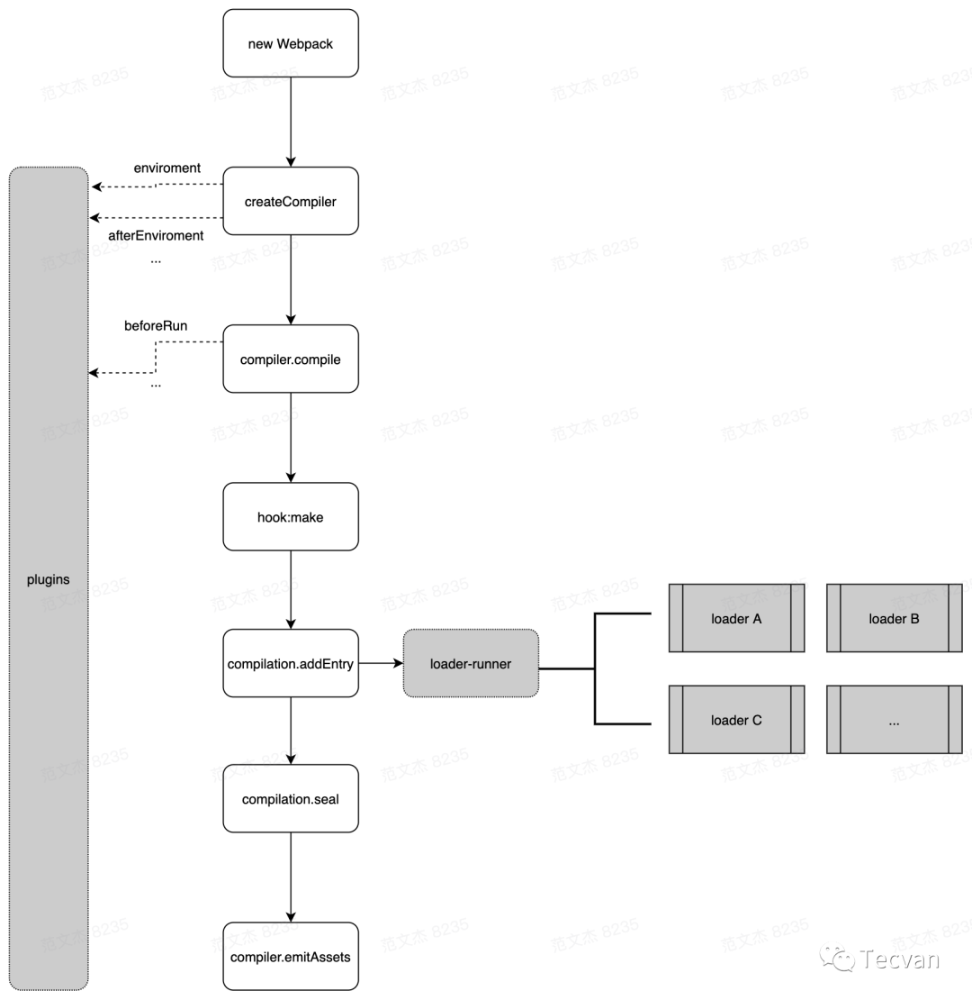
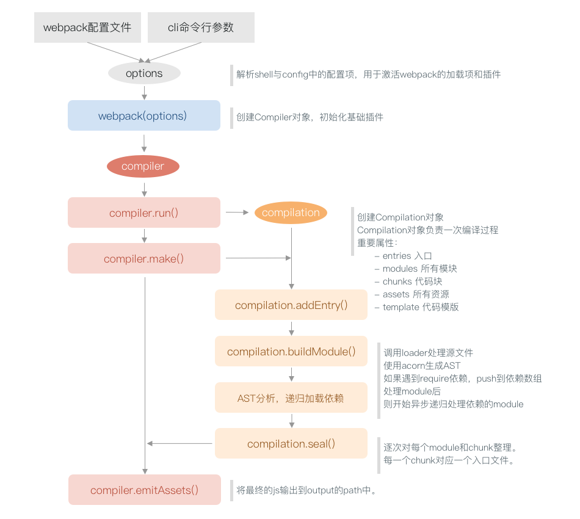
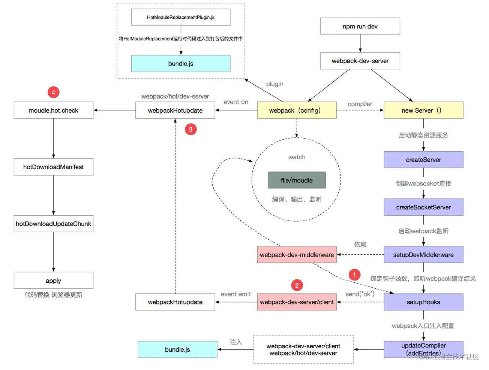

# 思维导图


# 

## 重要概念

- Module：
  资源在 webpack 内的映射 `对象` ，包含资源路径、上下文、依赖、内容等

- Dependency：
  在模块中引用其他模块，而形成的模块间依赖关系，如 `import { count } from 'computed'` ，webpack 会解析当前 `module` 得到当前 `module` 的所有 `dependency` ，再遍历当前 `module` 的 `dependencies`，得到它们的 `dependency`。

- Chunk：
  依据用户的配置，如 entry、splitChunkPlugin 的配置，构建出一个或多个 chunk 实例

## 流程三大阶段分析



1. 初始化

    1. 初始化参数：  
        shell 参数、webpack.config.js 配置文件、配置对象(??)，再结合默认配置得到最终的配置参数

    2. 初始化编译器对象：  
        用配置参数生成 compiler 对象

    3. 初始化环境：

        1. 注入内置插件
        2. 注册各种模块工厂
        3. 初始化 RuleSet 集
        4. 加载配置文件中配置的插件

    4. 开始编译：  
        执行 compiler 对象上的 run 方法 ，生成 compilation 对象

    5. 确认入口：

        1. 依据 entry 配置项找到所有的入口文件 (多页面应用有多个入口 )
        2. 调用 compilation.addEntry 将所有入口文件转为 dependence 对象

2. 构建

    1. 编译模块：

        1. 从 entry 的每个入口文件开始，调用 loader 将模块转译为标准 js 语法内容
        2. 调用 js 解析器将标准 js 内容转化为 AST 
        3. 从 AST 中找到该模块依赖的模块
        4. 如果这些被依赖的模块有自己依赖的模块，将该模块作为 entry 递归寻找依赖的模块

    2. 完成编译：  
        由编译得到的所有模块依赖关系生成 依赖关系图 

    整个构建编译的过程会有一个依赖关系图，用于记录所有模块之间的依赖关系，依赖关系图 是一个对象，这个对象的键为模块绝对路径，所有键的值也是一个对象，可以把这个对象当作一个 `子依赖关系图` 。  

    整个 依赖关系图 是扁平的，构建完后 依赖关系图 将由入口文件展开的所有模块构建而成，键为模块路径，值为该模块的依赖。

3. 生成

    1. 输出资源：

        1. 依据入口文件的 模块依赖关系图 ，组装成一个个包含多个模块的 chunk ，每个入口文件会对应一个 chunk ( 如果模块按需加载，这些模块也会被单独打包成一个 chunk，代码分块需要配置 splitChunkPlugin ，webpack5 已内置 )

        2. compilation.emitAsserts 将每个 chunk 转化成单独的文件添加到输出列表 asserts

    2. 写入文件系统：  
        确定好输出内容 asserts 后，根据配置参数确定输出的路径和文件名，把文件内容写入到文件系统

.png>)

## Plugin

看面经的时候经常能看到 plugin 概念：在 webpack 的整个生命周期中会触发各种钩子，plugin 会监听各种钩子，并执行操作。

从插件的本质来看其实是一个类，这个类需要定义一个 `apply` 函数，`apply` 函数是我们注册各种钩子回调的起点，`apply` 函数会在 webpack 初始化的时候被调用，并且会传入一个全局的 compiler 对象。

```ts
class MyPlugin {
    apply(compiler) {
    }
}
```

Compiler 对象上会有一个 `hooks` 属性，我们可以从 `hooks` 上拿到各种 Webpack 的钩子，并通过 不同方式 注册钩子的回调。

```ts
class MyPlugin {
    namespace: string = 'MyPlugin'
    apply(compiler) {
        compiler.hooks.thisCompilation.tap(this.namespace, () => {
            // 回调执行的东西
        })
    }
}
```

整个 Webpack 插件体系围绕 `tapable` 展开，如上面的 [thisCompilation](https://webpack.js.org/api/compiler-hooks/#thiscompilation) 钩子就是 [tapable](https://webpack.js.org/api/plugins/#tapable) 仓库提供的钩子对象。

### 如何注册一个钩子呢？

在开始注册一个钩子前先简单了解一下 `tapable` 提供的钩子类型。
`Tapable` 提供的钩子对象有下面几种类型。

```ts
class MyPlugin {
    namespace: string = 'MyPlugin'
    apply(compiler) {
        compiler.hooks.thisCompilation.tap(this.namespace, () => {
            // 回调执行的东西
        })
    }
}
```

可以从变量名简单的了解一下各个钩子类型的含义及作用，如果想实现一个自己的 plugin ，基本了解一下 tapable 的提供的钩子类型还是有必要的 。

如果只是看名字还比较迷茫可以参考下面两篇文章   
[tapable](https://github.com/webpack/tapable#hook-types)、[Tapable，看这一篇就够了](https://juejin.cn/post/7040982789650382855)。

Webpack 在内部创建钩子实例时采用的是如下的方式。
```ts
const { SyncHook } = require("tapable");
// 1. 创建钩子实例
const sync = new SyncHook();
// 2. 注册钩子的回调
sync.tap("test-sync", () => {
    console.log("test-callback")
})
// 3. 触发钩子的回调
sync.call()
```

不同的钩子类型也需要采用不同的方式注册回调。
我们可以暂时先简单的将 tapable 注册钩子回调方式的分为 

- 同步( sync ) 
- 异步( async ) 

这里的同步异步其实指的是回调函数的执行方式，webpack 需要等到异步的回调函数执行完毕才能继续接下来的步骤。

同步钩子用同步注册的方式，异步钩子用异步注册的方式，并且触发钩子回调时也是如此。

上面涉及到三种注册方式
- tap
- tapAsync
- tapPromise

以及三种触发回调的方式

- call
- callAsync
- promise

它们之间按顺序一一对应，使用时要严格遵守规范，如果钩子的调用方式与其本身类型不同会报错。

就如我们先前用到的 thisCompilation 就是一个同步钩子，所以采用 tap 的方式注册回调。

如果我们想知道某个想用的钩子的类型，可以到官网直接搜索钩子的名字。

```ts
class MyPlugin {
    apply(compiler) {
        compiler.hooks.thisCompilation.tap('MyPluginTapSync', (compilation) => {
            console.log('tap 注册同步钩子回调')
        })
    }
}
```

如上我们就实现了一个最简单的插件，它只注册了一个 thisCompilation 钩子的回调，并且这个钩子的回调会在 compilation 初始化完成以同步方式执行。

如果想实现一个异步的钩子，可以使用 tapAsync 或 tapPromise 进行注册，由它们注册的回调会异步执行，实现如下：


```ts
class MyPlugin {
    apply(compiler) {
        // compilation 初始化后同步执行
        compiler.hooks.thisCompilation.tap('MyPluginTapSync', (compilation) => {
            console.log('tap 注册同步钩子回调')
        })
        // compilation 初始化后异步执行
        compiler.hooks.thisCompilation.tapAsync('MyPluginTapSync', (compilation, compilstionParams, callback) => {
            console.log('tapAsync 注册异步钩子回调')
            setTimeout(callback, 1000)
        })
        // compilation 初始化后异步执行
        compiler.hooks.thisCompilation.tapPromise('MyPluginTapSync', (compilation) => {
            console.log('tapPromise 注册异步钩子回调')
            return new Promise((res) => {
                setTimeout(res, 1000)
            })
        })
    }
}
```

如上，tapAsync 会传入一个 callback , 与传统的异步回调方式相同，而 tapPromise 需要返回一个 promise 对象，我们可以将异步代码放在 promise 中执行，并在执行完 resolve 。

至于钩子回调的触发已经被内置在 webpack 内部，我们只需要关注它触发的时机以及传入的参数，这些也都可以在 Webpack 官网直接搜索名字找到。

不过如果你想试试自己弄个钩子玩玩，就有必要去学习下不同类型钩子内部的实现。

### 不同钩子的含义&用法

#### 同步钩子

- SyncHook (同步钩子)

    按顺序同步调用

- SyncBailHook (同步熔断钩子)

    按顺序同步调用，但只有某一回调函数返回了 `非 undefined` 则终端后续回调的执行

- SyncWaterfallHook (同步瀑布流钩子)

    按顺序同步调用，它会将回调函数的返回值传入下一个回调函数

    SyncWaterfallHook 初始化时必须提供参数，用于动态编译 call 的参数依赖，并且通过 call 调用时也需要传入初始参数

- ~~SyncLoopHook~~ (同步循环钩子)

    按顺序同步调用，它会循环执行回调，直到所有回调都返回 undefined ，这里循环执行的维度是单个回调

#### 异步钩子

- AsyncParallelHook (异步并行钩子)

    同时执行所有回调，所有回调之间互不影响，同时执行所有回调

- AsyncSeriesHook (异步串行钩子)

    按顺序异步执行，前一个回调执行结束才会执行下一个回调

- AsyncSeriesWaterfallHook (异步串行瀑布流钩子)

    按顺序异步执行，前一个回调执行结束才会执行下一个回调，并将参数传入下一个回调

- ~~AsyncParallelBailHook~~ (异步并行熔断钩子)

    同时执行所有回调，任意回调有返回值时，忽略剩余未执行完的回调，直接返回该结果

- ~~AsyncSeriesBailHook~~ (异步串行熔断钩子)

    同时执行所有回调，任意回调返回 `非 undefined` 值，则停止后续调用，直接返回该结果

- ~~AsyncSeriesLoopHook~~ (异步串行循环钩子)

    按序逐个异步执行，若有任意回调返回非 undefined 值，则重复执行该回调直到返回 undefined 后，才继续执行下一个回调

不同钩子会传递不同的上下文对象，这一点在钩子被创建的时候就定下来了，如下

```js
class Compiler {
    constructor() {
        this.hooks = {
            /** @type {SyncBailHook<Compilation>} */
            shouldEmit: new SyncBailHook(["compilation"]),
            /** @type {AsyncSeriesHook<Stats>} */
            done: new AsyncSeriesHook(["stats"]),
            /** @type {AsyncSeriesHook<>} */
            additionalPass: new AsyncSeriesHook([]),
            /** @type {AsyncSeriesHook<Compiler>} */
            beforeRun: new AsyncSeriesHook(["compiler"]),
            /** @type {AsyncSeriesHook<Compiler>} */
            run: new AsyncSeriesHook(["compiler"]),
            /** @type {AsyncSeriesHook<Compilation>} */
            emit: new AsyncSeriesHook(["compilation"]),
            /** @type {AsyncSeriesHook<string, Buffer>} */
            assetEmitted: new AsyncSeriesHook(["file", "content"]),
            /** @type {AsyncSeriesHook<Compilation>} */
            afterEmit: new AsyncSeriesHook(["compilation"]),
        };
    }
}
```

#### 详细类型划分

可以依据回调的逻辑进行划分：

- 基本类型，不带 `Waterfall/Bail/Loop`   
基本类型均按钩子的注册顺序依次调用，同步钩子注册的回调中只要有一个报错就不会继续执行。

- `Waterfall` 类型，前一个回调函数的返回值会被带入到下一个回调

- `Bail` 类型，逐次调用回调，若有任何一个回调返回非 undefined 值，则终止后续调用

- `Loop` 类型，逐次、循环调用，直到所有回调函数都返回 undefined

### 动态编译


### 中间件 Intercept

```js
const sleep = new SyncHook();

sleep.intercept({
  name: "test",
  context: true,
  call() {
    console.log("before call");
  },
  loop(){
    console.log("before loop");
  },
  tap() {
    console.log("before each callback");
  },
  register() {
    console.log("every time call tap");
  },
});
```

|  | 签名 | 解释 |
| --- | --- | --- |
| call | (...args) => void |  调用 call/callAsync/promise 时触发 |
| tap | (tap: Tap) => void | 调用 call 类函数后，每次调用回调之前触发 |
| loop | (...args) => void | 仅 loop 型的钩子有效，在循环开始之前触发 |
| register | (tap: Tap) => Tap  | undefined | 调用 tap/tapAsync/tapPromise 时触发

Webpack 中的进度提示，webpack/lib/ProgressPlugin 插件中，分别对 compiler.hooks.emit 、compiler.hooks.afterEmit 钩子应用了记录进度的中间件函数

### HookMap

```js
const { SyncHook, HookMap } = require("tapable");

const sleep = new HookMap(() => new SyncHook());

// 通过 for 函数过滤集合中的特定钩子
sleep.for("statement").tap("test", () => {
  console.log("callback for statement");
});

// 触发 statement 类型的钩子
sleep.get("statement").call();
```

HookMap 集中在 webpack/lib/parser.js 文件中，parser 文件主要完成将资源内容解析为 AST 集合，解析完成后遍历 AST 并以钩子方式对外通知遍历到的内容，如果遇到表达式就会触发 `Parser.hooks.expression` 钩子，这部分可以看看 webpack parser 部分源码。

### 实现一个简易的 plugin

为了更好方便我们实现一个简易的 plugin ，可以学一下 [jest 单元测试](https://jestjs.io/docs/getting-started) 和 [vscode 调试](https://juejin.cn/post/6992976045213220878#heading-0)


## AST

## loader

### 写一个简单的 loader

在编写 loader 前，先学习一下如何通过 [vscode 调试我们的 webpack 代码](https://juejin.cn/post/6844904032696287239)

按照上述文章简单的新建一个项目，接着创建一个 `src/index.js` 文件，编写如下代码

```js
function aaa() {
    return (
        `
            [name],
            [age],
            [height]
        `
    )
}
```

接下来我们先写第一个 loader 

```js
// loader/transfer/index.js
module.exports = function(source) {
    // getOptions 这个方法已被内置
    const options = this.getOptions()
    const newSource = source.replace(/\[name\]/, options.name)
                            .replace(/\[age\]/, options.age)
                            .replace(/\[height\]/, options.height)
    return newSource
}
```

可以看到我们通过 options 拿到 3 个属性，这 3 个属性可以通过  `webpack.config.js` 的 options 配置传入

```js 
// webpack.connfig.js
module: {
    rules:  [
        {
            test: /\.js$/,
            use: [
                {
                    loader: path.resolve(__dirname, './loader/transfer/index.js'),
                    options: {
                        name: 'seauning',
                        age: 18,
                        height: 182
                    }
                },
            ]
        }
    ]
}
```

这样我们就实现了一个简易的 loader ，可以在打包输出的 dist 中查看编译后输出的资源，或者手动 `console.log` 查看

接下来我们编写第二个 loader ，用于测试 babel 生成 AST

> 注意需要安装 `@babel/core` 这个包

```js
const babel = require("@babel/core");

module.exports = function(source, sourceMap, data) {
    const cb = this.async();

    // 1. parser -> ast
    // const ast = babel.parse(source);
    // 2. transform 遍历
    // ast: true ，时会 result 会携带上  ast 
    babel.transform(source, {ast: true}, function(err, result) {
        if(err) cb(err)
        cb(null, source, sourceMap, {
            data,
            ast: result.ast
        })
    })
    // 3.  generate -> code
    // const code = babel.generate(transformResult)

    // return source
}
```

上面使用了一个异步的 loader，我们可以在调试控制台中查看生成代码的 ast 。

相应的我们需要在原本的配置上添加新的 loader 的配置.

```js
module: {
        rules: [
            {
                test: /\.js$/,
                use: [
                    {
                        loader: path.resolve(__dirname, './loader/compiler/index.js'), 
                        
                    },
                    {
                        loader: path.resolve(__dirname, './loader/transfer/index.js'),
                        options: {
                            name: 'seauning',
                            age: 18,
                            height: 182
                        }
                    },
                ],
            },
            {
                test: /\.ts$/,
                loader: 'ts-loader'
            }
        ]
    }
```

### vue-loader


## Dependency Graph

webpack 处理应用代码时，会从开发者提供的 `entry` 配置开始递归构建包含所有模块的 **Dependence Graph** ，最后将这些 `module` 打包为 `bundles` 。

Dependence Graph 贯穿 webpack 整个运行周期，make 阶段模块的解析、seal  阶段 chunk 的生成 以及 tree-shaking 都依赖于 Dependence Graph。

- `ModuleGraph`

   1. 记录 Dependency Graph 信息的容器，保存构建过程中涉及到的所有 module 、 dependency 对象，以及这些对象间的引用

   2. 提供各种工具方法，用于读取和使用 module 或 dependency 附加的信息

- `ModuleGraphConnection`

   1. 记录模块间引用关系的数据结构，通过 `originModule` 记录引用关系中的父模块，`module` 记录子模块

   2. 提供了一系列工具函数用于判断引用关系的有效性

- `ModuleGraphModule`

  `Module` 对象在 Dependency Graph 体系下的补充信息，通过 `incomingConnections` 指向引用模块本身的 `ModuleGraphConnection` 集合，`outgoingConnections` 指向该模块引用的模块的集合。


## webpack 开发环境

```javascript
// webpack 默认能处理 js、json 文件
const HtmlWebpackPlugin = require("html-webpack-plugin");
const { resolve } = require("path");
module.export = {
  entry: "...index.js", // 入口文件
  output: {
    filename: "js/main.js",
    path: resolve(__dirname, "dist")
  },
  module: {k
    rules: [
      {
        test: /^\.less$/,
        use: ["style-loader", "css-loader", "less-loader"]
      },
      {
        test: /^\.css$/,
        use: ["style-loader", "css-loader"]
      },
      {
        // 处理样式中图片资源
        test: /^\.(jpg|png|gif)$/,
        loader: "url-loader",
        options: {
          limit: 8 * 1024,
          name: "imgs/[hash:10].[ext]", // 若要实现不同的输出路径(只需在文件名前加上目录名即可)
          esModule: false // 关闭 es6 模块化
        },
        type: "javascript/auto" // webpack5 版本开始弃用旧的assets loader，需要加点设置才能适用
      },
      {
        // 处理html中图片资源(这里的图片文件的输出路径无需配置，只需在处理图片资源中配置)
        test: /^\.html$/,
        loader: "html-loader"
      },
      {
        exclude: /^\.(less|css|html|jpg|png|gif|js)$/,
        loader: "file-loader",
        options: {
          name: "media/[hash:10].[ext]"
        }
      }
    ]
  },
  plugins: [
    new HtmlWebpackPlugin({
      template: resolve(_dirname, "...index.html")
    })
  ],
  mode: "development",
  devServer: {
    // 开发服务器 devServer: 用来自动化(自动编译、打开浏览器、刷新浏览器)
    // 特点：之后在内存中打包编译，不会有任何输出
    // 启动 devServer 的指令：npx webpack-dev-server
    static: {
      directory: resolve(__dirname, "build")
    },
    compress: true, // 开启 gzip 压缩
    host: "", // 主机名
    port: "", // 端口
    open: true, // 自动打开
    watchFiles: ["./src/index.html"] // webpack5+,监听html文件`热更新`需要添加这句
  }
};
```

## webpack 生产环境

```json
// package.json
{
  "browserslist": {
    "development": ["last 1 chrome version", "last 1 firefox version", "last 1 safari version"],
    "production": [">0.2%", "not dead", "not op_mini all"]
  },
  "dependencies": {
    "D": "^1.0.1",
    "optimize-css-assets-webpack-plugin": "^6.0.1"
  }
}
```

```javascript
const HtmlWebpackPlugin = require("html-webpack-plugin");
const MiniCssExtractPlugin = require("mini-css-extract-plugin");
const OptimizeCssAssetsWebpackPlugin = require("optimize-css-assets-webpack-plugin");

const commonCssLoader = [
  // 'style-loader', // 创建 style 标签,将样式放入
  // 用这个 loader 取代 style-loader 。作用：提取 js 文件中的 css
  MiniCssExtractPlugin.loader,
  "css-loader",
  {
    loader: "postcss-loader", // css 兼容性
    options: {
      postcssOptions: {
        // 外围需要包裹一层这个需要注意
        ident: "postcss",
        plugins: () => [
          require("postcss-preset-env")() // 记得需要运行
        ]
        // 还需要在 package.json 中定义 browerslist
      }
    }
  }
];
// 定义 nodejs 环境变量；决定使用 'broserslist' 的哪个环境
process.env.NODE_ENV = "production";
module.export = {
  entry: "...index.js", // 入口文件
  output: {
    filename: "js/main.js",
    path: resolve(__dirname, "dist")
  },
  module: {
    rules: [
      {
        test: /\.css$/,
        use: [...commonCssLoader]
      },
      {
        test: /\.less$/,
        use: [...commonCssLoader, "less-loader"]
      },
      /**
       * 正常来说，一个文件只能被一个 loader 处理
       * 当一个文件需要被多个 loader 处理
       * 那么一定要指定 loader 执行的先后顺序
       *  先执行 eslint 在执行 babel
       */
      /* { // js 代码规范校验
        // 在 packege.json 中配置 eslintConfig ??
        test: /\.js$/,
        exclude: /node_modules/,
        enforce: 'pre', // 优先执行  
        loader: 'eslint-loader',
        options: {
          fix: true // 自动修复
        }
      }, */
      {
        // js 兼容性
        test: /\.js$/,
        exclude: /node_modules/,
        loader: "babel-loader",
        options: {
          presets: [
            [
              "@babel/preset-env",
              {
                useBuiltIns: "usage",
                corejs: { version: 3 },
                targets: {
                  chrome: "60",
                  firefox: "60"
                }
              }
            ]
          ]
        }
      },
      {
        // 处理图片
        test: /\.(jpg|png|gif)$/,
        loader: "url-loader",
        options: {
          limit: 8 * 1024,
          name: "imgs/[hash:8].[ext]",
          esModule: false
        },
        type: "javascript/auto"
      },
      {
        // 处理 html 中的图片
        test: /\.html$/,
        loader: "html-loader"
      },
      {
        // 处理其他文件
        exclude: /\.(js|css|png|jpg|gif|html|less)$/,
        loader: "file-loader",
        options: {
          name: "media/[hash:8].[ext]"
        }
      }
    ]
  },
  plugins: [
    new MiniCssExtractPlugin({
      // 提取 css
      filename: "css/index.css"
    }),
    new OptimizeCssAssetsWebpackPlugin(), // 压缩 css
    new HtmlWebpackPlugin({
      template: "./src/index.html",
      minify: {
        // 压缩 html
        collapseWhitespace: true,
        removeComments: true
      }
    })
  ],
  mode: "production"
};
```

## 常用 loader

- file-loader：加载文件资源，如 图片，有移动复制命名等功能，在代码中通过相对 URL 引用输出的文件

- url-loader：通常用于加载图片，可以设置一个阈值，大于阈值交给 file-loader 处理，小于阈值时直接转为 base64 编码的二进制流，减少请求

- style-loader：将 css 代码注入到 Javascript 中，通过 DOM 操作加载 css，将 css 通过 `<style>` 标签引入到 html 中

- css-loader：分析 `@import` 和 `url()`，引用 css 与对应的资源。支持模块化、压缩、文件导入。

- less-loader/sass-loader：将 less/sass 代码转为 css 代码

- postcss-loader：处理 css 兼容性，如进制转换

- less-loader：less 文件的预处理器，将 .less 后缀的文件转换成 css 文件

- babel-loader：将 ES6 代码转换成 ES5，解决兼容性问题

  - balylon 将 ES6/ES7 代码解析成 AST
  - babel-traverse 对 AST 进行遍历转译，得到新的 AST
  - 新的 AST 通过 babel-generator 转换成 ES5



## 常用的 plugin

- html-webpack-plugin：简化 html 文件创建(依赖于 html-loader)，html 压缩、自动引入打包后的 js

- split-chunks-plugin：代码分割

- mini-css-extract-plugin：抽离样式，css 提取为独立文件，支持按需加载

- optimize-css-assets-webpack-plugin：css 压缩

- compression-webpack-plugin：使用 Gzip 压缩 js 和 css。

## loader 和 plugin 的区别

- `loader` 就是加载器，本质是一个函数，在该函数中对接收到的内容进行转换，返回转换后的结果。因为 Webpack 只能处理 CommonJS 规范的 JavaScript 模块，所以就需要通过 loader 对其他类型的资源进行转译，转换成 Webpack 能处理的模块。

- `plugin` 就是插件，它直接作用于 Webpack，可以扩展 Webpack 的功能，让 Webpack 具有更多的灵活性。在 Webpack 运行的生命周期中会广播出许多事件，Plugin 可以监听这些事件，在合适的时机通过 Webpack 提供的 API 改变输出结果。Plugin 可以解决 loader 无法实现的其他事，例如 html-webpack-plugin 可以在 html 中引入打包后的 js 资源。

- `loader` 在 module.rules 中配置，作为模块的解析规则，类型为数组。每一项都是一个对象，在对象中通过 loader 或 use 指定 loader、test 指定需要编译的文件、options 配置 loader 编译的配置。

- `plugin` 在 plugins 中单独配置，类型为数组，数组的每一项是插件的实例，参数都通过构造函数传入。

## 文件监听原理

轮询判断文件的最后编辑时间是否变化，如果某个文件发生了变化，并不会立刻告诉监听者，而是先缓存起来，等 `aggregateTimeout` 后再执行。

开启监听模式的方式：

- 启动 webpack 命令时，带上 --watch 参数
- 在 webpack.config.js 中设置 watch: true

```js
module.exports = {
  // 默认 false，也就是不开启
  watch: true,
  // 只有开启监听模式时，watchOptions 才有意义
  watchOptions: {
    // 默认为空，不监听的文件或者文件夹，支持正则匹配
    ignored: /node_modules/,
    // 监听到文件变化发生后会等 300ms 再去执行，默认 300ms
    aggregateTimeout: 300,
    // 判断文件是否发生变化，通过不断轮询系统指定文件有没有变化，默认每秒间 1000 次
    poll: 1000
  }
};
```

## devServer HMR 热模块替换原理

[热模块替换原理](https://juejin.cn/post/6844904008432222215#heading-14)
[热模块替换详细原理](https://zhuanlan.zhihu.com/p/30669007)

HMR，Hot Module Replacement。

**热模块替换与热更新不相同，热更新会打包编译所有资源，并刷新浏览器。而热模块替换只会发生局部修改。**

- 使用 webpack-dev-server 托管静态资源，同时以 Runtime 运行时的方式注入 HMR 客户端代码

- 浏览器加载页面后，与 WDS 建立 Websocket 链接

- Webpack 监听到文件变化后，`增量构建`发生变更的模块，并在增量构建完毕后触发 `compilation.hooks.done` 钩子，并向 WDS 传递本次构建的统计信息对象 `stats` 。WDS 监听 done 钩子，在回调中通过 Websocket 发送 hash 事件

- 浏览器接收到 hash 事件后，请求 `manifest` 资源文件，确认本轮热更新涉及的 chunk

  `manifest`文件：JSON 格式的文件，包含所有发生变更的模块列表，命名为 [hash].hot-update.json

  模块变更文化：js 文件，包含编译后的模块代码，命名为 [hash].hot-update.js

  注意： Webpack 4 之前，热更新文件以模块为单位，即所有发生变化的模块都会生成对应的热更新文件； Webpack 5 之后热更新文件以 chunk 为单位，chunk 下任意文件的变化都只会生成 main.[hash].hot-update.js

- 浏览器请求并加载发生变更的资源

- Webpack 运行时触发变更模块的 module.hot.accept 回调，这需要客户端通过 module.hot.accept 接口明确告知 webpack 如何执行代码替换，执行代码变更逻辑

- done



在构建打包文件时，加入一段 HMR runtime 的 js 和一段与服务器建立 websocket 连接的 js，文件修改会触发 webpack 重新构建，服务器通过向浏览器发送 hash 事件更新消息，浏览器通过 jsonp 拉取更新模块文件，jsonp 的回调触发热模块更新。


## babel 原理

[Babel 原理](https://juejin.cn/post/6844903760603398151)

babel 常用于将 ES6 语法转译为 ES5 的语法。主要步骤如下：

1. parse 解析

   将代码字符串解析为 AST 抽象语法树。每个 JS 引擎都有自己的解析器，Babel 通过 Babylon 实现。解析过程有两个阶段：

   1. 词法分析（Lexical Analysis）

      将字符串形式的代码转换为 tokens 令牌流， token 类似于 AST 中的节点

   2. 语法分析（Syntactic Analysis）

      把一个令牌流转换成 AST 形式，这个阶段会把令牌中的信息转换成 AST 的表述结构

   code(字符串形式代码) -> tokens(令牌流) -> AST(抽象语法树)

2. transform 转换

   Babel 拿到解析得到的 AST 通过 babel-traverse 对其深度优先遍历，在此过程中对节点进行添加、更新及移除。是 Babel 或是其他编译器中最复杂的过程。

3. generate 生成

   将转换后的 AST 通过 babel-generator 转换成字符串形式的 js 代码，同时还会创建源码映射（source-map）。
   通过深度优先遍历整个 AST ，然后构建可以表示转换后代码的字符串。

## 参考文档

[[万字总结] 一文吃透 Webpack 核心原理](https://juejin.cn/post/6949040393165996040)

[Webpack 原理系列二：插件架构原理与应用](https://juejin.cn/post/6955421936373465118)