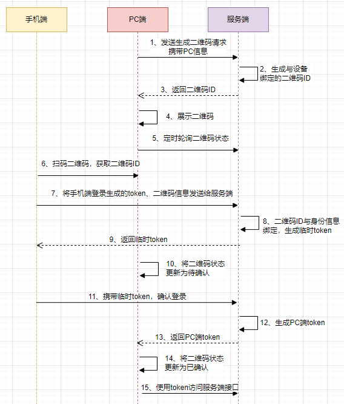
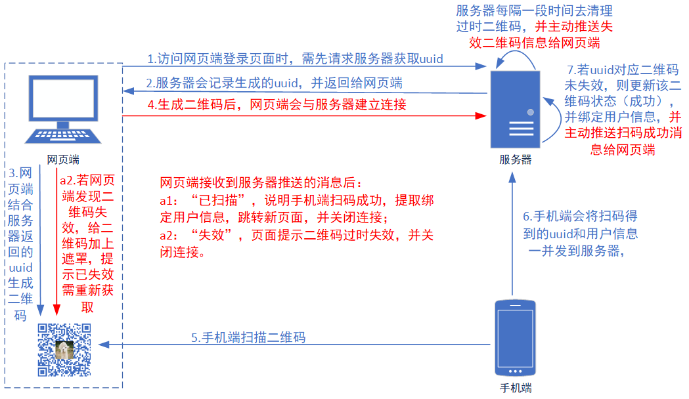

# 扫码登录

## 扫码登录详细流程

- 用户访问 PC 端进入登录页面，PC 端向服务端的获取二维码的接口发请求

- 服务端生成 **与这个 PC 端设备绑定的唯一的 `二维码 ID` / `二维码`**，在服务端中设置二维码的 过期时间、 状态为 `未扫码`

  如果二维码 ID 不唯一，在之后会将二维码 ID 与身份信息绑定，不唯一的话就会造成 你登录了其它用户的账号 或者 其它用户登录了你的账号

- PC 端拿到响应的数据，如果是 `二维码 ID` 则通过第三方库转为二维码，然后再显示

- 移动端扫描二维码，获取到二维码中的 二维码 ID（这里应该涉及了图像识别的技术）

- 因为此时移动端处于登录状态，移动端将 `移动端的 token` 和 `二维码 ID` 发送给服务端

- 服务端收到 `移动端的 token` 和 `二维码 ID` 后，确定要登录的用户，**将 `该用户` 与 `二维码 ID `绑定**，并由绑定的信息生成一个 `临时的 token` ，然后将二维码状态转为 `已扫码` ，此时 PC 端会轮询到这个状态，将二维码界面修改为已扫码待确认登录

  服务端发送一个 `临时的 token` 给移动端

- 移动端接收到 `临时的 token` ，将移动端界面跳转为 `确认登录界面`

- 用户点击登录，移动端发送 `临时的 token` 给服务端，服务端收到该 `临时的 token` 后将二维码

  状态修改为 `已确认状态` ，并生成一个 `PC端 token`，之后在 PC 端拿到 `PC端 token` 后 用户在 PC 端通过 `PC端 token` 访问服务端接口

  如果此时用户未点击登录，并退出了确认登录界面，服务端会在二维码过期后，将二维码的状态

  修改为 `已失效` ，这样 PC 端在轮询二维码状态时，发现二维码失效就会显示

  二维码已失效的界面，引导用户重新刷新二维码

- PC 端不断轮询服务端确认二维码状态，在整个二维码扫描的交互流程中，PC 端的二维码状态可能从

  `未扫码` -> `已扫码` -> `已确认` | `未扫码` -> `已失效` | `未扫码` -> `已扫码` -> `已失效`

  因此，是可能在扫码过程中发生二维码失效，因此需要控制好二维码的存活时间

## PC 端确认二维码的状态的方式：

[三种方式实现扫码登录](https://forthe77.github.io/2019/05/23/qrcode-scan-login/)

1. PC 端每隔一段时间 `轮询` 服务端确认二维码状态的接口

2. PC 端向服务器轮询二维码状态的请求，服务器对请求进行阻塞，直到二维码信息更新或超时，当 PC 端接收到返回结果后，若二维码仍未被扫描，则会继续发送查询请求，直到状态变化(已失效 / 已确认)

3. 在访问 PC 端并 **生成二维码后** ，PC 端与服务端之间建立 `WebSocket 连接`，在每次状态改变时 `服务端主动推送` 二维码状态给 PC 端，PC 端监听这个状态的改变

## 为什么用户扫描二维码后需要有移动端的确认操作呢？

1. 如果没有确认环节，很容易被坏人拦截 token 冒充登录，所以一定要有确认的页面，让用户去确认是否进行登录

2. 二维码扫描确认后，再往用户的 移动端 App 或 手机 发送登录提醒的通知，告知如果非本人登录，建议立即修改密码

## 为什么扫完二维码后需要给移动端发送一个临时 token 呢？

1. 临时 token 与 token 相同，都是一种身份凭证，不同的地方在于它只能用一次，使用过后就失效

2. 临时 token 用于确保移动端在下一步操作时，可以用它作为凭证，以此确保 扫码 和 确认登录 这两步操作是同一部手机发出的

## 在实现了基本的扫码登录后如何健壮整个扫码登录系统

1. 二维码的超时机制

2. 二维码的恶意请求机制

## 参考资料

[扫码登录](https://xw.qq.com/cmsid/20210907A0D5E400)

[二维码扫描登录的原理](https://baijiahao.baidu.com/s?id=1720540594523117642&wfr=spider&for=pc)

[面试官：如何实现扫码登录功能？](https://juejin.cn/post/7021515145335554079#heading-12)

# 大数量级场景

## 一个数据平台，如果数据是百万级的，怎么让页面不卡顿

后端：分页

前端：分批请求、懒加载

大量数据会涉及很多数据处理操作，尽量将数据的处理放在后台，如果前端存在数据处理操作，由于 JS 是单线程的，如果数据量级过大，主线程阻塞，会造成页面卡死，可以通过 Worker 将数据的处理放在新的子线程中，这样就不会阻塞主线程

## Worker 和主线程用什么方法传数据

- postmessage 发送数据

- onmessage 监听数据

## 参考资料

[前端如何处理十万级别的大量数据](https://juejin.cn/post/6844903821278199822)

# ServiceWorker

1. 第一次访问网页，加载入口 js 文件，注册 service-worker

2. 第二次访问网页，worker 线程中脚本拦截住 html 请求，由于 cacheStorage 中找不到当前网页 html 资源，放行去服务器请求 html 资源，请求完成后添加到 cacheStorage

3. 第三次访问网页，worker 线程拦截住 html 文档的请求，直接将 cacheStorage 中的 html 文档返回给浏览器，浏览器渲染文档，同时 worker 线程异步请求服务器获取最新的 html 文档，与缓存中的文档对比，如果发生变化，会将最新的文档更新到缓存中，并通过 postmessage 和主线程通讯，让页面 reload

# ServiceWorker 缓存和 http 缓存优先级

