# 思维导图

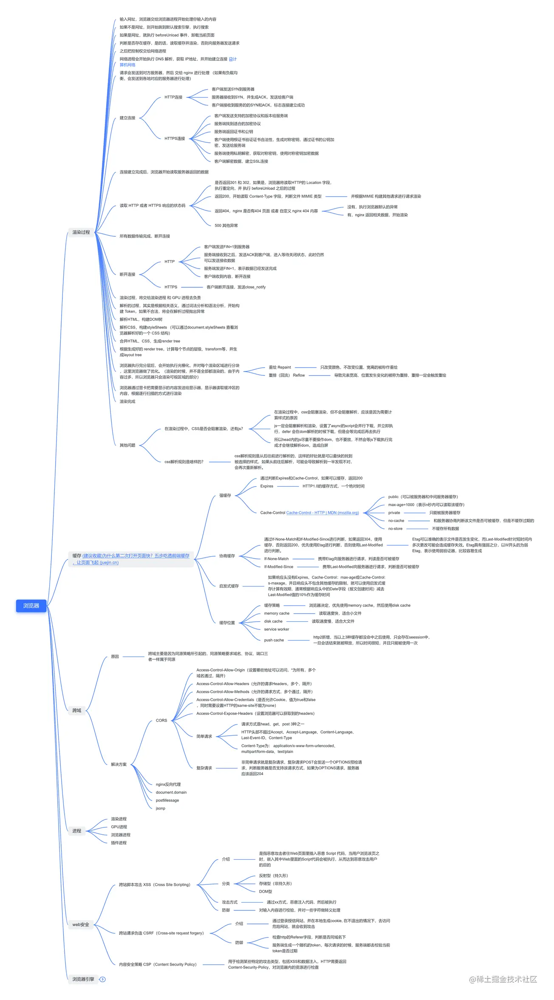

# 全文 !!!! 表示必考必记，!!! 表示必记，!! 表示理解，! 表示 了解

# 浏览器的多进程架构!!!

以 Chrome 浏览器为例：  
Chrome 浏览器由多进程组成，每个进程都有自己核心的职责，相互配合完成浏览器的整体功能。  
每个进程包含多个线程，一个进程内的多个线程协同工作
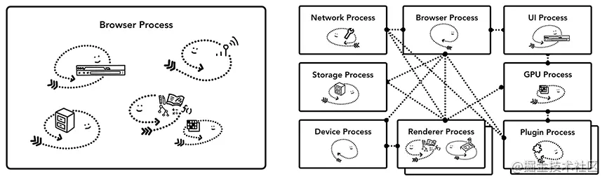
优点：

- 每一个页面都是一个新的进程，单个页面崩溃不会影响整个浏览器。
- 多进程可以充分利用现代 CPU 多核的优势

缺点：
每创建一个新进程需要分配内存、CPU 等资源，内存和 CPU 资源消耗也会更大。

# 浏览器的进程 !!!!

- 浏览器进程(Browser Process), 主进程。

  负责浏览器界面的显示与交互。各个进程的管理，创建和销毁。浏览器进程负责控制浏览器除标签外的界面，包括地址栏、书签、前进后退按钮等，以及负责与其他进程的协调工作并提供存储功能。

- GPU 进程(GPU Process)。

  最多只有一个，用于 3D 绘制。

- 渲染进程(Renderer Process)。

  也称为浏览器内核，内部是多线程。主要负责页面渲染，脚本执行，事件处理。负责控制和显示标签页内的所有内容，核心任务是将 HTML、CSS、JS 转为用户可以与之交互的网页。

  - GUI 渲染线程(渲染引擎)

    - 渲染浏览器界面，解析 HTML，CSS，构建 DOM 树和 Render 树，布局和绘制。

    - 当界面需要 reflow 或 repaint 时，该线程会执行。

    - 重点：GUI 渲染线程与 JS 引擎线程是互斥的，当 JS 引擎执行时 GUI 线程会被挂起，GUI 更新会被保存在一个队列中等到 JS 引擎空闲时再执行。

  - JS 引擎线程(如 V8)

    - Javascript 引擎，也称为 JS 内核。

    - 解析 Javascript 脚本，并执行。

    - 一个标签页中只有一个 JS 引擎线程(单线程)。

    - 注意：GUI 渲染线程与 JS 引擎线程互斥，如果 JS 执行时间过长，可能导致页面渲染阻塞。

  - 事件触发线程

    - 归属于浏览器而不是 JS 引擎，用于控制**事件循环**(因为 JS 引擎太忙了,需要把工作分配出去,让浏览器协作)。

    - 当 JS 引擎执行如 setTimeout 这样的任务时(也可以是浏览器内核的其他线程,如鼠标点击、AJAX 异步请求)，会将对应任务添加到事件线程的队列中。

    - 因为 JS 是单线程的关系，所有这些待处理队列中的事件都需要排队等待 JS 引擎处理(JS 引擎空闲会去执行)。

  - 定时触发线程

    - 浏览器定时器并不是由 Javascript 引擎计时的(单线程,如果阻塞影响计时准确性)。

    - 通过单独的线程来计时并触发定时,计时完毕后添加到事件触发线程的事件队列中。

    - 注意：W3C 在 HTML 标准中规定 setTimeout 低于 4ms 的时间间隔算为 4ms。

  - 异步 HTTP 请求线程

    - XMLHttpRequest 连接后是通过浏览器新开一个线程请求。

    - 检测到状态变更时，如果设有回调函数，产生状态变更事件并将这个回调放入事件队列中。

- 网络进程(Network Process)。

  负责发起和接受网络请求。

- 第三方插件进程(Plugin Process)。

  每种类型的插件对应一个进程，仅当使用插件时创建。

最新的 Chrome 浏览器包括：`1 个浏览器主进程`，`1 个 GPU 进程`，`1 个网络进程`，`多个渲染进程`，和 `多个插件进程`。

# 每打开一个页面有多少进程

浏览器从关闭到启动，新开一个标签页至少需要 `4` 个进程，浏览器进程(主进程)、渲染进程、网络进程、GPU 进程。如果有再新打开一个标签页，**浏览器进程、GPU 进程、网络进程**这三个进程是共享的，另外默认会为每个标签页配置一个渲染进程，但是如果 `A 页面里打开一个新的页面 B 页面`，而 A 页面和 B 页面又`属于同一站点`，则 A 和 B 就共用一个渲染进程。

# 为什么 Javascript 是单线程的 !!!!

JavaScript 为处理页面中用户的交互,以及操作 DOM 树、CSS 样式树来给用户呈现一份动态而丰富的交互体验和服务器逻辑的交互处理。

如果 JavaScript 以多线程的方式来操作这些 DOM,则可能出现操作的冲突。在多线程的交互下，界面中的 DOM 节点就能成为一个临界资源。

假设存在两个线程同时操作一个 DOM,一个负责修改一个负责删除,那么这个时候就需要浏览器来裁决如何生效哪个线程的执行结果。当然可以给临界资源加锁来解决资源冲突的问题,但为了避免因为引入锁而带来更大的复杂性,Javascript 在最初就选择了单线程执行。

# 关键渲染路径(CRP,Critical Rendering Path) !!

[关键渲染路径](https://mp.weixin.qq.com/s?__biz=Mzg4MTYwMzY1Mw==&mid=2247495963&idx=1&sn=0c4d17e24e176f96ee879c1e4df9068d&source=41#wechat_redirect)

关键渲染路径是浏览器将 HTML、CSS、Javascript 转换为在屏幕上呈现的像素内容所经历的一序列步骤。

**优化 CRP：**

- 删除不必要的代码和注释包括空格，尽量做到最小化文件
- 利用 GZIP 压缩
- 使用 HTTP 缓存
- 减少使用媒体查询
- 使用 link 标签 rel 属性的 preload & prefetch
  [preload & prefetch](https://zhuanlan.zhihu.com/p/48521680)
- 延迟 js 脚本加载

# 浏览器渲染过程 !!!!

[浏览器渲染过程](https://juejin.cn/post/6844903815758479374#heading-7)

1. 解析 HTML ，构建 DOM 树
2. 解析 CSS，构建 CSS 规则树(CSSOM 树)
3. 合并 DOM 树和 CSS 规则，生成 render 树
4. 布局 render 树(Reflow)，负责各元素尺寸、位置计算
5. 绘制 render 树(RePaint) ，绘制页面像素信息
6. 渲染层 (composite) 合并，将所有绘制后的渲染层组合为一张图层
7. 显示 (Display)，将组合后的图层发送给 GPU，展示在页面上

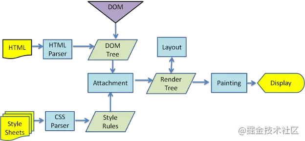

## 详细：

1.  解析 HTML，构建 DOM 树

    1.  Conversion 转换：浏览器将获得的 HTML 文本内容（Bytes）基于指定的编码(如 UTF-8) 转换为单个字符。

    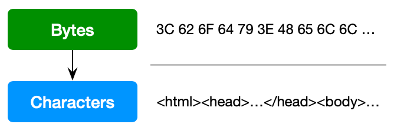

    2.  Tokenizing 分词：浏览器按照 HTML 规范标准将这些字符转换为不同的 token ，token 中会标识出当前 token 是 `起始标签` 还是 `结束标签` 亦或是 `文本` 等信息。

    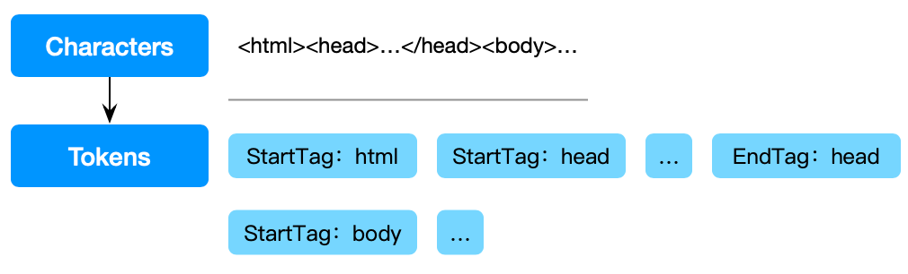

    只要是在 token 的 `起始标签` 与 `结束标签` 之间的节点，就肯定是属于这个 token 的子节点。

    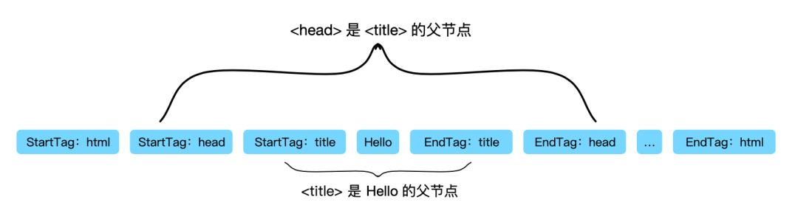

    3.  Lexing 词法分析：分词的结果是得到一堆的 token，此时把他们转换为对象，对这些对象分别定义他们的属性和规则，得到 DOM 节点。

    实际上在构建 DOM 的过程中，是一边生成 Token 一边消耗 Token 来生成节点对象。每个 Token 被生成后，会立即消耗这个 Token 创建出来的节点对象，用这个节点对象来构建 DOM 树。

    4.  DOM 构建：节点对象包含了这个节点的所有属性，随后通过 `起始标签` 与 `结束标签` 来识别并关联节点之间的关系。

    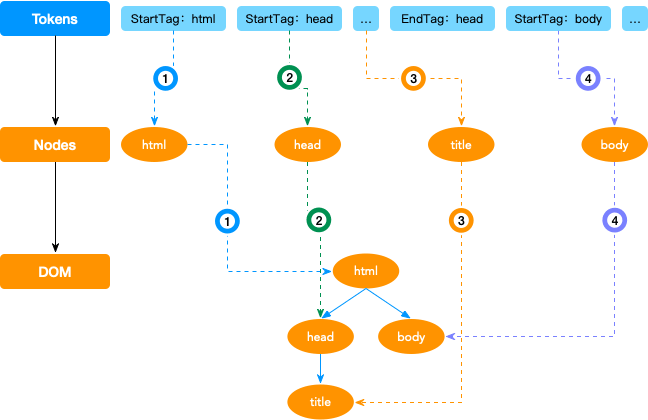

    Bytes => Characters => Tokens => Node => DOM

    

2.  解析 CSS，构建 CSSOM 树，类似于构建 DOM 树，只是最后生成的是 CSS 规则树。

    例如下面这一段代码

    ```css
    body {
      font-size: 16px;
    }
    p {
      color: red;
    }
    p span {
      display: none;
    }
    span {
      font-size: 14px;
    }
    img {
      float: right;
    }
    ```

    经过如 DOM 树构建一样的步骤最后生成如下图的 CSSOM 树。

    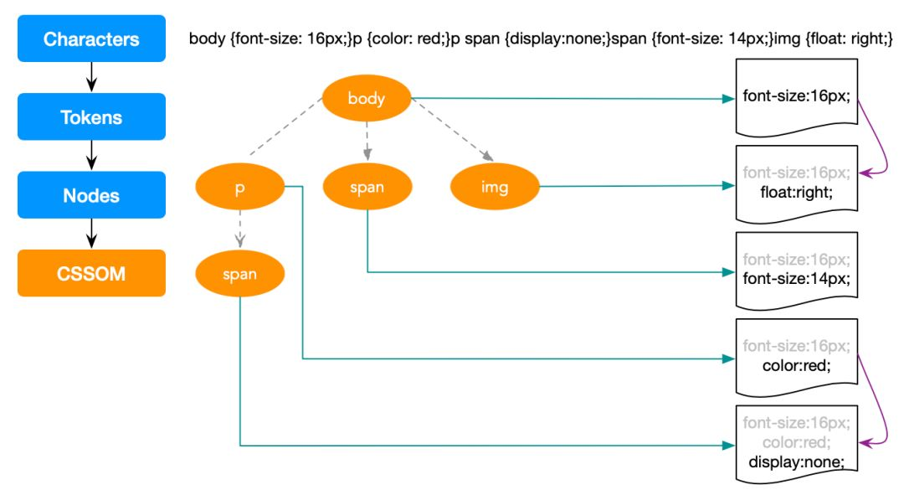

    另外可以发现，`body` 节点的子节点继承了 `body` 的可继承属性 `font-size`，这就是层叠规则以及 CSS 为什么叫层叠样式表的原因。

    CSS 匹配 HTML 元素是一个非常耗费性能的事情，所以 DOM 树要小， CSS 尽量使用 id 和 class 减少过渡层叠。css 选择器的读取顺序是从右向左，如果是从左向右就会变成深度遍历并伴随着大量的回溯节点，非常消耗性能。

3.  合并 DOM 树和 CSSOM 树，构建渲染 (Render) 树。

    一般来说，渲染树和 DOM 树相对应的，但不是严格意义上的一一对应,因为有一些不可见的 DOM 元素不会插入到渲染树中，如 head 这种不可见的标签或者 display: none 等。

    例如如下一段代码

    ```html
    <!DOCTYPE html>
    <html>
      <head>
        <meta charset="UTF-8" />
        <title>Demos</title>
        <style>
          body {
            font-size: 16px;
          }
          p {
            color: red;
          }
          p span {
            display: none;
          }
          span {
            font-size: 14px;
          }
          img {
            float: right;
          }
        </style>
      </head>
      <body>
        <p>Hello <span>berwin</span></p>
        <span>Berwin</span>
        
      </body>
    </html>
    ```

    最终构建出来的渲染树如下图

    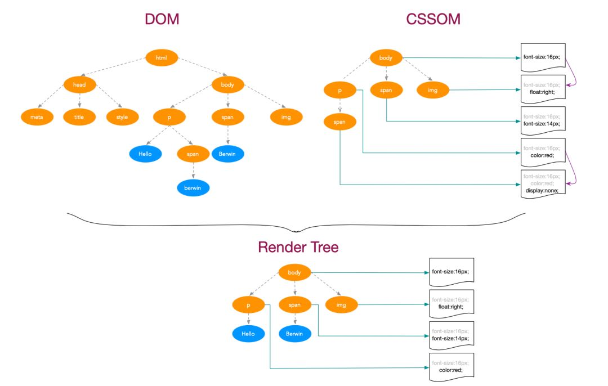

    构建渲染树时，浏览器会进行如下工作：

    1. 从 DOM 树的根节点开始遍历每个可见节点

    2. 如果有些节点本身就是不可见的，如 `script`、`meta` 等，因为它们不会体现在渲染输出中，所有会被忽略

    3. 某些节点被 CSS 隐藏，因此在渲染树中也会被忽略，例如设置了属性 `display: none;` 的节点

    4. 对于可见的节点，为其找到适配的 CSSOM 规则并应用。

4.  布局渲染树(Layout/reflow)(回流)

    通过渲染树中渲染对象的信息，计算出每一个渲染对象的位置和尺寸。

    布局输出的是一个 `盒模型` ，浏览器会精确地捕获每个元素在视口内的确切位置和尺寸，所有相对测量值都将转换为屏幕上的绝对像素。

    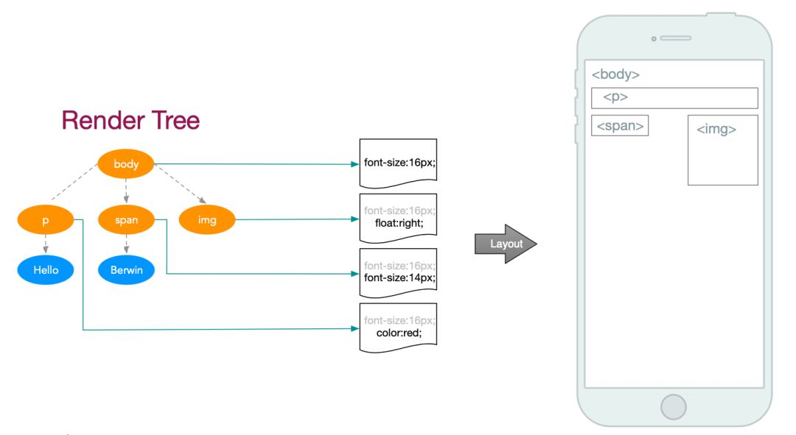

5.  绘制渲染树(paint)(重绘)

    布局完成后，浏览器会立即发出 `Paint Setup` 和 `Paint` 事件。

    然后遍历渲染树，在屏幕上绘制出节点的内容，本质上是一个像素填充的过程。绘制过程在多个层上完成，这些层被称为渲染层（RenderLayer）。

    

6.  渲染层合成(Composite)

    多个绘制后的渲染层按照恰当的重叠顺序进行合并，而后生成位图，发送个 GPU 进程显示到屏幕上。

    [compisite 参考](http://jartto.wang/2017/09/29/expand-on-performance-composite/)。

    [GPU Accelerated Compositing in Chrome](https://www.chromium.org/developers/design-documents/gpu-accelerated-compositing-in-chrome/?spm=taofed.bloginfo.blog.1.2c585ac8AYkyz4#from-graphicslayers-to-weblayers-to-cc-layers)

    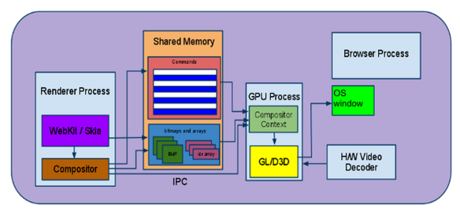

# 浏览器渲染原理

[浏览器层合成与页面渲染优化](https://juejin.cn/post/6844903966573068301)
[无线性能优化：Composite](https://fed.taobao.org/blog/2016/04/26/performance-composite/)

浏览器渲染过程中，HTML 会被解析为 DOM 树，每个 HTML 元素对应树结构上的一个 node 节点。而从 DOM 树转化到一个个渲染层，最终执行合并、绘制的过程中还存在一些用于过渡的数据结构，它们记录了 DOM 树到屏幕图形的转化原理，本质也就是树结构到层结构的演化。

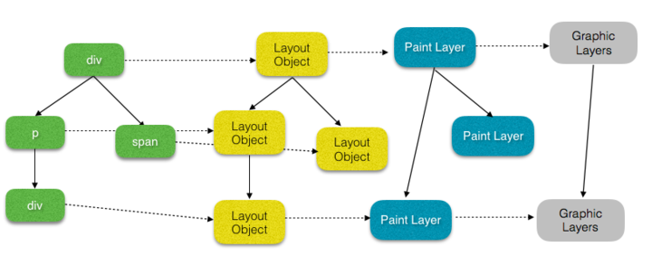

1. 渲染对象 （RenderObject | LayoutObject）

   每个 DOM 节点都对应一个 渲染对象 ，渲染对象依然维持着 DOM 树的树形结构。每个 `RenderObject` 上 **记录着如何绘制一个 DOM 节点的内容** ，通过向一个 绘图上下文（GraphicsContext） 发出必要的绘制调用来绘制 DOM 节点。

2. 渲染层（RenderLayer | PaintLayer）

   渲染层是浏览器渲染期间构建的第一层模型，处于相同坐标空间（Z 轴空间）的 `RenderObject` ，都将归并到同一个渲染层中。

   `RenderLayer` 最初是**用来实现[层叠上下文](https://developer.mozilla.org/zh-CN/docs/web/css/css_positioning/understanding_z_index/the_stacking_context)**，以此保证页面元素以正常的顺序合成，这样才能展示元素的重叠，以及半透明元素。所以，所谓的渲染层就是我们常说的层叠上下文中的层。

   根据层叠上下文，不同坐标空间的渲染对象将形成多个渲染层，以体现层叠关系。因此满足形成层叠上下文条件的 `RenderObject` ，浏览器会自动为其创建新的渲染层。

   不过还有一些特殊的情况，浏览器会为一些特殊的 RenderObject 创建新的渲染层，见[如何创建新的渲染层](#rendercomposite)

3. 合成层（CompositingLayer）

   满足某些特殊条件的 `RenderLayer` ，会被浏览器自动**提升为合成层**。每一个合成层 **拥有单独的 `GraphicsLayer`**，而其他不是合成层的 `RenderLayer`，则 **和其第一个拥有 GraphicsLayer 的父层** 共用一个 GraphicsLayer。

   [详细见渲染层提升](#renderupdate)。

4. 图形层（GraphicsLayer）

   图形层（GraphicsLayer） 其实是一个**负责生成最终准备呈现的内容图形的层模型**。每一个 `GraphicsLayer` 拥有一个 图形上下文 `GraphicsContext` 。`GraphicsContext` 会先把像素级的数据写入位图中，然后输出该层位图，位图存储在共享内存中，作为纹理上传到 GPU 中，最后由 GPU 将多个位图进行合成，然后绘制到屏幕上，此时，我们的页面也就展现了屏幕上。

   所以 GraphicsLayer 是一个重要的渲染载体和工具，但它并不直接处理渲染层，而是处理合成层。

`渲染层` 和 `合成层` 并不是同一个东西，产生的条件也不相同，并且发生在两个不同的层处理环节。

# css 加载会造成 DOM **渲染**阻塞吗 !!!!

1.  DOM 与 CSSOM 的**构建**是并行的,所以 CSS 加载不会阻塞 DOM 的**解析**。

2.  但是渲染树(Render Tree)是依赖于 DOM 和 CSSOM 来构建的。所以必须等待 DOM 和 CSSOM 构建完成才会生成,因此 CSS 加载会阻塞 DOM 渲染。

# 为什么 js 阻塞页面加载 !!!!

1.  由于 Javascript 是可操纵 DOM 的，如果在修改这些元素属性的同时渲染界面(即 JS 引擎线程和 GUI 渲染线程同时运行),那么渲染线程后获得的元素数据可能不一致。
2.  因此为了防止渲染出现不可预期的结果，需要将 GUI 渲染线程与 Javascript 引擎设为互斥关系。
3.  所以,当 Javascript 引擎执行时 GUI 线程会被挂起,GUI 渲染线程会被保存在一个队列中,直到 js 脚本执行完毕才会接着执行。

**注意：** css 应总是在 js 前解析构建完成,这样 js 执行时才能获取正确的属性,并且最终的结果由 js 操作结果决定(详细见下面)。

# css 会阻塞 js 执行吗 !!!!

1.  因为 javascript 是可操纵 DOM 和 CSS 样式的，如果修改样式的同时渲染界面,那么渲染的结果可能会出现偏差。

2.  因此样式表会在后面的 js 执行前写加载完毕,如果此时 js 已经要执行了它会等待 css 加载完再执行,也就是阻塞。

# 回流、重绘 !!!!

- 回流：回流是当 DOM 的修改影响了元素的几何属性(DOM 对象的位置和尺寸大小)，浏览器需要重新计算元素的几何属性，将其安放在界面中的正确位置的过程。`BFC 元素会引起重排。`

  - 触发时机(回流一定会触发重绘、重绘不一定会回流)

    - 页面一开始渲染的时候

    - 添加或者删除可见的 DOM 元素

    - 元素尺寸发生变化(外边距、内边框、边框大小、高度和宽度等）

    - 元素位置发生变化，(注意 translate 不触发回流)

    - 元素内容发生变化，如用户在 input 框中输入文字，文字数量增加、字体大小变化。

    - 浏览器的窗口尺寸变化（因为回流是根据视口的大小来计算元素的位置和大小的）

    - 计算 offsetWidth 和 offsetHeight 属性

    - 设置 style 属性的值，通过 style 属性改变结点样式的话，每一次设置都会触发一次 reflow

  

- 重绘：重绘是当对 DOM 的修改导致了样式的改变，却并未影响其几何属性时，浏览器不需要重新计算元素的几何属性、直接为该元素绘制新的样式。

  - 触发时机：改变元素的 color、background、box-shadow、visibility、border-style、outline、background-size 等属性

  

- 浏览器优化机制

  由于每次回流都会造成额外的计算消耗，因此大多数浏览器都会通过队列化修改并批量执行来优化回流过程，浏览器会将修改操作放入到队列里，直到过了一段时间或者操作达到了一个阈值，才清空队列。但是，当获取布局信息的操作的时候，会强制队列刷新。以下属性和方法都需要返回最新的布局信息，因此浏览器不得不清空队列，触发回流重绘来返回正确的值。在修改样式的时候，**最好避免使用上面列出的属性，他们都会刷新渲染队列**。如果要使用它们，最好将值缓存起来。

  - offsetTop、offsetLeft、offsetWidth、offsetHeight
  - scrollTop、scrollLeft、scrollWidth、scrollHeight
  - clientTop、clientLeft、clientWidth、clientHeight

# 回流优化(减少回流、重绘) !!!!

1.  最小化重绘和重排(合并多次对 DOM 和样式的修改)

    - 使用 cssText，合并所有的改变然后依次处理
      `const el = document.getElementById('test'); el.style.cssText += 'border-left: 1px; border-right: 2px; padding: 5px;';`
    - 修改 CSS 的 class,通过 class 减少样式修改次数

2.  批量修改 DOM,当我们需要对 DOM 对一系列修改的时候，可以通过以下步骤减少回流重绘次数：

    1. 使元素脱离文档流(方法)

    - 隐藏元素，应用修改，重新显示
      ```javascript
      //示例
      function appendDataToElement(appendToElement, data) {
        let li;
        for (let i = 0; i < data.length; i++) {
          li = document.createElement("li");
          li.textContent = "text";
          appendToElement.appendChild(li);
        }
      }
      const ul = document.getElementById("list");
      ul.style.display = "none"; // 隐藏
      appendDataToElement(ul, data); // 再修改
      ul.style.display = "block"; // 重新显示
      ```
    - 使用文档片段(documentFragment)在当前 DOM 之外构建一个子树，再把它拷贝回文档。

      ```javascript
      const ul = document.getElementById("list");
      const fragment = document.createDocumentFragment();
      appendDataToElement(fragment, data);
      ul.appendChild(fragment);
      ```

    - 将原始元素拷贝到一个脱离文档的节点中，修改节点后，再替换原始的元素。
      上述过程的 1、3 会引起回流，但是经过第一步之后，对 DOM 的所有修改都不会引起回流重绘，因为它已经不在渲染树了。
      ```javascript
      const ul = document.getElementById("list");
      const clone = ul.cloneNode(true);
      appendDataToElement(clone, data);
      ul.parentNode.replaceChild(clone, ul);
      ```

    2. 对其进行多次修改
    3. 将元素带回到文档中

3.  避免触发同步布局事件

    ```javascript
    // 对 offsetWidth 等进行缓存
    const width = box.offsetWidth;
    function initP() {
      for (let i = 0; i < paragraphs.length; i++) {
        paragraphs[i].style.width = box.offsetWidth + "px";
      }
    }
    ```

4.  对于复杂动画效果,使用绝对定位让其脱离文档流。否则会引起父元素以及后续元素频繁的回流。也可以使用 requestAnimationFrame 让浏览器在下次重绘调用回调函数。

5.  用 transform 的 translate 替换 top | bottom | left | right

# <span id="rendercomposite">如何创建新的渲染层？</span>

根据创建 RenderLayer 的原因，可分为常见的 3 类：

- NormalRenderLayer

  - 文档根元素 document

  - position 值为 `absolute` 或 `relative` 且 `z-index` 值不为 auto

  - position 值为 `fixed` 或 `sticky` 的元素

  - opacity < 1

  - flex | grid 容器的子元素，且 `z-index` 值不为 auto

  - transform、filter、perspective、clip-path、mask/mask-image/mask-border 值不为 none 的元素

  - 当前有对于 opacity、transform、filter、bacdrop-filter 应用动画

- OverflowClipRenderLayer

  - overflow 不为 visible

- NoPaintLayer (不需要 paint 的 RenderLayer)

  - 例如一个没有视觉属性 (背景、颜色、阴影等) 的空 div。

DOM 节点与渲染对象是一一对应的，只要满足以上条件的渲染对象就能拥有独立的渲染层。

这里的独立不代表完全独享，因为不满足上述条件的渲染层对象，会**与其第一个拥有渲染层的父元素共用一个渲染层**，因此实际上，这些渲染对象会与它的部分子元素共用这个渲染层。

# 渲染层合成？

**渲染层合成：** DOM 树中每个节点都会对应一个渲染对象 `RenderObject` ，当它们的渲染对象处于相同的坐标空间（Z 轴空间）时，就会形成一个 `RenderLayers` 渲染层。

渲染层将保证页面元素以正确的顺序堆叠，这时候就会出现 **层合成（composite）** ，从而正确处理 `透明元素` 和 `重叠元素` 的显示。对于有位置重叠的元素的页面，一旦图层的合并顺序出错，将会导致元素显示异常。

# <span id="renderupdate">渲染层提升(创建新的合成层)</span>

渲染层提升为合成层需要有一个先决条件，该渲染层必须是 `SelfPaintingLayer` (基本可以认为是 NormalRendeLayer) 。

在渲染层为 `SelfPaintingLayer` 的条件下，渲染层提升为合成层的原因有如下几种：

- 元素本身原因

  - 硬件加速的 iframe 元素，(iframe 嵌入的页面中有合成层)

  - video 元素，覆盖在 video 元素上的视频控制栏

  - 3D Canvas 或 硬件加速的 2D Canvas 元素，普通 2D Canvas 不会发生渲染层提升

  - 有 3D transform：translate3d、translateZ

  - 对 opacity、transform、filter 应用了 animation 或 transition (需要是 active 的 animation 或 transition，当 animation 或 transition 效果未开始或已结束，提升合成层也会失效)

  - 具有 will-change 属性，并且值设置为 opacity、transform、top、left、bottom、right (其中 top、left 等需要设置明确的定位属性，如 relative)

- 后代原因

  - 有合成层后代同时本身有 transform、opacity < 1、mask、fliter、reflection 属性

  - 有合成层后代同时本身 overflow 不为 visible (如果本身是因为 position 为 relative、absolute、fixed、sticky 产生的 SelfPaintLayer ，则需要 z-index 不为 auto)

  - 有合成层后代同时本身有 fixed 定位

  - 有 3D transform 的合成层后代同时本身有 preserves-3d / perspective 属性

- overlap 重叠原因(见[渲染层隐式提升](#hiddenupdate))

可以利用 will-change 属性，将 CPU 消耗高的渲染元素提升为一个新的合成层，才能开启 GPU 加速。

# <span id="hiddenupdate">渲染层`隐式提升`</span>

在上述情况下渲染层会被提升为合成层，除此以外，在 Composite 合成阶段，如果**一个或多个非合成元素应出现堆叠顺序上的合成元素至上，会被提升为合成层**，这是一种隐式合成，让部分渲染层在一些特定场景下被提升为合成层。

0 例 1：

- 两个 absolute 定位的元素，根据 z-index 关系，一个 div 会覆盖在另外一个元素上。

  

- 如果被覆盖的元素添加了 `transform: tranlateZ(0)` ，就会被提升为合成层，然后位于 document 根元素上方，如果没有隐式合成，原本的覆盖元素就会保持和 document 共用同一个 GraphicsLayer ，发生层级降低的情况，导致元素交叠关系错乱。

  

- 浏览器为了纠正错误的交叠关系，就会让覆盖元素也提升为合成层。

  

例 2：

元素 scroll 情况下和合成层重叠。如果一个 scroll 的元素同一个合成层重叠，则其可视子元素也同该合成层重叠。

- 假设重叠在一个合成层之上 (assumedOverlap)

  assumedOverlap 就比如一个 css 动画元素，动画运行期间可能和其他元素重叠，也就是 assumedOverlap 的合成层产生原因，虽然期初没有与兄弟元素重叠，但是由于 assumedOverlap 的原因，其兄弟元素也会提升为合成层。

  另外，如果合成层有 `内联 transform` 属性，会导致其兄弟渲染层发生 assumedOverlap，从而提升为合成层。

# 层爆炸和层压缩`(合成层)`

## 层爆炸

在开发中很少会关注层合成的问题，尤其是隐式合成，很容易就产生一些不在预期范围内的合成层，当这些不符合预期的**合成层达到一定量级时，就会发生`层爆炸`**。层爆炸会占用 GPU 和大量的内存资源，严重损耗页面性能。

例如一个使用了 animation 的元素，并且通过 transform 动态修改元素，这就导致了它被提升为合成层，而由于存在隐式合成，就导致了页面中所有 `z-index` 高于它的节点所对应的渲染层全部提升为合成层，如果高于它的节点元素过多就会出现 `层爆炸` 的现象。**可以给造成渲染层提升的元素设置一个较高的 `z-index` 值**，这样它就能高于页面中的其他元素，自然也就不会发生大量的隐式提升为合成的现象。

## 层压缩

如果多个渲染层同一个合成层重叠时，这些渲染层会被压缩到一个 GraphicsLayer 图形层中，通过这样防止由于重叠原因导致可能出现的 “层爆炸” 。

例如：

有四个 absolute 定位的 div 在屏幕内发生交叠，此时处于最下方的 div 发生了渲染层提升，然后被浏览器提升为合成层，按照隐式合成的原理，盖在它上边的 div 会提升为一个新的合成层，而第三个 div 又覆盖在第二个 div 元素上，所以又被提升为一个合成层。

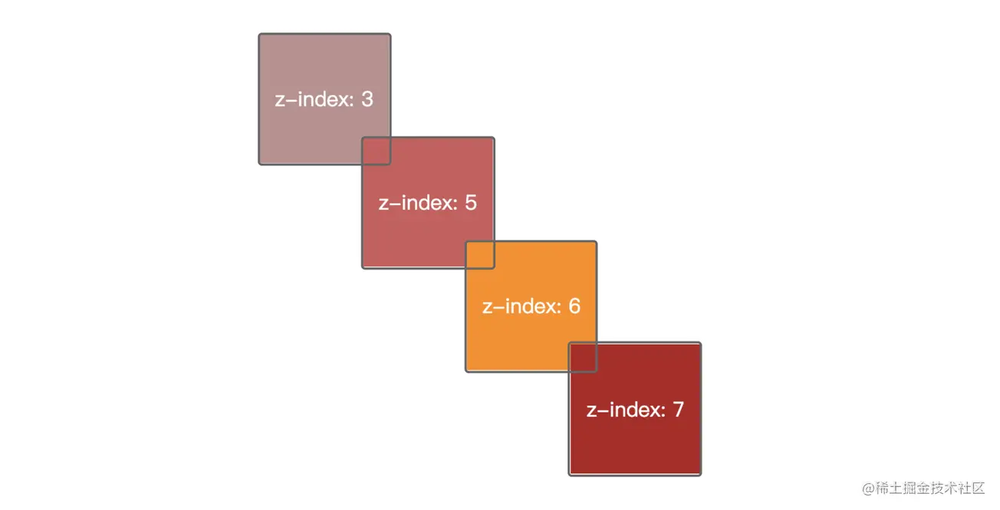

但实际上浏览器的 `层压缩` 机制会将多个隐式合成的渲染层压缩到同一个 GraphicsLayer 图形层中渲染，这样发生隐式合成的三个 div 最终会处于同一个合成层，这就是 `浏览器的层压缩`。

但是仍会存在一些特殊情况，浏览器不会进行层压缩，例如以下几种。

- 无法进行会打破渲染顺序的压缩 (squashingWouldBreakPaintOrder)

  [demo](./test/overlapzip.html)

  如果 `#overlap-child` 进行层压缩，会导致渲染顺序改变，其父元素 `#ancestor` 的 mask 属性将会失效，因此这种情况下是无法进行层压缩的。常见产生这种原因的情况有两种，一种是祖先元素使用了 mask ，另一种是祖先元素使用了 filter。

- video 元素的渲染层无法被压缩，同时也无法将别的渲染层压缩到 video 所在的合成层上 (squashingVideoIsDisallowed)

- 相对于合成层滚动的元素也无法被压缩 (scrollsWithRespectToSquashingLayer)

- 当渲染层同合成层有不同的 `裁剪容器` 时 (也就是有 overflow 不为 visible)，该渲染层无法压缩（squashingClippingContainerMismatch）

- 当渲染层同合成层有不同的具有 opacity 的祖先层时该渲染层无法压缩 (squashingOpacityAncestorMismatch，同 squashingClippingContainerMismatch)

- 当渲染层同合成层有不同的具有 transform 的祖先层时该渲染层无法压缩（squashingTransformAncestorMismatch，同上)

- 当渲染层同合成层有不同的具有 filter 的祖先层时该渲染层无法压缩（squashingFilterAncestorMismatch，同上）

- 当覆盖的合成层正则运行动画时，该渲染层无法压缩 (squashingLayerIsAnimating) ，在动画未开始或结束后，该渲染层才可以被压缩

# 合成层的页面渲染优化机制

**优化：**

1. 合成层的位图会由 GPU 合成，比 CPU 处理快的多

2. 当需要 repaint 重绘时，只需要 repaint 合成层本身，不会影响到其他层

3. 提升为合成层后 transform 和 opacity 不会触发 repaint ，如果不是合成层，依然会触发 repaint

**弊端：**

1. 绘制的图层必须传输到 GPU 由 GPU 合成，这些层的数量和大小达到一定量级后，可能会导致传输十分缓慢，在一些低配设备上可能会出现闪烁

2. 渲染层提升很容易造成隐式合成的现象，从而导致产生过量的合成层，每个合成层都占用额外的内存，过多的使用内存可能会导致浏览器崩溃

# 基于合成层的优化

1. 动画使用 transform 实现

   对于一些体验要求较高的关键动画，比如一些交互复杂的玩法页面，存在持续变化位置的 animation 元素，我们最好是使用 transform 来实现而不是通过改变 left/top 的方式。

   这样是因为，如果使用 left/top 来实现位置变化，animation 节点和 Document 将被放到了同一个 GraphicsLayer 中进行渲染，持续的动画效果将导致整个 Document 不断地执行重绘，而使用 transform 的话，能够让 animation 节点被放置到一个独立合成层中进行渲染绘制，动画发生时不会影响到其它层。

   并且动画会完全运行在 GPU 上，相比起 CPU 处理图层后再发送给显卡进行显示绘制来说，这样的动画往往更加流畅。

2. 减少隐式合成导致的渲染层提升

   虽然隐式合成从根本上来说是为了保证正确的图层重叠顺序，但具体到实际开发中，隐式合成很容易就导致一些无意义的合成层生成，归根结底其实就要求我们在开发时约束自己的布局习惯，避免踩坑。

   可以把动画节点的 z-index 属性值设置得大一些，让层叠顺序高过于页面其他无关节点。不过不是盲目地设置 z-index ，有时候 z-index 也还是会导致隐式合成，这个时候可以试着调整一下文档中节点的先后顺序，让后边的节点覆盖前边的节点，而不用 z-index 来调整重叠关系。

3. 减小合成层的尺寸

   举个例子，分别画两个尺寸一样的 div，但实现方式有点差别：一个直接设置尺寸 100x100，另一个设置尺寸 10x10，然后通过 scale 放大 10 倍，并且我们让这两个 div 都提升为合成层

   ```css
   <style>
     .bottom, .top {
       position: absolute;
       will-change: transform;
     }
     .bottom {
       width: 100px;
       height: 100px;
       top: 20px;
       left: 20px;
       z-index: 3;
       background: red;
     }
     .top {
       width: 10px;
       height: 10px;
       transform: scale(10);
       top: 200px;
       left: 200px;
       z-index: 5;
       background: blue;
     }
   </style>
   <body>
     <div class="bottom"></div>
     <div class="top"></div>
   </body>

   ```

   通过 Chrome Devtools 查看这两个合成层的内存占用，可以看出 .bottom 内存占用是 39.1 KB，而 .top 是 400 B，差距十分明显。这是因为 .top 是合成层，transform 位于的 Composite 阶段，现在完全在 GPU 上执行。

   因此对于一些纯色图层来说，我们可以使用 width 和 height 属性减小合成层的物理尺寸，然后再用 transform: scale(…) 放大，这样一来可以极大地减少层合成带来的内存消耗。

4. 通过一些 CSS3 的属性开启硬件加速，这些属性变化不会引起回流重绘。

   对于一些属性，比如 background-color，属性值变化会引起回流重绘，不过可以通过硬件加速来提升性能。

   **常见的触发硬件加速的 css3 属性。**

   - transform: translate3d、translateZ
   - opacity
   - perspective
   - will-change

   为太多元素使用 css3 硬件加速，会导致内存占用较大，会有性能问题。应合理使用 CSS3 硬件加速，对于一些频繁引起回流重绘元素使用。

   在 GPU 渲染字体会导致抗锯齿无效。这是因为 GPU 和 CPU 的算法不同。因此如果你不在动画结束的时候关闭硬件加速，会产生字体模糊。

**补充：通过 Chome 浏览器查看层合成**

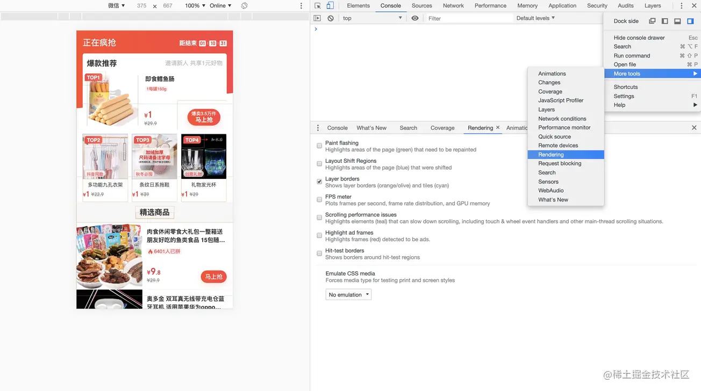
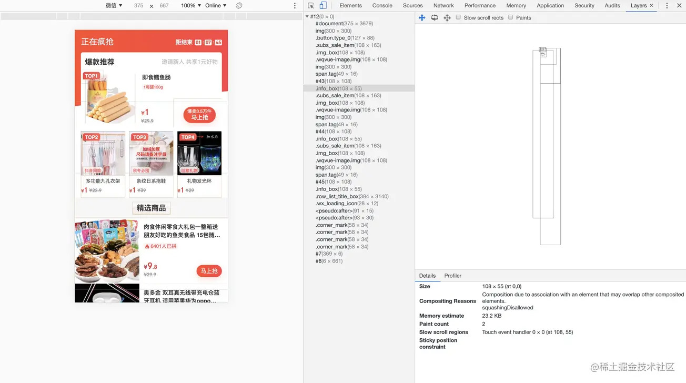

包括以下几个比较关键的信息：

- Size：合成层的大小，其实也就是对应元素的尺寸

- Compositing Reasons：形成复合层原因，这是最关键的，也是我们分析问题的突破口，比如图中的合成层产生的原因就是交叠问题

- Memory estimate：内存占用估算

- Paint count：绘制次数

- Slow scroll regions：缓慢滚动区域

# will-change 属性

will-change 帮助我们提前通知浏览器我们可能对元素的哪些属性发生更改，从而让浏览器预先知道如何优化将要发生更改的属性，例如动画，动画的准备工作往往比较昂贵，因此可以通过 will-change 预先告诉浏览器动画执行过程中要修改到的属性。

通过 will-change 减少硬件加速的启动成本，更快的更改和渲染元素，并且页面将能够快速更新，从而带来更流畅的体验。

例如，当我们需要在一个元素上使用 3D 变换时，元素及其内容会被提升到一个合成层，但是为元素创建一个合成层是一个较为昂贵的操作，它可能导致将要变换的动画的起始时间被延迟 1/n 秒，从而出现明显的 “闪烁” ，这里的闪烁指的是动画跳过了一部分渲染帧，展现了不一样的初始效果。

## will-change 副作用

will-change 是否会有副作用取决于在 will-change 中指定的属性。如果这个属性的非默认值会为元素创建一个层叠上下文，那么在 will-change 中指定该属性也将会创建该元素的层叠上下文。

例如，clip-path 与 opacity 属性取非默认值时，将会为应用了它们的元素创建层叠上下文。因此，在 will-change 中指定这些属性之一作为 will-change 的值，都将会为元素创建一个层叠上下文，甚至有可能在 change 发生之前创建。这同样也适用于其他会创建层叠上下文的属性。

另外，有一些属性可能导致固定定位的元素创建包含块。例如，一个 transform 的元素会为其所有定有定位的子元素创建一个包含块，即使是一个固定定位的元素。因此，如果一个属性会导致创建包含块，那么在 will-change 中指定这个属性也将会导致一个固定定位的元素生成包含块。

除此之外，will-change 对元素不会有直接的影响，它只是对浏览器起提示的作用。

## will-change 使用

will-change 可以让浏览器优化可能会变化的属性，但是我们不能为所有的元素的所有属性使用 will-change。

```css
*,
*::before,
*::after {
  will-change: all;
}
```

如上，这看起来这会告诉浏览器对所有的属性进行优化，但这其实是没有实际意义的。

1. will-change 并不能指定 all 作为属性值来表示所有属性，will-change 有可用的属性值列表(后续会讲到)。

2. 若确实有 all 这个属性值，那么浏览器会尽可能的尝试优化所有属性，为了优化属性，浏览器会为元素分配更多的资源，若像这样过度使用时可能会导致一些不良的影响，比如页面渲染速度变慢，甚至导致整个标签页的进程崩溃。

### 给浏览器足够的准备时间

除此之外，我们应该尽可能将 will-change 设置在发生更改的前一个状态，而不是正则发生更改的状态。

例如

```css
.element:hover {
  will-change: transform;
  transition: transform 2s;
  transform: rotate(30deg) scale(1.5);
}
```

这告诉浏览器在 hover 时对元素的 transform 属性进行优化，但这其实并没有多大作用。
我们可以试着想一下，当一个元素的改变已经发生了或是正在发生，这时候我们才通过 will-change 提示浏览器对改变进行优化，是不是有点太迟了，因为此时浏览器已经开始或结束了要发生的改变的准备工作，而且这样做也违背了 will-change(将要-改变) 这个属性的概念。

所以在使用 will-change 时我们一般将其放在要改变的状态的前一个状态。

就比如我们想在一个元素被激活时旋转 180° ，我们知道激活前一定会触发 hover 事件，因此我们可以在元素 hover 时添加 will-change。

```css
element {
  display: flex;
  border-radius: 50%;
  width: 40px;
  height: 40px;
  justify-content: center;
  align-items: center;
  background-color: skyblue;
  transition: transform 1s linear;
}

element:hover {
  will-change: transform;
}

element:active {
  transform: rotate(180deg);
}
```

然后我们可能会想，如果要在 hover 时触发动画呢，这时候我们可以这样做。

例如我们想在 hover 一个元素的时候让这个元素的字体颜色由半透明变为不透明，可以通过以下这种方式实现。

```css
.father {
  transition: opacity 1s linear;
}

.father:hover > .child {
  will-change: opacity;
}

.child {
  color: #000;
  opacity: 0.5;
}

.child:hover {
  opacity: 1;
}
```

通过在子元素的父元素发生 hover 时为子元素添加 will-change 的方式，我们也能够给浏览器一个准备优化变更属性的时间，当然还可以有其他的方式去实现，因为父元素发生 hover 时不代表子元素一定会被交互发生 hover ，不过这也是一种解决方式。

从悬停到用户点击元素，以及从父元素进入到子元素这大概会给浏览器 100ms 左右的时间(当然子元素占满父级 100% 时没有这么久)，这足够让浏览器对将要发生的改变做优化。

### 更改完成后删除 will-change

通过上述几个例子，我们大概了解了如何使用 will-change。 并且我们也知道 will-change 提醒浏览器对将要发生改变的属性进行优化会花费昂贵的代价，这会占用机器的部分资源，通常浏览器对属性的改变进行优化的行为，会在优化发生后尽可能快的回到正常的状态。但是 will-change 会保持更久的浏览器的优化行为。这也是为什么我们前两个例子中不直接在元素中直接声明 will-change 的原因。

因此为了不让已经发生优化的更改保持更长的优化行为，我们可以通过 js 设置和取消 will-change。通过脚本，我们可以向浏览器声明需要优化的更改行为，然后监听更改行为，在更改完之后删除 will-change 。

例如，我们可以监听元素（或其祖先）何时悬停，然后在发生 mouseenter 时设置 will-change，并且监听动画的结束事件 animationend ，在动画执行结束时移除 will-change 。

```js
var el = document.getElementById("element");

el.addEventListener("mouseenter", hintBrowser);
el.addEventListener("animationEnd", removeHint);

function hintBrowser() {
  this.style.willChange = "transform, opacity";
}

function removeHint() {
  this.style.willChange = "auto";
}
```

当然，如果一个元素会频繁的与用户进行交互，并且不断的触发更改，这时候我们就没有必要考虑太多，可以直接在元素本身添加 will-change 并指定要发生更改的属性。

### will-change 属性值

will-change 可能的属性值如下： auto、scroll-position、contents 以及 <custom-ident>。

- auto 默认值，没有指定属性，浏览器不会进行任何优化

- scroll-position 表示之后我们想随时更改元素的滚动位置

  我们知道浏览器通常只渲染滚动窗口中的可见内容，以及部分超出窗口的不可见内容，并且会平衡跳过的渲染节省的内存和时间，使滚动看起来更舒适

  使用 scroll-position 可以进一步优化浏览器对滚动的渲染，以便可以平滑地完成更长和更快的内容滚动，浏览器会准备并显示超出滚动元素的 滚动可视区域的内容 ，这听起来用在 懒加载|虚拟列表 中是不错的。

- contents 表示元素的内容预计会发生变化

  浏览器通常会随着时间 “缓存” 元素的渲染，因为大多数元素不会经常改变，或者只是改变它们的位置。

  浏览器将读取 `will-change: contents` 作为 **对元素进行较少缓存** 或 **完全避免对元素进行缓存** 的信号，因为如果元素的内容定期更改，那么对元素的内容进行缓存是无用的，也会造成时间的浪费，因此浏览器将停止缓存，并在其内容更改时继续从头开始渲染元素。

- <custom-ident> 用于指定我们希望更改的一个或多个属性的名称，如果是多个属性，属性之间通过逗号分隔

  <custom-ident> 排除了 will-change，none，all，auto，scroll-position 和 contents，除了前面这些关键字，还排除了 [<custom-ident>](https://drafts.csswg.org/css-values-3/#identifier-value)。因此，`will-change: all` 这样的用法是无效的且会被浏览器忽略。

从上面四个属性我们可以发现，浏览器不会对大多数属性的更改进行优化。并且指定 will-change: all 虽然是无效的，但是浏览器并不会对它发出警告，因为它根本没有效果。

###

`参考文章：`
[Everything You Need to Know About the CSS will-change Property](https://dev.opera.com/articles/css-will-change-property/)

# GPU 绘制为什么比 CPU 快

图形处理单元 (Graphics Processing Unit，GPU)，位于计算机的显卡上，负责处理和渲染图形。并且 GPU 专门为执行图形渲染所需的复杂数学和集合计算而设计，将图形渲染的操作放在 GPU 可以产生巨大的性能提升，还可以减少移动设备上的 CPU 资源的争用。

[GPU Accelerated Compositing in Chrome](https://www.chromium.org/developers/design-documents/gpu-accelerated-compositing-in-chrome/)

**GPU 工作原理 | 数据处理流程**

1. 将每个复合层绘制成一个单独的图像

2. 准备层数据，如尺寸、偏移量、透明度

3. 准备动画着色器

4. 将数据发送到 GPU

5. GPU 渲染完成后将渲染结果存放到帧缓冲区

6. 视频控制器按照 VSync 信号逐行读取帧缓冲区的数据，经过数字信号到模拟信号的转换后传递给显示器显示

**优势**

1. GPU 上合成图层可以在涉及大量像素的绘图和合成操作中实现比 CPU 更好的效率，GPU 本身就是为了这些类型的工作而设计的

2. GPU 上的内容不需要昂贵的回读（例如加速视频 Canvas2D | WegbGL）

3. CPU 和 GPU 之间并行，可以同时运行以创建高效的图形管道

4. GPU 优化了图像高度并行浮点数运算，在图像处理方面用硬件往往会更快

# 页面渲染的不良现象

## 白屏

因为 渲染树 的构建需要先构建 DOM 树和 CSSOM 树，如果 CSS 样式防在 HTML 的尾部，由于 CSS 未加载完成，浏览器迟迟未渲染，从而会导致白屏现象；

另外也有可能是因为 JS 资源防止了头部，JS 的执行挂起了 GUI 线程阻塞了渲染树的构建；

现在我们说说的白屏现象一般指的是浏览器初次加载页面时的白屏，这种情况往往是由于单页面应用程序的整个资源过于庞大加载慢导致的。

## 无样式内容闪烁 (FOUC)

由于浏览器渲染是在 CSS 加载前，先呈现 HTML ，这就会导致展现出无样式内容的情况，然后样式又突然出现。

# 浏览器垃圾回收 !!!!

程序工作过程中会产生很多垃圾，这些垃圾是程序不用的内存或者是之前用过了以后不会再用的内存空间，垃圾回收机制就是负责回收垃圾的。

例如创建了一个变量它的值是一个对象，而后来又重新赋值了这个变量的值为一个数组，那么该变量就从引用对象变成了引用一个数组，之前的对象引用关系就没有了，也就是无用的对象，如果像这样无用的对象多了内存占用就会越来越高，可能会影响系统性能，因此需要引入垃圾回收机制。

垃圾回收其实就是一个发现不可访问的对象并清理的过程，而 js 垃圾回收机制就是定期找出(实时找出并释放开销大)不再用到的内存并将其释放。

而关于垃圾回收就涉及到垃圾回收的策略，常见的有标记清除法、引用计数法：

- 标记清除法
  分为标记和清除两个阶段，活动对象的简单来说就是不可达的对象。

  - 标记，为所有**活动对象**上做标记
  - 清除，把没有标记的对象，也就是**非活动对象**销毁

  引擎在执行标记清除策略的垃圾回收时，需要从出发点去遍历内存中所有的对象去打标记，而这个出发点有很多，常称之为一组根对象，在浏览器中根对象包括又不仅仅是 window、dom 等。

  标记清除算法流程

  1. 垃圾收集器在运行时会给内存中的所有变量都加上一个标记，假设内存中都是非活动对象全标记为 0
  2. 然后从各个根对象开始递归遍历，把不是垃圾的节点改为 1
  3. 清理所有标记为 0 的垃圾，销毁并回收它们占用的内存空间
  4. 最后把所有内存中的对象标记修改为 0，等待下一轮垃圾回收

  **优点：**实现简单

  **缺点：**清除之后，剩余的对象内存位置是不变的，也会导致空闲内存空间是不连续的，就会出现**内存碎片**，并且由于剩余空闲内存不是一整块，而是由不同大小内存组成的内存列表，这就会牵扯到内存分配的问题。标记清除算法采用的是首次适应的内存分配策略，是一个时间复杂度为 O(n)的操作，最坏情况是每次都要遍历到最后，同时因为碎片化，大对象的分配效率会会更慢。

  解决标记清除算法缺点的方法：标记清除算法的缺点在于清除之后剩余的对象位置不变而导致的空闲内存不连续，可以通过**标记整理算法**(操作系统中的动态重定位分区分配+紧凑)有效解决，就是在标记清除阶段，会将不需要清理的对象向内存的一段移动，最后清理掉边界的内存，并且为每个对象返回新的数据的起始地址。(如果只是紧凑会引来新的问题，就是每一次紧凑都需要对移动了的数据的地址进行修改，这回大大影响系统的效率，所以需要动态重定位分区分配)

- 引用计数法
  一种早先的垃圾回收算法，把对象是否不再需要简化定义为对象有没有其他对象引用到它，如果没有引用该指向对象，则该对象将被垃圾回收机制回收。

  它的策略是跟踪记录每个变量值的使用次数。

  - 当声明了一个变量并且将一个引用类型赋值给该变量的时候这个值的引用次数就为 1
  - 如果同一个值又被赋给另一个变量，那么引用数加 1
  - 如果该变量的值被其他的值覆盖了，则引用次数减 1
  - 当这个对象的引用次数变为 0 时，就说明该对象是个非活动对象
  - 垃圾回收机制就会清理掉引用次数为 0 的值占用的内存

  **优点：** 引用计数法会在对象变成垃圾的那一刻被回收，所有可以立即回收垃圾

  **缺点：** 引用计数法需要为每个对象创建一个计数器，这个计数器需要占据很大的空间，而且也不清楚被引用的次数上限，另外引用计数法无法解决发生循环引用时的回收问题。

- 分代式垃圾回收

  分代式垃圾回收是 v8 引擎对标记清除法的优化，v8 引擎将堆内存分为新生代和老生代两区域，采用不同的策略管理垃圾回收。

  新生代的对象为存活时间较短的对象，也就是新产生的对象，通常只有 1-8M 的容量，而老生代的对象为存活时间较长或常驻内存的对象，也就是经历过新生代垃圾回收后还存活下来的对象，容量通常比较大。

  对于新生代和老生代两块内存区，v8 引擎采用了两个垃圾回收器来管控。

  新生代对象的垃圾回收采用的是 Scanvenge 的算法进行垃圾回收，而在 Scanvenge 算法具体实现中 ，主要采用了一种复制式的方法 Cheney 算法。
  Cheney 算法将新生代区的堆内存一分为二，一个使用区一个是空闲区，新加入的对象会被存放到使用区中，当使用区**快被写满时**就要执行一次垃圾回收操作。它采用的是标记清除的算法，将使用区中的活动对象做标记，标记完后将使用区的活动对象**复制**进空闲区并进行排序，随后垃圾回收器会清理使用区中剩余的非活动对象，最后将使用区与空闲区的身份的互换，原来的使用区变为空闲区，原来的空闲区变为使用区。

  当一个对象经过多次复制后依然存活，就会被认定为是常驻内存(生命周期较长)的对象，随后会被移动到老生代中，采用老生代的垃圾回收策略进行管理。另外如果复制对象到空闲区时空闲区的空间占用超过了 25%，那么这个对象会被复制到老生代空间中，之所以是 25%的比例是因为 Scanvenge 回收后，空闲区将翻转为使用区，继续进行对象内存的分配，如果占比过大会影响后续内存的分配。

  老生代中的对象占据的内存往往比较大，如果使用复制式的方法会非常耗时，所以 V8 引擎对老生代内存区的垃圾回收就直接采用了标记清除法(所有对象全标记为 0->从各个根节点开始把活动对象标记为 1->清除标记为 0 的垃圾->所有对象标记为 0 等待下一轮回收)

  **优点：** 分代式垃圾回收把对象分为了新生代和老生代，采用一小块清理频率较高内存的用作为新生代的内存区，而一些占据空间大，且常驻内存中的对象作为老生代。新生代和老生代采用不同回收策略以及回收的时间频率是不同的，对垃圾回收有很大程度的提升。

- 新生代内存区的并行回收优化

  因为 js 是单线程的语言，那么在进行垃圾回收时就需要停止原本线程上正在执行的工作，转而执行垃圾回收，那么每执行一次垃圾回收就需要暂停原来的工作，如果每次暂停的时间过长，就会引起页面卡顿的问题。所以就引入了并行回收的机制，并行也就是同一时刻有多个任务在不同的处理机上同时执行的意思。

  V8 引擎通过引入辅助线程，负责新生代内存区垃圾清理操作，辅助线程需要将活动对象复制到空闲区，也需要同步更新栈中引用这些对象的内存区起始地址。

- 增量标记与惰性清理

  新生代内存区采用了并行回收的方式优化，但是老生代内存区存放的都是一些占据空间比较大的对象，对于这些对象哪怕使用并行回收的方式也会消耗大量的时间。所以对老生代内存区引入了增量标记和惰性清理的概念。

  增量就是将每次垃圾回收器执行过程分次执行，每次执行完后就去执行原来的任务。  
   而为了配合增量算法需要用三色标记法，三色标记法使用两个标记位及一个标记工作表实现，分别用白、灰、黑三种颜色来表示未被标记的对象、自身被标记而对自身有引用对象未被标记及自身和引用对象都被标记。

  **流程：**最初所有的对象都是白色，然后垃圾回收器从一组根对象开始标记，先将该对象标记为灰色，而后从标记工作表中弹出对象并访问它的引用对象，将其自身由灰色转变为黑色，而引用对象转为灰色。按照这样的流程一直往下进行标记，最后所有活动对象都会被标记为黑色，剩下所有的白色对象都是非活动对象等待垃圾回收器回收。

  垃圾回收器可以通过当前内存中还有没有灰色节点来**判断整个标记是否完成**，在从运行任务进程变为垃圾回收时如果有灰色节点就继续从灰色节点进行标记，如果没有就执行垃圾回收。

  为了防止在垃圾回收器标记完一个对象为黑色后又有新的对象引用了该对象，从而导致这个引用对象的颜色为白色而被垃圾回收器回收的情况。使用**写屏障**的机制，就是将这个新的引用对象直接转为灰色，从而保证下次增量标记阶段可以正确标记。

  **惰性清理**就是如果当前的内存足以快速执行代码，就没有必要马上清理，让 js 脚本先执行。并且也无需一次性清理所有的非活动对象，可以逐一按需清理直到所有的非活动对象内存清理完毕，后面再接着执行增量标记。

总结：V8 的垃圾回收机制基于分代式垃圾回收机制，分代式垃圾回收机制中的新生代内存区采用多个辅助线程并行回收垃圾，而老生代内存区采用由辅助线程完成并发标记，并配合多个辅助线程采用增量的方式进行并行清理。

# 内存泄漏

- 使用了未声明的变量，从而意外的创建了一个全局变量，使得这个变量一直在内存中

- 设置了计时器却没有取消它，如果计时器的回调函数对外部变量存在引用关系的话，那么这个变量就会一直在内存中

- 获取了一个 DOM 元素的引用，而后面该 DOM 元素从 DOM 树中删除，但因为一开始保存了对这个元素的引用，也就导致它一直无法被回收

- 不合理的使用闭包，从而导致了某些变量一直被留存在内存中

# 设计一个渲染引擎

[你不知道的浏览器页面渲染机制](https://juejin.cn/post/6844903815758479374)

# 屏幕刷新率、帧率

[通俗易懂的 Android 屏幕刷新机制](https://juejin.cn/post/6976787089703010341)
[ VSYNC、三重缓存](https://allenvork.github.io/2018/10/15/ProjectButter/)

**帧 (Frame)** 指的是每一张画面。

**应用帧率（FPS，frames per second）** 显卡 1 秒钟渲染好并发送给显示器多少张画面，也就是每秒钟能渲染的画面数又或是帧数。

**屏幕刷新率** 是显示器的硬件性能参数，也就是显示器每秒钟能够刷新几幅画面，一般用物理单位 Hz 表示。显示器是的面板是由物理像素铺满的，例如 1080P 的分辨率，也么就是 1080\*1920 个像素点，即每行 1080 个像素，每列 1920 个像素。

一般把显示器画完一行的 1080 个像素叫做行扫描，把 1920 行全部画完叫做场扫描，开始扫描第一行的物理信号称为水平同步信号（`HSYNC`），把开始扫描一场的物理信号叫为垂直同步信号（`VSYNC`）。

VSYNC 与屏幕刷新率直接相关，显示器每秒钟能够画完多少场就有多少个 VSYNC 信号，也就是屏幕的刷新率。目前大部分手机的屏幕刷新率是 60 Hz，也就代表着每秒钟会产生 60 个 VSYNC 信号，手机屏幕每秒钟会刷新 60 次，显示 60 次画面，也就是每隔 16.6ms 从 `Buffer 缓冲区` 中取一帧的数据显示，所以理想的情况下就是 GPU 每绘制完一帧，显示器就从缓冲区中读取一帧来显示。

# 画面撕裂

当帧率与刷新率不一致时，就容易出现画面撕裂的现象。画面撕裂指的就是显示器把两帧或两帧以上的数据同时显示在同一个画面的现象。

## 拓展：显卡与数据流动到显示屏过程

[数据的流动——计算机是如何显示一个像素的](https://zhuanlan.zhihu.com/p/32136704)

显卡主要负责把主机向显示器发出的显示信号转换为一般电气信号（数模转换），让显示器明白个人电脑让它做什么。显卡的主要芯片叫“显示芯片”（Video chipset，也叫 GPU 或 VPU，图形处理器或视觉处理器），是显卡的主要处理单元。

显卡上有类似于 CPU 的存储器，称为显存。

数据离开 CPU 到的显示屏，中间经历的比较关键的步骤如下：

1. 从总线进入 GPU：将 CPU 送来的数据送到北桥（连接显卡等高速设备），再通过北桥送到 GPU

2. GPU 将处理完的数据送到显存

3. 从显存中读取出数据再送到 随机读写存储，数模转换器进行转换工作

4. 从 DAC 进入显示器，将转换完的模拟信号送到显示屏

我们知道画面撕裂是因为显示器把两帧以上的数据同时显示再同一画面上了。那我们可不可以在显示器显示完再绘制下一帧数据来解决呢？

因为 **图像绘制** 和 **屏幕读取数据** 使用的是同一个 `Buffer` ，显示器无法知道在读取数据的过程中 `Buffer` 是否被修改。由于屏幕是逐行扫描，扫描的过程中被打断仍然会从前面扫描的位置继续扫描，直到扫描完一场后才回到第一行等待下一次扫描，所以有可能存在 `Buffer` 里的数据还未被显示器扫描显示完就被重写的情况（也就是新一帧的数据覆盖了旧一帧的数据），也就出现了画面撕裂。

# 双缓存

针对于画面撕裂的问题，关键在于图像绘制与显示器读取都是使用的同一个 `Buffer` 里的数据。

那如果我们采用双 `Buffer` ，一个 `Buffer` 负责让显示器读取数据，另一个 `Buffer` 负责图像绘制写入数据，只要在每次显示器读取完数据之后交换两个 `Buffer` 的身份，这样就不会造成 画面撕裂 的现象了。

我们称负责显示器读取的 `Buffer` 为 `前缓存` ，负责图像绘制缓存数据的 `Buffer` 为 `后缓存` 。每当 `GPU` 绘制完一帧图像后，将图像数据写入到后缓存，并且，显示器在读取图像数据时只会从 `前缓存` 扫描读取，显示器在未扫描完这一帧数据时，前缓存中的数据不改变，屏幕就只会显示这一帧的图像，**避免了撕裂**。

使用双缓冲区的关键在于什么时候交换两个缓冲区的身份，我们显然不能在 `后缓存` 准备完这一帧数据后就进行交换，因为有可能 `后缓存` 准备好数据时，显示器还未读取完 `前缓存` 中的数据，这样仍然出现画面撕裂。

那我们延续之前的想法，在显示器扫描完这一帧数据后交换两者的身份。在显示器扫描完一帧数据后，需要回到第一行进行下次扫描，在这个间隙中屏幕没有刷新，我们可以在此时交换两个缓冲区的身份。

这需要引入前面介绍屏幕刷新率时的一个概念 `VSYNC` ，当显示器扫描完一场后会发出一个 `VSYNC` 信号，在发出 `VSYNC` 信号到回到第一行这个时间段我们称为 `VBlank` 阶段，这时候便发生缓存区身份的交换 `BufferSwap` ，`帧传递`。

这样只有在垂直同步信号 `VSYNC` 发出后，我们才会去交换两个缓冲区身份。即便 GPU 已经处理好了下一帧的数据存入了 `后缓存` ，但是由于此时显示器未扫描完 `前缓存` ，就不允许发生 `帧传递`。显卡此时就空载者，等待显示器扫描完的 `VBlank` 阶段。

# Jank 卡顿

在浏览器绘制的一帧内如果要处理的任务太多又或是耗时太长，会导致这一帧无法完成任务，造成页面渲染不连贯，就会出现页面卡顿的现象。例如，我们在打游戏时，经常会遇到同一帧画面在那显示很久没有变化，这就是所谓的 `Jank`。

## 场景 1

在最原始的，只有双缓冲，没有 VSync 影响下，它会发生什么：

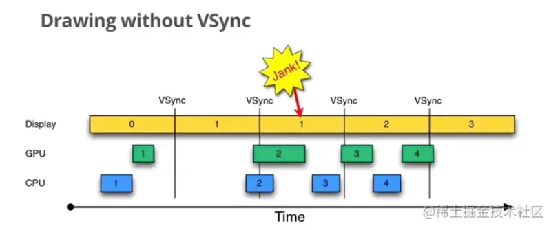

图中 Display 为显示屏， VSync 仅仅指双缓冲的交换。

1. Display 显示第 0 帧，此时 CPU/GPU 渲染第 1 帧画面，并且在 Display 显示下一帧前完成。

2. Display 正常渲染第一帧

3. 出于某种原因，如 CPU 资源被占用，系统没有及时处理第 2 帧数据，当 Display 显示下一帧时，由于数据没处理完，所以依然显示第 1 帧，即发生 `Jank` ，

上图出现的情况就是第 2 帧没有在显示前及时处理，导致屏幕多显示第一帧一次，导致后面的帧都延时了。根本原因是因为第 2 帧的数据没能在 VBlank 时（即本次完成到下次扫描开始前的时间间隙）完成。

上图可以看到的是由于 CPU 资源被抢，导致第 2 帧的数据处理时机太晚，假设在双缓存交换完成后，CPU 资源可以立刻为处理第二帧所用，就可以处理完成该帧的数据（当前前提是该帧的处理数据不超过刷新一帧的时间），也就避免了 Jank 的出现。

## 场景 2

在双缓冲下，有了 VSync 又会发生什么：

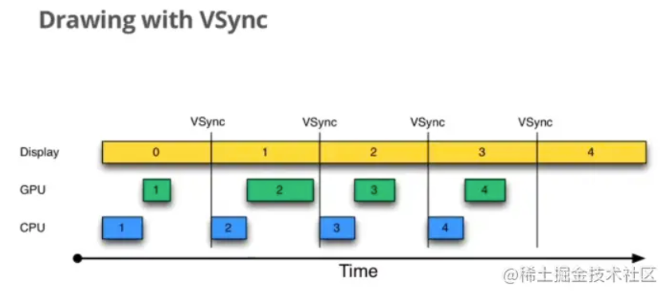

如图，当且仅当收到 VSync 通知（比如 16ms 触发一次），CPU 和 GPU 立刻开始计算然后把数据写入 Buffer。VSync 同步信号的出现让绘制速度和屏幕刷新速度保持一致，使 CPU 和 GPU 充分利用了这 16.6 ms 的时间，减少了 jank。

## 场景 3

如果界面比较复杂，CPU/GPU 处理时间超过 16.6ms 的话，实际情况又是怎么样：

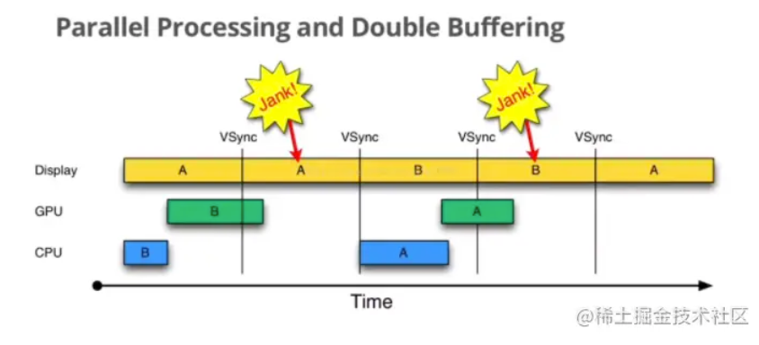

图中可以看出当第 1 个 VSync 到来时 GPU 还在处理数据，这时缓冲区在处理数据 B，被占用了，此时的 VBlank 阶段就无法进行缓冲区交换，屏幕依然显示前缓冲区的数据 A，发生了 jank。当下一个信号到来时，此时 GPU 已经处理完了，那么就可以交换缓冲区，此时屏幕就会显示交互后缓冲区的数据 B 了。

由于硬件性能限制，我们无法改变 CPU/GPU 渲染的时间，所以第一次的 Jank 是无法避免的，但是在第二次信号来的时候，由于 GPU 占用了后缓冲区，没能实现缓冲区交换，导致屏幕依然显示上一帧 A。由于此时，后缓冲区被占用了，就算此时 CPU 是空闲的也不能处理下一帧数据。增大了后期 Jank 的概率，比如图中第二个 Jank 的出现。

出现该问题本质的原因是，两个缓冲区各自被 GPU/CPU、屏幕显示所占用。导致下一帧的数据不能被处理。

# 三缓存

发生第二个 Jank 本质是因为两个缓冲区各自被 GPU/CPU、屏幕显示所占用。导致下一帧的数据不能被处理。

借鉴之前解决画面撕裂的思路，我们很容易想到再添加一个 `Buffer` ，可以称它为 `中 Buffer` ，在 GPU 还未处理完数据时，我们可以让 CPU 先在 `中 Buffer` 处理，接着在 GPU 处理完数据后，然 `中 Buffer` 与 `后 Buffer` 的身份交换，这样既不会影响到显示器读取 `前 Buffer`，又可以在 `后 Buffer` 中数据不能处理时，让 `中 Buffer` 来处理。

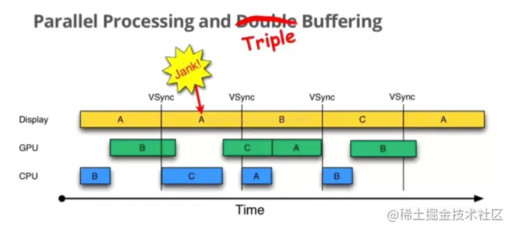

当第一个信号到来时，前缓冲区在显示 A、后缓冲区在处理 B，它们都被占用。此时 CPU 就可以使用中缓冲区，来处理下一帧数据 C。这样的话，C 数据可以提前处理完成，之前第二次发生的 Jank 就不存在了，有效的降低了 Jank 出现的几率。

到这里，可以看出，不管是双缓冲和三缓冲，都会有卡顿、延时问题，只是三缓冲下，减少了卡顿的次数。但并不是 `Buffer` 越多就越好，每一个 `Buffer` 都需要占据大量的内存， `Buffer` 越多系统需要在图像显示方面分配的内存越多，所有一般 `Buffer` 只要分配 3 个就足够了。
