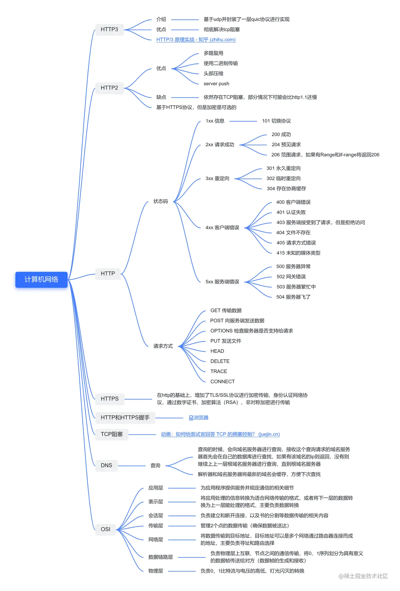
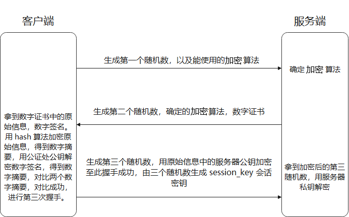
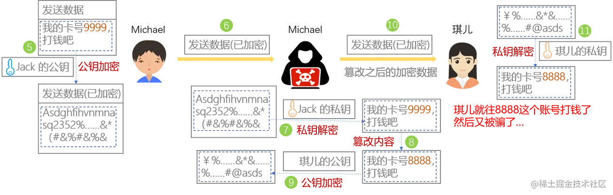
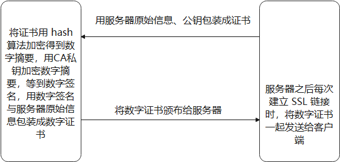

# 思维导图



# 一、OSI 七层体系结构

## 网络协议分层

1. 简化网络设计的复杂性，通信协议采用分层的结果，各层协议之间既相互独立又相互高效的协调工作。

2. 网络协议分层灵活性好，当任何一层发生改变时，只要确保层间接口关系保持不变，则这层以上或以下各层均不受影响。

3. 各层间是独立的，某一层不需要知道它的下一层是如何实现的，而仅仅需要知道该层通过层间的接口所提供的的服务。

4. 促进标准化工作。

## 应用层

应用层负责为应用程序提供服务,并规定应用程序中通讯相关的细节。常见的协议有 HTTP，FTP，TELNET、SMTP 等。

## 表示层

表示层将应用要发送的信息转换为适合网络传输的格式，或者将来自下一层的数据转换为上层能处理的格式。它主要负责数据格式的转换、加密解密以及编码压缩。常见的协议有 ASCII、SSL/TLS 等。

## 会话层

会话层作用是负责建立、管理和中断运输层实体之间的通信会话。常见的协议有 ADSP、RPC 等。

## 运输层

运输层负责两台主机进程之间的数据传输服务。代表性的协议： TCP 与 UDP。

## 网络层

网络层主要负责寻址和路由选择，确保将数据传输到正确的目标地址，以及用统一格式的 IP 地址屏蔽因数据链路层 MAC 地址体系不同而导致的复杂问题。代表性的协议：IP、ICMP 和 IGMP。

## 数据链路层

数据链路层负责信道上两个节点之间 mac 帧的传输，具有差错检验(CRC)、透明传输(转义符转义特殊字符)的功能。在两个相邻节点之间传送数据时，数据链路层将网络层交下来的 IP 数据报组装成帧，在两个相邻节点间的链路上传送帧。常见的协议有 HDLC、PPP、SLIP 等。

## 物理层

物理层实现相邻计算机节点之间比特流的透明传输，尽可能屏蔽掉具体传输介质与物理设备的差异。

# 二、TCP、UDP

## 1 TCP 协议与 UDP 协议的特点(区别)

- 用户数据报协议 UDP（User Datagram Protocol）

  - 无连接的
  - 尽最大努力交付
  - 面向报文（对于应用程序传下来的报文不合并也不拆分，只是添加 UDP 首部）
  - 没有拥塞控制
  - 支持一对一、一对多、多对一和多对多的交互通信
  - 首部开销小

- 传输控制协议 TCP (Transmission Control Protocol)

  - 面向连接的
  - 只能是点对点通信
  - 可靠交付
  - 全双工通信
  - 面向字节流

## 2 TCP 的端到端连接

每一条 TCP 连接有两个端点，TCP 连接的端点称为套接字/插口(socket)，格式（IP 地址 : 端口号）

每一条 TCP 连接唯一地被两端的两个端点确定

## 3 TCP 报文格式：


## 4 UDP 报文格式：


## 5 三次握手

TCP 之所以要进行三次握手，是为了建立客户端与服务端之间可靠的通讯通道，并通过握手确认客户端与服务端的状态信息。


- 假设 A 为客户端，B 为服务器端。
- 首先 B 处于 LISTEN（监听）状态，等待客户的连接请求。
- A 向 B 发送连接请求报文，SYN=1，ACK=0，选择一个初始的序号 seq=x。
- B 收到连接请求报文，如果同意建立连接，则向 A 发送连接确认报文，SYN=1，ACK=1，确认号为 ack=x+1，同时也选择一个初始的序号 seq=y。
- A 收到 B 的连接确认报文后，还要向 B 发出确认，确认号为 ack=y+1，序号为 seq=x+1。
- B 收到 A 的确认后，连接建立。

## 6 三次握手的原因

第三次握手是为了防止失效的连接请求到达服务器，让服务器错误打开连接。

客户端发送的连接请求如果在网络中滞留，那么就会隔很长一段时间才能收到服务器端发回的连接确认。客户端等待一个超时重传时间之后，就会重新请求连接。但是这个滞留的连接请求最后还是会到达服务器，如果不进行三次握手，那么服务器就会打开两个连接。如果有第三次握手，客户端会忽略服务器之后发送的对滞留连接请求的连接确认，不进行第三次握手，因此就不会再次打开连接。

## 7 四次挥手


## 8 四次挥手的原因

客户端发送了 FIN 连接释放报文之后，服务器收到了这个报文，就进入了 CLOSE- WAIT 状态。这个状态是为了让服务器端发送还未传送完毕的数据，传送完毕之后，服务器会发送 FIN 连接释放报文。

## 9 等待 2MSL 的原因

- 确保最后一个确认报文能够到达。如果 B 没收到 A 发送来的确认报文，那么就会重新发送连接释放请求报文，A 等待一段时间就是为了处理这种情况的发生。

- 等待一段时间是为了让本连接持续时间内所产生的所有报文都从网络中消失，使得下一个新的连接不会出现旧的连接请求报文。

## 10 TCP 可靠传输的工作原理

在不可靠的传输信道上，使用一些可靠的传输协议，如当出现差错时让发送方重传出现差错的数据的协议(ARQ)，同时在接收方来不及处理收到的数据时，及时告诉发送方适当降低发送速率的机制(流量控制)

### 停止等待协议

- 每发送完一个分组就停止发送，等待对方确认，在收到确认之后再发送下一个分组。发送方只要在设定的时钟时间段内没有收到确认，就会认为发送的分组丢失，重传刚才发送的分组。**注意：** 发送方在发送完一个分组后需要暂时保存分组；分组和确认分组都必须编号；超时重传时间应比数据在分组传输的平均往返时间更长一些。

- **确认丢失和确认迟到两种情况：** 如果确认丢失发送方在超时计时器过期后会认为刚刚发送的分组错误，重传分组，而接受方在收到第二次相同分组时，会直接丢弃该分组并重新发起该分组的确认；如果确认迟到，发送方同样重传分组，接送方丢弃后重传确认，发送方会接受最先到达的确认，并丢弃后面到达的无用确认。

- 停止等待协议固然是简单、可靠的协议；但是信道利用率太低，改进方法是采用流水线传输。

### 连续 ARQ 协议

- 发送方维持一个发送窗口，凡位于发送窗口内的分组可以连续发送出去，而不需要等待对方确认。接收方一般采用累积确认，对按序到达的 **最后一个分组** 发送确认， **表明到这个分组为止的所有分组都已经正确收到了** 。
- 具有停止等待协议可靠、易实现的优点，且信道利用率高；但连续 ARQ 协议可提高信道利用率。比如：发送方发送了 5 条 消息，中间第三条丢失（3 号），这时接收方只能对前两个发送确认。发送方无法知道后三个分组的下落，而只好把后三个全部重传一次。这也叫 Go-Back-N（回退 N），表示需要退回来重传已经发送过的 N 个消息。

## 11 以字节为单位的滑动窗口(这部分即是连续 ARQ 的实现)

- 发送窗口可以连续把窗口内的数据都发送出去，但是，凡是已经发送过的数据在未收到确认前都必须暂时保留，在收到一个累积确认后，将窗口的左指针缩小到累积确认的序号前一位，如接收方发送的累计确认序号为 42，则发送方窗口将为移到 43，并且已确认的数据均可移除保留的副本。

- 发送缓存暂时存放发送应用程序传送给发送方 TCP 准备发送的数据；TCP 已发送出但尚未收到确认的数据。

- 接收缓存暂时存放按序到达的、但尚未被接收应用程序读取的数据；未按序到达的数据。

## 12 流量控制

1. TCP 协议在接收方通过 TCP 报文中窗口字段控制发送方的发送窗口，窗口字段的值告诉对方：从本报文段首部中的确认号算起，接收方目前允许对方发送的数据量(以字节为单位)。

2. 接收窗口的大小用一个变量 rwnd 表示，在接收到报文窗口值为 0 的一端，会设置一个持续计时器，每当持续计时器到期，会发送一个 0 窗口探测报文段文，对方会对这个报文确认给出窗口值，如果为 0 重新启动持续计时器，如果不为 0 便可以重新发送数据。

## 13 拥塞控制

- 概念：在某段时间，若对网络中某一资源的需求超过了该资源所能提供的可用部分，网络的性能就要变坏，这种情况就叫拥塞。拥塞控制就是为了防止过多的数据注入到网络中，这样就可以使网络中的路由器或链路不致于过载。

  拥塞控制是一个全局性的过程，涉及到所有的主机，所有的路由器，以及与降低网络传输性能有关的所有因素。相反，流量控制往往是点对点通信量的控制，是个端到端的问题。流量控制所要做到的就是抑制发送端发送数据的速率，以便使接收端来得及接收。  
  为了进行拥塞控制，TCP 发送方要维持一个 拥塞窗口(cwnd) 的状态变量。拥塞控制窗口的大小取决于网络的拥塞程度，并且动态变化。发送方让自己的发送窗口取为 拥塞窗口和接收方的接受窗口中较小的一个。

- TCP 的拥塞控制采用了四种算法，即 慢开始、拥塞避免、快重传和快恢复。在网络层也可以使路由器采用适当的分组丢弃策略（如主动队列管理 AQM，路由器常常因为队列已满，然后以后再到达的分组将被丢弃，这就可能导致分组丢失，这时候发送方会出现超时重传现象，从而进入慢开始状态。采用 AQM 的原理就是不要等到路由器队列长度已经达到最大值是才丢弃，应该在队列长度达到某个警惕数值时便主动丢弃分组），以减少网络拥塞的发生。

## 14 拥塞控制算法

- 慢开始： 慢开始算法的思路是当主机开始发送数据时，如果立即把大量数据注入到网络，那么可能会引起网络阻塞，因为现在还不知道网络的符合情况。经验表明，较好的方法是先探测一下，即由小到大逐渐增大发送窗口，也就是由小到大逐渐增大拥塞窗口数值。cwnd 初始值为 1，每经过一个传播轮次，cwnd 加倍。

- 拥塞避免： 在拥塞窗口 >= 慢开始门限后，便采用拥塞避免算法，具体的思路是让拥塞窗口 cwnd 缓慢增大，即每经过一个往返时间 RTT 就把拥塞窗口的大小加 1。

- 快重传与快恢复：

  在 TCP/IP 中，快重传和恢复（fast retransmit and recovery，FRR）是一种拥塞控制算法，它能快速恢复丢失的数据包。没有 FRR，如果数据包丢失了，TCP 将会使用定时器来要求传输暂停。在暂停的这段时间内，没有新的或复制的数据包被发送。有了 FRR，如果接收方接收到一个不按顺序的数据段，它会立即给发送方发送一个重复确认。如果发送方接收到三个重复确认，它会假定确认指出的数据段丢失了，并立即重传这些丢失的数据段。有了 FRR，就不会因为重传时要求的暂停被耽误。当有单独的数据包丢失时，快速重传和恢复（FRR）能最有效地工作。当有多个数据信息包在某一段很短的时间内丢失时，它则不能很有效地工作。

**补充：** 

**如果出现了传输超时，则令慢开始门限变为 = cwnd / 2，然后重新执行慢开始。**

慢开始和快恢复的快慢指的是 cwnd 的设定值，而不是 cwnd 的增长速率。慢开始 cwnd 设定为 1，而快恢复 cwnd 设定为 ssthresh(慢开始门限)，这时候直接进入拥塞避免。发送方窗口的上限值应该是接收方窗口 rwnd 和拥塞窗口 cwnd 中较小一个即 上限值 = min(rwnd, cwnd)

## 15 TCP 粘包问题

[TCP 粘包是什么？ 为什么 UDP 不粘包？为什么 UDP 要冗余长度字段？](https://zhuanlan.zhihu.com/p/359177898#:~:text=%20%E7%B2%98%E5%8C%85%E5%87%BA%E7%8E%B0%E7%9A%84%E6%A0%B9%E6%9C%AC%E5%8E%9F%E5%9B%A0%E6%98%AF%E4%B8%8D%E7%A1%AE%E5%AE%9A%20%E6%B6%88%E6%81%AF%E7%9A%84%E8%BE%B9%E7%95%8C%20%E3%80%82%20%E6%8E%A5%E6%94%B6%E7%AB%AF%E5%9C%A8%E9%9D%A2%E5%AF%B9%20%22%E6%97%A0%E8%BE%B9%E6%97%A0%E9%99%85%22%E7%9A%84%E4%BA%8C%E8%BF%9B%E5%88%B6%E6%B5%81%20%E7%9A%84%E6%97%B6%E5%80%99%EF%BC%8C%E6%A0%B9%E6%9C%AC%E4%B8%8D%E7%9F%A5%E9%81%93%E6%94%B6%E4%BA%86%E5%A4%9A%E5%B0%91%2001,%E5%85%B6%E5%AE%9E%E7%B2%98%E5%8C%85%E6%A0%B9%E6%9C%AC%E4%B8%8D%E6%98%AF%20TCP%20%E7%9A%84%E9%97%AE%E9%A2%98%EF%BC%8C%E6%98%AF%E4%BD%BF%E7%94%A8%E8%80%85%E5%AF%B9%E4%BA%8E%20TCP%20%E7%9A%84%E7%90%86%E8%A7%A3%E6%9C%89%E8%AF%AF%E5%AF%BC%E8%87%B4%E7%9A%84%E4%B8%80%E4%B8%AA%E9%97%AE%E9%A2%98%E3%80%82%20%E5%8F%AA%E8%A6%81%E5%9C%A8%E5%8F%91%E9%80%81%E7%AB%AF%E6%AF%8F%E6%AC%A1%E5%8F%91%E9%80%81%E6%B6%88%E6%81%AF%E7%9A%84%E6%97%B6%E5%80%99%E7%BB%99%E6%B6%88%E6%81%AF%20%E5%B8%A6%E4%B8%8A%E8%AF%86%E5%88%AB%E6%B6%88%E6%81%AF%E8%BE%B9%E7%95%8C%E7%9A%84%E4%BF%A1%E6%81%AF%20%EF%BC%8C%E6%8E%A5%E6%94%B6%E7%AB%AF%E5%B0%B1%E5%8F%AF%E4%BB%A5%E6%A0%B9%E6%8D%AE%E8%BF%99%E4%BA%9B%E4%BF%A1%E6%81%AF%E8%AF%86%E5%88%AB%E5%87%BA%E6%B6%88%E6%81%AF%E7%9A%84%E8%BE%B9%E7%95%8C%EF%BC%8C%E4%BB%8E%E8%80%8C%E5%8C%BA%E5%88%86%E5%87%BA%E6%AF%8F%E4%B8%AA%E6%B6%88%E6%81%AF%E3%80%82)

# 三、应用层

## 1 HTTP(HyperText Transfer Protocol 超文本传输协议)

**本质：** 一种浏览器与服务器之间约定好的通信格式。

### 1.1 HTTP 请求

HTTP 报文结构主要由 `起始行+头部+空行+实体`

- 起始行

  - 请求报文，`请求方法` `URL` `协议版本`
  - 响应报文，`协议版本` `响应状态码` `原因`

- 头部

  - 报文头部字段名不区分大小写
  - 字段名不允许出现空格，不可以出现下划线 `_`
  - 字段名后必须为 `:`

- 空行

  用于区分头部和实体，如果头部中添加了一个空行，那么空行内容后面会全部视为实体。

- 实体

  实体就是真实的数据，请求报文对应请求体，响应报文对应响应体。一般来说 get 请求没有请求体。

### 1.2 HTTP 特点

1. 灵活可扩展。

   语义上自由，只规定基本格式，其他部分没有严格的语法限制。传输媒体多样，支持文本、图片、视频等任意数据。

2. 可靠传输。

   HTTP 协议基于可靠的传输层协议 TCP。(可以扩展 TCP 为何可靠)

3. 请求响应模式。

   HTTP 采用一方发送一方接收，并且有发送就会有响应的模式。

4. 无状态。

   每次 HTTP 请求都是独立的、无关的，并且默认不需要保留状态信息。

### 1.3 HTTP 缺点

- HTTP 是无状态的协议，在需要长链接的场景中，需要保持大量的上下文信息，以免传输大量重复的信息。

- HTTP 的整个传输过程都是明文传输，传输的信息直接暴露给了外界，很容易被截取。

- 队头阻塞，如果 HTTP 开启长链接，共用一个 TCP 连接，同一时刻就只能处理一个请求，如果一个请求耗时过长，其他请求就只能处于阻塞状态。

### 1.4 常见的请求方法有哪几种

- GET：常用于获取资源。(幂等)

- POST：提交数据，上传数据。(非幂等)

- PUT：修改数据。(幂等)

- DELETE：删除资源。(幂等)

- HEAD：获取资源的元信息，如用于确认资源更新的日期时间。

- PATCH：常用于对资源进行部分修改。(非幂等)

  PATCH 提供的实体则需要根据程序或其他协议的定义，解析后在服务器上执行，以此来修改服务器上的资源。换句话说，PATCH 会执行某个程序，如果重复提交，程序可能执行多次，对服务器上的资源就可能造成额外的影响。

- OPTIONS：查询指定的 URL 能够支持的请求方法，如 CORS 跨域时的预检请求。

- CONNECT：建立连接隧道，用于代理服务器。

- TRACE：常用于追踪请求到响应这个过程的传输路径。

**幂等方法：** 无论调用这个 URL 多少次，都不会有不同的结果的 HTTP 方法。(前提是服务器端的数据没有被人为手动更改。比如说，你数据库中的数据被手动更改过，那两次调用的结果肯定是变化的)

### 1.5 GET 与 POST 区别

GET 和 POST 请求的本质是相同的

**前提：** 基于 RFC 规范

- 作用不同，GET 多用于从服务端获取资源、POST 一般用来向服务端提交资源

- 参数传递方式不同，GET 请求一般通过 query 传参 、 POST 请求的参数一般是包含在 请求体 中

- 安全性不同，GET 请求参数直接暴露在 URL 上，所以 GET 不能用来传递敏感信息

- 编码方式不同，GET 请求只能进行 URL 编码，只能接受 ASCLL 字符；POST 支持多种编码方式 application/x-www-form-urlencoded、multipart/form-data。

- 缓存机制不同，GET 请求会被浏览器主动缓存，而 POST 需要手动设置；GET 请求参数会被完整保留在浏览器历史记录里，而 POST 的参数不会保留；GET 在浏览器回退时是无害的，而 POST 会再次提交请求。

- 从 TCP 角度来讲，GET 请求会把请求报文一次性发出，而大部分浏览器 POST 请求会分为两个 TCP 数据包，首先发送 header 部分，如果服务器响应 100 (表明继续操作)，然后发送 body 部分。(firefox 的 post 只发送一个 TCP 包)

补充：

1. 为什么 post 是两个 tcp 包呢？

   post 先去检测一下服务器是否能正常应答，然后再把 data 携带过去，如果应答不了，就没有了第二步数据传输。 就好像送快递的先打个电话给你看看你在不在家，在的话再送过去，以免不必要的资源浪费。

2. GET 方法的 URL 长度限制

   HTTP 协议并没有明确规定 GET 请求的 URL 长度，而是浏览器即服务器对 URL 长度进行了限制。

   - IE：2083 字节
   - chrome：8192 字节
   - 其他：大于 8192 字节

### 1.6 HTTP 响应状态码

- 1xx：信息性状态码，表示目前是协议处理的中间状态，还需要后续操作。

  - 100 Continue：常用于 POST 请求的第一个请求报文的响应，当服务器返回此代码表示已收到请求的第一部分，正在等待剩余部分。

  - 101 Switching Protocols：常用于在 HTTP 协议切换到 WebSocket 的时候，如果服务器同意变更，就会发生切换协议的状态码。

- 2xx：成功状态码，表示请求正常处理完毕。

  - 200 OK：服务器已成功处理了请求。

  - 204 No Content：请求已经成功处理，但是返回的响应报文不包含实体部分。

  - 206 Partial Content：常用在 HTTP **范围请求** 和 **断点续传** ，会带上响应头字段 Content-Range。

- 3xx：重定向状态码，表示需要进行附加操作以完成请求。

  - 301 Moved Permanently：永久性重定向。

    请求的网页已永久移动到新位置，服务器返回此响应时，会自动跳转到新的位置。

    若用户已经把原来的 URI 保存为书签，此时会按照 Location 中新的 URI 重新保存该书签。同时，搜索引擎在抓取新内容的同时也将旧的网址替换为重定向后的网址。

    例如服务器更换域名，旧的域名不再使用时，用户访问旧域名时服务器返回 301 的响应重定向到新域名。

  - 302 Found：临时性重定向。

    服务器目前从不同位置的网页响应请求，但请求者应继续使用原有位置来进行以后的请求。

    若用户把 URI 保存为书签，302 不会像 301 状态码那样更新书签，而是仍旧保留返回 302 状态码的页面对应的 URI。同时，搜索引擎会抓取新的内容而保留旧的网址。

    常用于登录到首页时自动重定向到活动页面、未登录的用户自动跳转到登录页面、访问 404 重定向到首页

  - 304 Not Modified：常用于协商缓存中服务器通知客户端资源未修改，可以继续使用缓存中的资源。

- 4xx：客户端错误状态码，说明客户端请求报文有误。

  - 400 Bad Request：请求报文中存在语法错误，但并没有具体出错原因。浏览器会像 200 OK 一样对待该状态码。

  - 401 Unauthorized：请求要求身份验证。

  - 403 Forbidden：请求的资源服务器禁止访问。

  - 404 Not Found：服务器无法找到对应资源(未找到)。

  - 405 Method Not Allowed：请求的方法服务器不支持使用。可以通过 OPTIONS 方法预检来查看服务器运行访问的方法。

- 5xx：服务端错误状态码，服务器处理请求出错。

  - 500 Internal Server Error：服务器在执行请求时发生错误，具体原因未知。

  - 502 Bad Gateway：作为网关或代理角色的服务器，从上游服务器（如 tomcat、php-fpm）中接收到的响应是无效的。

  - 503 Service Unavailable：服务器暂时处于过载或进行停机维护，暂时无法响应服务。

### 1.7 常见的头部字段

- 数据格式，Content-Type/Accept

  发送端如果要发送数据，需要在请求头中添加数据格式字段。

  - text: text/html、text/plain、text/css
  - image: image/gif、image/png、image/jpeg
  - audio/video：audio/mpeg、video/mp4
  - application：application/json、application/javascript
  - multipart：multipart/form-data、multipart/byteranges

- 压缩方式，Content-Encoding/Accept-Encoding

  指定数据的压缩方式，常见的值有 gzip、deflate、br

- 语言，Content-Language/Accept-Language

  用于指定支持的语言，如果支持多种语言用 `, ` 分隔；
  常见的值有 zh-CN、zh、en

- 字符集，Content-Type/Accept-Charset

  发送端将采用的字符集放在 Content-Type 中；
  格式：Content-Type: text/html; charset=utf-8；

- Web 认证信息，Authorization

- 客户端在这个域名下的 Cookie，Cookie

- HTTP 客户端程序的信息，User-Agent

- 响应报文
  Accept-Ranges (是否接受字节范围请求),
  Age (推算资源创建经过时间),
  ETag (资源的匹配信息),
  Location (令客户端重定向至指定 URI),
  Proxy-Authenticate (代理服务器对客户端的认证信息),
  Retry-After (对再次发起请求的时机要求),
  Server (HTTP 服务器的安装信息),
  Vary (代理服务器缓存的管理信息),
  WWW-Authenticate (服务器对客户端的认证信息)

### 1.8 HTTP 传输定长和不定长(分块传输)的包体

- 定长的包体涉及到 Content-Length 字段，如果手动将该字段的值设置的比传输的内容小，那么多余的字段会直接截取。如果设置的比传输内容大，响应的内容会出现错误。

- HTTP 通过分块传输不定长包体

  需要在响应头设置 Transfer-Encoding: chunked，开启这个字段后默认会采用长链接，并且 Content-Length 字段会被忽略。

  可以通过手动设置 Connection 字段为 keep-alive 开启长连接。

### 1.9 HTTP 的大文件传输(范围请求)

HTTP 通过服务器的**范围请求**来支持大文件传输，服务器端需要设置响应头的字段为 `Accpet-Ranges: bytes` 表明服务器支持范围请求。

而对于客户端需要指定要请求哪一部分的内容，通过设置请求头的 `Range` 字段，格式为`bytes=x-y` 例如 0-499、500- 分别表示开始到第 499 个字节、从第 500 个字节到文件终点。

服务器收到请求后，会验证客户端请求的范围是否违法，如果越界返回 416 状态码；否则会读取相应的片段，并返回 206 状态码。同时服务器需要添加 `Content-Range` 字段。

单段请求返回的响应：

```js
HTTP/1.1 206 Partial Content
Content-Length: 10
Accept-Ranges: bytes
Content-Range: bytes 0-9/100  // 0-9表示请求的范围，100表示总资源大小

i am xxxxx
```

多段请求返回的响应：

```js
HTTP/1.1 206 Partial Content
Content-Type: multipart/byteranges; boundary=00000010101
Content-Length: 189
Connection: keep-alive
Accept-Ranges: bytes


--00000010101
Content-Type: text/plain
Content-Range: bytes 0-9/96

i am xxxxx
--00000010101
Content-Type: text/plain
Content-Range: bytes 20-29/96

eex jspy e
--00000010101--

```

在 Content-Type 字段中指定了两个值，multipart/byteranges 表示请求是多段请求，而 boundary=00000010101 是响应体中的分隔符，并且在最后的分隔末尾添加上--。

### 1.10 HTTP 中表单数据的处理

表单的提交方式，一般使用 POST 将提交的数据放在请求体中，并且有两种不同的 Content-Type 取值：

- application/x-www-form-urlencoded
  - 数据会被编码成以 & 分隔的键值对
  - 字符以 URL 编码方式编码
- multipart/form-data
  - Content-Type 还会包含 boundary，由浏览器指定
  - 数据会分为多个部分，每个部分间通过 boundary 指定的分隔符分隔，最后的分隔符会加上`--`
  - 各部分均有 HTTP 头部描述子包体

一般表单的提交采用 multipart/form-data 而不是 application/x-www-form-urlencoded ，因为没有必要做 URL 编码，会增加耗时和空间的占用。

### 1.11 HTTP 缓存（属于 Web 性能优化，也称为浏览器缓存）

**概念：** 通过复用缓存资源，减少了客户端等待时间和网络流量，同时也能缓解服务器端的压力。

**缓存失效：** 手动刷新(f5)、右键刷新，强缓存失效协商缓存有效。强制刷新(ctrl+f5)，强缓存、协商缓存失效。

- 涉及的头部字段

  - Expires，`响应头`，资源的过期时间。
  - Cache-Control，`请求/响应头`，控制强缓存的逻辑。

  - Last-Modified，`响应头`，资源最近修改时间(配合 If-Modified-Since 使用)。
  - If-Modified-Since，`请求头`，资源最近修改时间。

  - Etag，`响应头`，资源标识，资源变化会导致 ETag 变化。
  - If-None-Match，`请求头`，缓存资源标识(配合 Etag 使用)。

- 强缓存，强制直接使用缓存  
  强缓存不会向服务器发送请求，直接从缓存中读取资源。在浏览器控制台的 network 选项中可以看到该请求返回 200 的状态码，并且 size 显示 from disk cache 或 from memory cache；

  - 约定过期时间 (Expires)

    - 浏览器第一次请求 a.js
    - 服务器发送 a.js 资源并设置的 Expires(资源过期时间)
    - 浏览器接收并缓存的 a.js ,记下该资源过期时间
    - 浏览器第二次请求 a.js 发现缓存中的 a.js 还未过期,直接使用
    - 浏览器第三次请求 a.js 发现 a.js 过期了，重新向服务器发请求获取资源

    **缺点：** 缓存过期以后，服务器不管 a.js 有没有变化，都会重新读取磁盘上的 a.js 文件发送给浏览器。

  总结：服务器在每次浏览器请求资源时，在响应头中设定资源的过期时间，只要过期时间未达浏览器就直接使用缓存中资源

  - 增加相对时间控制(Cache-Control)

    - max-age: 缓存最大过期时间
    - no-cache: 可以在客户端存储资源，每次都必须去服务端做新鲜度校验，来决定从服务端获取新的资源（200）还是使用客户端缓存（304）。
    - no-store: 永远不缓存

  总结：除了第一次请求，其他每次请求浏览器会先检查 Cache-Control，以 Cache-Control 为准，没有 Cache-Control 再用 Expires。Cache-Control 相对于 expires 可以实现更精细的缓存策略，所以优先级更高。

  **强缓存缺点：** 如果服务器上更新了资源浏览器并不会拿到最新的资源

- 协商缓存，和服务器协商确认缓存能否使用

  协商缓存会先向服务器发送一个请求，服务器会根据这个请求的请求头的一些参数来判断是否命中协商缓存;如果命中，则返回 304 状态码并带上新的响应头通知浏览器从缓存中读取资源。

  - 服务器告诉浏览器资源上次修改时间(Last-Modified/If-Modified-Since)

    - 浏览器第一次请求 a.js

    - 服务器发送 a.js 资源,并设置的 Last-Modified (最近修改时间)及过期时间

    - 当 a.js 过期时,浏览器带上 If-Modified-Since（等于上一次请求的 Last-Modified）请求服务器

    - 服务器比较请求头里的 If-Modified-Since 时间和服务器上 a.js 的最近修改时间

      - 一致，告诉浏览器：你可以继续用本地缓存(304),并不再返回 a.js
      - 不一致，读取磁盘上的 a.js 文件返给浏览器，同时告诉浏览器 a.js 的最近的修改时间以及过期时间

    **缺点：** 浏览器端可以随意修改 Exipres，导致缓存使用不精准；最近修改时间只能精确到秒(可能 a.js 在 1 秒内经常变动,并且 a.js 设置了无缓存)

  - 增加文件内容对比(Etag/If-None-Match)

    - 浏览器第一次请求 a.js

    - 服务器发送 a.js 资源,同时告诉浏览器资源过期时间以及相对时间（Cache-Control：max-age=10），以及 a.js 上次修改时间，以及 a.js 的 Etag。

    - 10 秒内浏览器再次请求 a.js，不再请求服务器，直接使用本地缓存。

    - 10 秒后，浏览器再请求 a.js，带上最近修改时间和设置在 If-None-Match 的的上次 Etag 值 。

    - 服务器收到浏览器的 If-Modified-Since 和 If-None-Match ，则比较 If-None-Match 和 a.js 的 Etag 值，忽略 If-Modified-Since 和 Last-Modified 的比较。

    - Etag 和 If-None-Match 一致，则 a.js 文件内容没变化，服务器告诉浏览器继续使用本地缓存（304）。

### 1.12 如果 ETag 的值改变了文件一定改变吗

这是不一定的，取决于服务器中 `ETag` 的生成算法。

比如 NGinx 中的 ETag 由 `Last-Modified` 和 `Content-Length` 组成，而 `Last-Modified` 由 `mtime` 组成，当编辑文件却未更改其内容时，又或是 `touch file` 时 `mtime` 也会改变，此时也会造成 `etag` 改变，但实际上文件内容是没有更改的。

**Etag 是怎么解决 last_modified，当编辑文件却未更改文件时间的问题？**

1. 此时文件大小有可能发生更改，ETag 会改变
2. 此时文件大小没有发生更改，ETag 不会改变。但这需要极其苛刻的条件：1s 内更改文件，并且保持文件大小不变。这种情况出现概率很低，因此忽略了

又比如服务器采用的是 `hash` 算法计算 `ETag` ，由于每次都会调用 `hash` 算法对文件遍历生成 `ETag` ，所以只要文件内容没有更改 `ETag` 也不会更改。

### 1.13 长连接和短连接

HTTP 1.0 默认没有 Keep-Alive ，需要手动设置 `Connection: keep-alive` 建立连接，若想关闭长连接，需要发送 `Connection: close` 字段。

- 长链接：客户端向服务端发起连接，服务端接受客户端连接，双方建立连接，客户端与服务端完成一次请求后，它们之间的连接并不会主动关闭，后续的读写操作会继续使用这个连接。长连接可以省去较多的 TCP 建立和关闭的操作，减少浪费，节约时间。服务端有保活功能(防止长链接无数据交互长期不关闭)。客户端与服务端之间的连接如果一直不关闭的话，会随着客户端连接越来越多，迟早服务端会崩溃。

  - 较少的 CPU 和内存的使用(因为减少了同时打开的连接数)

  - 允许请求和应答的 HTTP 流水线化

  - 降低网络拥塞(TCP 连接减少了)

  - 减少了后续请求的延迟(无需再进行握手)

  - 报告错误无需关闭 TCP 连接

  - 长时间没有使用的 TCP 连接导致系统资源无效占用，浪费系统资源

- 短连接：客户端和服务器每进行一次 HTTP 操作，就建立一次连接，任务结束就中断连接。管理起来比较简单，存在的连接都是有用的连接，不需要额外的控制手段。信道利用率低。

### 1.14 URI 和 URL 的区别是什么

- URI(Uniform Resource Identifier) 是统一资源标志符，可以唯一标识一个资源，用于区分互联网上的不同资源。

  **结构**：`scheme: // user:passwd@ host.domain:port / path / filename ? abc = 123 # 456789`

  - scheme，定义因特网服务的类型。常见协议有 HTTP、FTP 等
  - user:passwd@ 表示登录主机时用户信息，不安全一般不使用
  - host，域主机(http 默认的主机是 www)
  - domain，域名,比如 baidu.com
  - port，端口号
  - path，资源在服务器上的路径
  - filename，资源的名称
  - query，查询参数
  - fragment，表示锁定位的资源内的一个锚点，浏览器可以根据这个锚点跳转到对应位置。

  URI 只能使用 ASCII 码，ASCII 码外的字符不支持显示，通过引入编码机制将所有非 ASCII 码字符和界定符转为十六进制值，并在前面加 %。`空格被转义成了%20`

- URL(Uniform Resource Locator) 是统一资源定位符，可以提供该资源的路径.它是一种具体的 URI，即 URL 可以用来标识一个资源，而且还指明了如何定位到这个资源。

- 区别：URI 不提供定位到资源的方法

- **补充：** URI 包括 URL 和 URN，URN 是统一资源名称，用来定义一个资源的名称
  

### 1.15 如何让 HTTP 有状态(Cookie、Session)

#### Cookie

HTTP 是一种无状态协议。也就是说 HTTP 协议自身不对请求和响应之间的通信状态进行保存。

HTTP 为了实现有状态引入了 Cookie，本质上是浏览器中存储的一个很小的文本文件，内容以键值对的方式存储。

向同一个域名下发送请求，都会携带相同的 Cookie ，服务器便能通过 Cookie 拿到客户端的状态。在服务器中可以设置响应头的 Set-Cookie 字段对客户端写入 Cookie。在 Cookie 设置时便绑定了域名和路径，在发送请求前会对比请求的域名和路径是否匹配，不匹配请求头就不携带 Cookie。对于路径来说，如果使用 / 就表示绑定的域名下任意路径都允许使用 Cookie。

Cookie 的有效期可以通过 Expires(过期时间) 和 Max-Age(存活时间) 两个字段设置。

如果设置请求头带上了 Secure 就说嘛只能通过 HTTPS 传输 Cookie，如果 Cookie 字段添加了 HttpOnly ，则说明 Cookie 不能通过 js 访问(document.cookie)，只能通过 HTTP 协议传输。

Cookie 存储容量小，上限为 4kb、安全缺陷，会有 xss、csrf 攻击。

#### Session

那么我们保存用户状态呢？Session 机制的存在就是为了解决这个问题，Session 的主要作用就是通过服务端记录用户的状态。典型的场景是购物车，当你要添加商品到购物车的时候，系统不知道是哪个用户操作的，因为 HTTP 协议是无状态的。服务端给特定的用户创建特定的 Session 之后就可以标识这个用户并且跟踪这个用户了（一般情况下，服务器会在一定时间内保存这个 Session，过了时间限制，就会销毁这个 Session）。 在服务端保存 Session 的方法很多，最常用的就是内存和数据库(比如是使用内存数据库 redis 保存)。大部分情况下，通过在 Cookie 中附加一个 Session ID 来方式来实现 Session 跟踪(Cookie 禁用使用 URL 重写)。

### 1.16 HTTP 和 HTTPS 的区别

1. 端口：HTTP 默认端口为 80、HTTPS 默认端口为 443
2. 安全性：HTTP 是明文传输、HTTPS 是对称加密后传输
3. 资源消耗：由于 HTTPS 采用对称加密后进行传输，所以在服务器资源消耗上相对 HTTP 更大

### 1.17 HTTP `队头阻塞`解决方法

HTTP 队头阻塞是由于 HTTP 的 `请求-应答` 模型导致的，HTTP 规定报文必须一发一收，因此上一个请求没有收到响应，则会阻塞队列中后续请求的发送。

1. 采用并发连接，对一个域名允许分配多个长链接，等同于增加了任务队列，也就不至于一个队伍的任务阻塞其他所有任务。例如 Chrome 浏览器一个域名下支持并发 6 个长链接。

2. 域名分片，在一个域名下分出多个二级域名，并且它们指向同样的一台服务器，这样在多个域名下有多个长链接，能够并发的长链接数就更多了。

### 1.18 HTTP 1.0 和 HTTP 1.1 的主要区别是什么

- HTTP1.0 中默认采用短连接、HTTP1.1 中默认采用长链接，即默认开启 Connection:keep-alive，通过持久链接使多个 HTTP 请求复用同一个 TCP 连接。

- 新增缓存控制策略 `Etag`、`If-None-Match`

- 针对 HTTP 队头阻塞，采用并行连接、域名分配进行优化。

- 断点续传，范围请求 `range` 头域，允许只请求资源的某个部分

### 1.19 HTTP2 的改进(与 HTTP1.1 区别)

- 二进制分帧 (二进制协议)

  HTTP1.1 中，报文的头部必须是 ASCII 编码的文本，数据体可以是文本也可以是二进制。HTTP2 是完全的二进制协议，请求头部和请求体都是二进制。

  HTTP2 将原来 Header + Body 的报文格式拆分成了一个个二进制的帧，一个 HTTP2 连接上可以同时发送多个帧，用 `Headers` 头信息帧存放头部字段， `Data` 数据帧存放请求体数据，并且每个二进制帧可以设置优先级，让服务器优先处理重要的资源请求。

  二进制分帧层是处于应用层和传输层之间的中间层，所有信息都会从中经过转换。

- 数据流

  双方都可以给对方发送二进制帧，这种二进制帧的**双向传输的序列**，叫做`数据流(Stream)`。HTTP2 用 `数据流` 在一个 TCP 连接上进行多个数据帧的通信。

  二进制分帧实现了乱序发送，在每个帧上都有一个流标记，在接收方接收完毕，会按照标记位的拼接成一整条信息。因此发送方可以并行发送数据，接收方可以并行返回确定，无需按照顺序返回。

  乱序指的是 `不同 ID 的流` 是乱序的，但 `同一个 ID 的流` 的帧一定是按顺序传输的，二进制帧到达后对方会将 `Stream ID` 相同的二进制帧组装成完整的请求报文或响应报文。

- 多路复用

  HTTP 会存在`队头阻塞`的问题，通过 **并发连接** 和 **域名分配** 并没有从 HTTP 本身解决问题，只是增加了 TCP 连接。也会带来额外的问题，多条 TCP 连接竞争有限的带宽，优先级高的请求不能优先处理。

  HTTP2 的多路复用基于二进制分帧，二进制分帧后，服务器收到的将不是一个完整的 HTTP 请求报文，而是一堆乱序的二进制帧。这些二进制帧不存在先后关系，因此也就不会排队等待，也就没有 HTTP 队头阻塞的问题。并且多路复用也可以并行发送请求，无需等待前面的请求的响应。

- 头部压缩

  1. 头部会使用 gzip 或 compress 压缩后再发送；

  2. 支持 HTTP2 的浏览器和服务器会维护一份相同的静态表和动态表，以及内置一个哈夫曼编码表。

  静态表存储一些常见的头部，和一些常见的头部键值对。动态表初始时是空的，如果请求头头部字段命中静态表中的名称，那么就会将这份键值对加入到动态表中。这样下次请求或响应只需要用一个字节的 `索引号` 就可以表示，这个字节就是一个指向表中数据的地址。

  另外像 Cookie 字段的值就可以用哈夫曼编码，将所有出现的字符串加入到哈夫曼编码表，让多次出现的字符串的索引值尽可能短，传输时传输索引值，这样可以达到很高的压缩效率。

- 服务器推送

  HTTP2 中服务器不再是被动的接收请求，响应请求，它也能通过新建 `Stream` 向客户端发送消息。

  当 TCP 连接建立之后，如果浏览器请求一个 HTML 资源，服务器就可以在返回相应 HTML 资源的基础上将 HTML 中引用到的其他资源一起返回给客户端，减少客户端发送请求的次数。

  另外，如果浏览器有缓存服务器就可能发送不必要的数据浪费带宽，因此一般只有在对某资源第一次请求时实现服务器推送。

  服务器推送遵循同源策略。

  需要注意的是，HTTP2 下服务器主动推送的是静态资源，和 Websocket 以及 SSE 方式向客户端发送及时数据的推送是不同的。

### 1.20 TCP 队头阻塞

HTTP2 虽然解决了 HTTP 的队头阻塞问题，但并没有解决 TCP 的队头阻塞问题。

HTTP2 中将每个请求拆分成多个二进制帧，不同请求的二进制帧组合成 Stream，Stream 是 TCP 上的逻辑传输单元，这样 HTTP2 就达到了一条连接同时发送多个请求。

TCP 队头阻塞：在一条 TCP 连接上同时发送多个 Stream，假如此时第二个 Stream 的第三个二进制帧丢失，因为 TCP 的数据有严格的前后顺序，如果前面的数据没到达，就算后面的数据到达了也需要等待，这就造成了 TCP 阻塞。

### 1.21 基于 UDP 的 HTTP3

队头阻塞：因为 UDP 的数据包在接收端没有处理顺序，即使中间丢失一个包，也不会阻塞整条链接。

HTTP3 是基于 QUIC 层的应用层协议，只要是运行在 QUIC 是至上的 HTTP 协议就被称为 HTTP3。

HTTP3 对 TCP 的拥塞控制、流量控制做了改进将其应用在 UDP 上

拥塞控制

- 热拔插

  TCP 的拥塞控制策略需要在系统层面进行操作，HTTP 的拥塞控制在应用层操作，动态选择拥塞控制策略。

- 前向纠错

  一段数据被切分为 10 个包后，一次对每个包异或运算，异或运算结果作为前向纠错包与数据包一起传输，如果传输过程中有一个数据包丢失，那么可以根据剩余 9 个包以及前向纠错包推算出丢失的包的数据，也能用于校验数据正确性。

- 单调递增的 Packet Number

  使用 Packet Number 解决原始请求与超时重传请求 ACK 的歧义，例如一个包丢失了，那么它重传的包的 Packet 标识将是比原来的标识大的数。

- ACK Delay

  TCP 计算 RTT 没有考虑接收方收到数据和发送数据间的延迟，HTTP3 考虑了这段延迟。

- 更多的 ACK

  一般接收后回复都是发送一个 ACK，但每接收一个就返回一个 ACK 太麻烦了，所以采用了接收多个后再回复多个也就是 ACK BLOCK，TCP 采用了这样的机制，但是最多只能有 3 个 ACK BLOCK，HTTP3 最多可以有 256 个 ACK BLOCK。在丢包严重的网络下，更多 ACK BLOCK 可以减少重传次数。


## 2 常见的应用层协议

- HTTP：端口 80,TCP
- HTTPS，端口 443,TCP
- DNS：端口 53,UDP/TCP
- DHCP：端口 67/68,UDP
- FTP：端口 20/21,TCP
- TFTP(Trivial FTP,简单文件传输协议)：端口 53,TCP
- SMTP：端口 25,TCP
- TELNET：端口 23,TCP
- POP3(邮件读取协议)：端口 110,TCP
- IMAP(网际报文存取协议)：端口 143,TCP

# 在浏览器中输入 url 地址到显示主页的过程

## 流程

- **解析 url**，分析所需要使用的 `传输协议` 和请求的资源的 `路径`。对 `非法字符` 进行 `转义` 。

- **判断`资源`缓存**，判断请求的资源是否存在有效的缓存，如果存在就直接使用缓存，否则向服务器发起新的请求。

- **DNS 解析**，判断浏览器缓存、系统缓存中是否存在请求资源的域名对应的 IP 地址的缓存，如果存在拿到 IP 地址，不存在将域名发送给本地域名服务器，由本地域名服务器完成 DNS 解析的p过程。

- **三次握手**，应用层将 HTTP 报文下交给传输层由 TCP 进行三次握手建立连接，建立连接过程中会涉及到服务器的 MAC 地址，通过 ARP 地址解析协议获取。

- **(HTTPS 握手)**，如果使用的是 HTTPS 协议，在正式通讯前需要进行 SSL/TLS 的握手，通过握手确定通讯时每次发送数据包前用于加密的会话密钥以及加密方法

- **请求-应答**，正式开始通讯，发送由上层传递下来的 HTTP 报文加上 TCP 首部后的 TCP 包，服务器处理请求并返回请求的资源的响应。

- **浏览器解析 HTML 资源并渲染页面**，详细见浏览器章

- **中断连接，四次挥手**，如果采用的是长链接暂时内不中断，否则进行四次挥手中断连接。

## 1 DNS 解析域名获取 IP 地址


- 域名系统会先检测浏览器缓存中是否存在该域名对应的 IP 地址，如果有解析结束。

- 如果没有则会去系统缓存中的 hosts 文件查找是否存在相应的 IP 地址，如果没有就会把这个 IP 地址发送给 LocalDNS 本地域名服务器，由本地域名服务器帮我们查找 IP 地址。一般所有的域名查询在本地域名服务器查询时就已经结束，本地域名服务器承担了域名的解析工作。

如果是`移动设备`则不会有前两个步骤，而是直接向根域名服务器发起 DNS 查询。

- 主机向本地域名服务器的查询属于`递归查询`，递归查询就是如果主机所询问的本地域名服务器不知道被查询的域名的 IP 的地址，那么本地域名服务器就以 DNS 客户的身份，向其他域名服务器继续发出查询请求报文，而不是让主机自己进行下一步查询。因此，递归查询返回的查询结果要么是所要查询的 IP 地址，或者是报错表示无法查询到所需的 IP 地址。

- 本地域名服务器向根域名服务器的查询过程属于`迭代查询`，在根域名服务器收到本地域名服务器发出的迭代查询请求报文时，要么给出所要查询的 IP 地址，要么告诉本地服务器你下一步应该向哪一个顶级域名服务器进行查询，然后让本地域名服务器自己进行后续的查询。而在顶级域名服务器查询时也是类似的，要么告诉本地域名服务器下一步应该向哪一个二级域名服务器进行查询，要么告诉本地域名服务器该域名的 IP 地址，通过这样不断的迭代，找到该域名对应的 IP 地址或者是报错，然后本地域名服务器把结果返回给发起查询的主机。

迭代查询特点就是各级域名服务器不返回 ip 而是返回下一级的 DNS 服务器地址。

权威服务器：在根域名服务器、顶级域名服务器下认证的域名服务器

## 2 DNS 缓存

浏览器缓存，系统缓存，路由器缓存，ISP 服务器缓存，根域名服务器缓存，顶级域名服务器缓存，二级域名服务器缓存...

## 3 DNS 负载均衡

DNS 负载均衡，又叫做 DNS 重定向。CDN(Content Delivery Network)就是利用 DNS 的重定向技术，DNS 服务器会返回一个跟用户最接近的点的 IP 地址给用户，CDN 节点的服务器负责响应用户的请求，提供所需的内容。

## 4 DNS 劫持

- 劫持方法

  1. 本机 DNS 劫持

     通过一些手段让用户主机感染上木马病毒，通过病毒恶意修改本地 hosts 文件中的 DNS 配置。

  2. 路由 DNS 劫持

     入侵到用户的路由器中，修改路由器中的 DNS 缓存。

  3. 攻击 DNS 服务器

     攻击 DNS 服务器，通过某些手段感染 DNS 服务器的缓存，给用户返回恶意的 IP 地址，

- 防范方法

  1. 用户主机开启防火墙，防止恶意软件或木马病毒侵入计算机

  2. 改变路由器默认密码，防止攻击者修改路由器配置中的 DNS 缓存

  3. 企业的服务器可以准备多个域名，如果一个域名被劫持了可以使用另外一个域名

  4. 使用 HTTP DNS 代替 Local DNS

## 5 HTTPS

HTTPS 即 HTTP + SSL/TLS，HTTPS 协议需要在建立 TCP 连接后，进行 SSL 握手，客户端和服务端交换随机数确定会话密钥，在之后的数据通信中采用会话密钥进行加密(表示层)。

### SSL 握手的流程：

1. 客户端生成一个随机数(client random)、以及能使用的加密方法发送给服务端

2. 服务端接收该随机数和加密方法，并生成一个随机数(server random)，并携带加密方法和自己的数字证书一起发给客户端

3. 客户端接收该随机数(到此为止加密方法确定，因为如果能使用的加密方法不同在服务端接收到的时候就已经断开连接)，客户端再生成一个随机数并从数字证书中取出公钥，用公钥加密该随机数并发送给服务端

4. 服务端接收该随机数并用自己的私钥解密，到此三个随机数生成完毕，客户端和服务端用这三个随机数生成会话秘钥， **注意：** 前面两个随机数都是明文传输，只有第三个随机数采用非对称加密后再传输，因此 SSL 握手的安全性体现在**第三个随机数**。



### 中间人攻击

在 `2` 这个步骤中，公钥的存放如果不采用数字证书，可能会出现中间人攻击

中间人拿到服务端的公钥，保留在自己身上并替换为自己的公钥，重新发送给客户端。  
而客户端在收到请求拿到公钥后，便会用这个公钥加密自己要发送的东西发送给服务端。  
中间人截取了客户端的发送的加密数据，并用自己的私钥去解密，中间人修改客户端要发送 的信息为有害的信息，并用一开始截取的公钥加密发送给服务端。服务端用自己的私钥去解密，  
并执行了中间人修改后的有害操作。



解决这个问题的办法就是借助第三方公证机构，服务端将自己的公钥和自己的个人信息包装成一个证书，凡是收到这个证书的客户就能确定是服务端的公钥，再进行安全地传输。

### 数字证书

不过这个证书仍然可能被篡改，这时候就需要使用 `数字签名`，服务端将服务器信息、支持的 hash 算法及其他必要信息发送给 CA ，CA 用 `hash算法` 生成一个 `数字摘要`，只要`数字摘要`的内容被修改，使用该算法生成的 `数字摘要` 就会发生巨大改变。所以只要更改了服务器的原始信息，生成出来的摘要也会不相同，校验时自然不会通过。

然后 CA 用自己的 `私钥` 对 `数字摘要` 进行加密，生成`数字签名`，最后将服务端的`原始信息`与`数字签名`合并为`数字证书`，之后每次服务器要给客户端发送公钥时，就发送自己的数字证书。由于 `数字摘要` 由 CA 的 `私钥` 加密，因此如果 `数字签名` 被更改了，由 公钥 解密出来的内容也会不一致，保证了 `数字签名` 不被修改。

客户端收到数字证书后，从证书中拿到 `hash算法` 将数字证书上的服务端原始信息转化为 `数字摘要` ，再用已事先植入到浏览器的公证处的公钥对 `数字签名` 进行解密，也生成一个 `数字摘要`，所以如果此时服务端的信息被篡改了 `数字摘要` 就会出现很大的变动，所以就解决了中间人攻击的问题。



**证书中包括：签发者、证书⽤途、使⽤者公钥、使⽤者私钥、使⽤者的 Hash 算法、证书到期时间等。**

### 非对称、对称、散列加密

#### 非对称加密

我们拥有两个秘钥，一个是公钥，一个是私钥。`公钥是公开的`，`私钥是保密的` 只有自己知道，用公钥加密的数据，只有对应的私钥能够解密，用私钥加密的数据，只有对应的公钥能够解密。我们可以将公钥公布出去，任何想和我们通信的客户，可以通过我们的公钥对数据进行加密，这样就只有我们可以用私钥进行解密，也就能够保证数据的安全。

- 非对称加密加密的过程很慢，如果每次通信都采用非对称加密的话，会造成等待时间过长的问题。

- 通过非对称加密，可以实现信息一对多，服务器只要维持一个私钥就可以和客户端进行通信，但服务器发出的信息能够被所有客户端解密。

常见的非对称加密算法有 RSA、ECC、DH。

#### 对称加密

双方使用同一个秘钥对数据进行加密和解密，但是对称加密存在的问题就是如何保证秘钥传输的安全性，因为对称加密的秘钥会通过网络传输，一旦被其他人截取，那么整个加密过程就失效了，这时候就需要借助非对称加密来传输秘钥。

对称加密可以实现信息的一对一，通信双方共享相同的秘钥，由秘钥保证信息的安全，并且加密解密的速度快。服务器和 N 个客户端进行通信，需要维持 N 个秘钥记录，且不能修改秘钥。

常见的对称加密算法有 AES-CBC、DES、3DES、AES-GCM。

#### 散列函数 hash 加密

散列函数单向不可逆，对输入数据非常敏感，输出的长度固定，任何数据的修改都会改变散列函数的结果，可以用于 `防止信息被篡改` 并验证数据的 `完整性` 。

常见的散列函数有 MD5、SHA1、SHA256。
