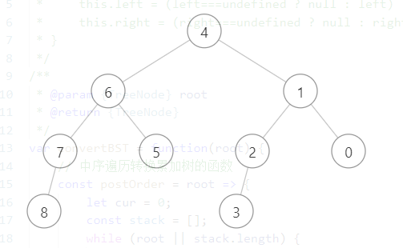

# 简单

## 双指针

### [移动零](https://leetcode.cn/problems/move-zeroes/solution/by-smasu-hgrg/)

#### **题目**

给定一个数组 nums，编写一个函数将所有 0 移动到数组的末尾，同时保持非零元素的相对顺序。

**请注意 ，必须在不复制数组的情况下原地对数组进行操作。**

**示例 1：**

```
输入: nums = [0,1,0,3,12]
输出: [1,3,12,0,0]
```

**示例 2：**

```
输入: nums = [0]
输出: [0]
```

提示:

1 <= nums.length <= 104  
-2^31 <= nums[i] <= 2^31 - 1

#### **题解**

1.  暴力枚举

    暴力枚举很简单，就是每次碰到 0 时，从后面找到一个非 0 的数，交换位置。

    ```js
    /**
     * @param {number[]} nums
     * @return {void} Do not return anything, modify nums in-place instead.
     */
    var moveZeroes = function (nums) {
        const n = nums.length;
        const swap = (nums, i, j) => ([nums[i], nums[j]] = [nums[j], nums[i]]);
        for (let i = 0; i < n - 1; i++) {
            if (!nums[i]) {
                let j = i + 1;
                // 找到非 0 的数，注意这里是 < n - 1
                while (!nums[j] && j < n - 1) {
                    j++;
                }
                swap(nums, i, j);
            }
        }
        return nums;
    };
    ```

2.  双指针

    这题的双指针思路并不是那么容易想到，我们试着用第一个示例模拟一下理想中的交换过程。

    1. 0 <-> 1
    2. 3 <-> 0
    3. 1 <-> 0
    4. 2 <-> 0

    理想中我们的交换过程就是这样的，遍历整个列表，在右指针遇见 `非 0 数` 时与 `连续的 0 中 最前面的那个 0` 交换。

    有一点需要注意的地方，如果左指针指向的是 `非 0 数` ，而右指针指向的也是 `非 0 数` 呢？

    上面的分析时，我们默认左指针指向的一直都是 0 ，而如果左指针指向的不是 0 呢？这就是本题比较细节值得思考的一个地方。

    就 `1 2 1 0 2 1 2` 这个例子来说，在遍历时，如果右指针为 `非 0 数` 那么我们就应该交换 `左右指针指向的数` 。

    初始时，左右指针都指向 0 ，并且它是 `非 0 数` ，那么我们交换它，这时候由于指向的是同一个位置，所以它是不变的。

    第二步，右指针往前移动一位，我们试着想想，这时候如果左指针是不变的，那它指向的还是 第一位，这时候由于第二位也是 `非 0 数` ，第一位和第二位交换，这就出现了我们不想要的结果。

    所以，你已经能够想到了，左指针也应该有自己的移动规则。你可能会想到两种移动左指针的情况：

    1. `非 0 数`时移动
    2. 0 时移动

    最简单的方法无非就是将这两者都代入试试，我们不妨先试试 1. 。

    因为右指针是不断往前进的（这是当然的，否则会无限循环）所以我们无需考虑它。

    而 `非 0 数` 时移动左指针，应该是右指针 `非 0 数` 时移动呢，还是左指针 `非 0 数` 时移动呢。

    <br>

    暂且不思考这个，换个角度，`非 0 数` 时，我们需要交换左右指针的数，所以我们为了符合预期，显然在左右指针都为 `非 0 数` 时，应让 左指针 和 右指针 指向下标相同，这样就不会出现交换和相对于原列表的顺序变化的情况（因为交换的是元素本身）。

    <br>

    所以，应该是 右指针 `非 0 数` 时移动左指针，因为这里我们一直是相对于右指针是否为 `非 0 数` 然后进行交换，并且交换完还会移动右指针，为了保持和右指针的行为一致，左指针也需要前进一位。

    <br>

    就这样一直前进，只有在右指针指向的数是 0 时，左指针才不会前进，但是这样就达到了我们的目标，让左指针一直指向`连续的 0 的第一个 0`。

    <br>

    将上述的行为进行编写，就能得到下面的代码，测试 -> 提交 -> 解决了。

    ```js
    /**
     * @param {number[]} nums
     * @return {void} Do not return anything, modify nums in-place instead.
     */
    var moveZeroes = function (nums) {
        let l = 0,
            r = 0;
        const swap = (nums, i, j) => ([nums[i], nums[j]] = [nums[j], nums[i]]);
        while (r < nums.length) {
            if (nums[r]) {
                swap(nums, l, r);
                l++;
            }
            r++;
        }
        return nums;
    };
    ```

    <br>

    那我们来考虑一下第 2 种情况， 0 时移动（扩展思维，可以不看这部分），这里的 0 时移动肯定也有两种情况，左指针 0 时移动，右指针 0 时移动。

    <br>

    以刚刚的例子 `1 2 1 0 2 1 2` ，对左指针的两种 0 时移动情况进行分析。

    实际上很明显，在右指针移动到 2 时，由于左指针没有移动，所以 1 会和 2 交换，这就不是预期的情况了。因此，两种 0 时才移动的方案都是不成立的，因为这时移动已经太晚了。

    <br>

    我们再扩展一下思维，如果题目要求的不是移动到末尾，而是移动到队头呢。

    hhh，也许你可以很快想到，倒序遍历。这是对的，我们只需要将原本的遍历的方向变为相反的就能够解决这个问题，代码如下。

    ```js
    /**
     * @param {number[]} nums
     * @return {void} Do not return anything, modify nums in-place instead.
     */
    var moveZeroesToHead = function (nums) {
        let l = nums.length - 1,
            r = nums.length - 1;
        const swap = (nums, i, j) => ([nums[i], nums[j]] = [nums[j], nums[i]]);
        while (r >= 0) {
            if (nums[r]) {
                swap(nums, l, r);
                l--;
            }
            r--;
        }
        return nums;
    };
    ```

### [回文链表](https://leetcode.cn/problems/palindrome-linked-list/solution/by-smasu-zr6w/)

#### **题目**

给你一个单链表的头节点 head ，请你判断该链表是否为回文链表。如果是，返回 true ；否则，返回 false 。

**示例 1：**


```
输入：head = [1,2,2,1]
输出：true
```

**示例 2：**


```
输入: nums = [0]
输出: [0]
```

提示:

-   链表中节点数目在范围[1, 105] 内
-   0 <= Node.val <= 9

**进阶：**你能否用 O(n) 时间复杂度和 O(1) 空间复杂度解决此题？

#### **题解**

此题需要你有 [反转链表](https://leetcode.cn/problems/fan-zhuan-lian-biao-lcof/) 的基础，如果还未掌握 [反转链表](https://leetcode.cn/problems/fan-zhuan-lian-biao-lcof/)，建议先去学习一下 [反转链表](https://leetcode.cn/problems/fan-zhuan-lian-biao-lcof/) 再回来解决此题。

1. 反转链表

    反转链表的思路很好想到，但在本题存在许多基础上的细节问题。  
    拿到这题时很快就写出了下面的代码。

    ```js
    /**
     * Definition for singly-linked list.
     * function ListNode(val, next) {
     *     this.val = (val===undefined ? 0 : val)
     *     this.next = (next===undefined ? null : next)
     * }
     */
    /**
     * @param {ListNode} head
     * @return {boolean}
     */
    var isPalindrome = function (head) {
        const reverse = (head, tail) => {
            let newHead = null;
            let cur = head;
            let tmp = null;
            while (cur !== tail) {
                tmp = cur.next;
                cur.next = newHead;
                newHead = cur;
                cur = tmp;
            }
            return newHead;
        };
        const reverseHead = reverse(head, null);
        let p1 = head,
            p2 = reverseHead;
        while (p1 && p2) {
            if (p1.val !== p2.val) return false;
            p1 = p1.next;
            p2 = p2.next;
        }
        return true;
    };
    ```

    反转链表模板啪的一下出来了，啪的一下， `Wrong Answer` ，hhh。  
    一开始还是很懵圈的，但是当你调试时试着输出一下 p1 和 p2 ，你就会恍然大悟。  
    JS 中，如果是对象，那么存在变量上的将只是一个地址，我们调用了 reverse(head, null)，  
    并且拿到翻转后的链表，但是原链表（翻转前）丢失了，因为当你执行 `cur.next = newHead` 这条语句时，
    它改变了原链表 head 指向的堆中的内容，所以原链表丢失了。  
    好的，怎么解决。在调用 reverse 前用一个变量保存 head 吗，no no no。  
    这是很多 JS 新手会犯的错误，因为用一个引用类型的变量去赋值，赋值的将会是个地址，因此也是同时改变了。  
    emmm，那咋办。很简单，在调用 reverse 前拷贝一份。  
    我们写一个 copy 函数，如下代码。再次提交，OK，success 。  
    乍一看，击败百分十几的人，并且，由于拷贝了链表，空间复杂度也是 O(n)，不过也是一种解答方案。  
    这题实际上不写 copy 函数也可以，只需要你再 reverse 迭代的过程中顺便拷贝一份也 OK，  
    不过为了可读性，选择多写个 copy 函数。

    ```js
    /**
     * @param {ListNode} head
     * @return {boolean}
     */
    var isPalindrome = function (head) {
        const copy = head => {
            let cur = head;
            const newHead = new ListNode();
            let p1 = newHead;
            while (cur) {
                p1.next = new ListNode(cur.val);
                p1 = p1.next;
                cur = cur.next;
            }
            return newHead.next;
        };
        const reverse = (head, tail) => {
            let newHead = null;
            let cur = head;
            let tmp = null;
            while (cur !== tail) {
                tmp = cur.next;
                cur.next = newHead;
                newHead = cur;
                cur = tmp;
            }
            return newHead;
        };
        const originHead = copy(head); // 拷贝源链表
        const reverseHead = reverse(head, null);
        let p1 = originHead,
            p2 = reverseHead;
        while (p1 && p2) {
            if (p1.val !== p2.val) return false;
            p1 = p1.next;
            p2 = p2.next;
        }
        return true;
    };
    ```

2. 快慢指针 + 反转链表

    除了反转整个链表，我们还能想到一个思路，就是反转后半段链表。  
    为了反转后半段链表，最关键的在于，如何找到中间节点。  
    奇数个节点数的链表和偶数个节点数的链表应该  
    如何找到它的中间结点，比如 1 -> 2 -> 5 -> 2 -> 1，它的中间节点是 5  
    而，1 -> 2 -> 3 -> 1 它的中间节点是应该 2 还是找 3 。  
    为了 **方便链表的反转** ，我们统一找 第 ~~(n / 2) 个节点，这样奇数偶数都合法。

    寻找中间节点，最简单的思路就是两次遍历，第一次遍历`计算链表长度`，  
    通过链表长度我们可以得到中间节点的位置，第二次遍历`找到中间节点`。

    ```js
    /**
     * @param {ListNode} head
     * @return {boolean}
     */
    var isPalindrome = function (head) {
        const reverse = (head, tail) => {
            let newHead = null;
            let cur = head;
            let tmp = null;
            while (cur !== tail) {
                tmp = cur.next;
                cur.next = newHead;
                newHead = cur;
                cur = tmp;
            }
            return newHead;
        };
        const getListLength = head => {
            let cur = head;
            let length = 0;
            while (cur) {
                length++;
                cur = cur.next;
            }
            return length;
        };
        const length = getListLength(head);
        const middle = ~~(length / 2); // ~~ 是向下取整运算符
        let p = head,
            i = 1;
        while (i < middle) {
            i++;
            p = p.next;
        }
        const reverseHead = reverse(p.next, null);
        p.next = null; // 截断链表，防止死循环
        let p1 = head,
            p2 = reverseHead;

        while (p1 && p2) {
            if (p1.val !== p2.val) return false;
            p1 = p1.next;
            p2 = p2.next;
        }
        return true;
    };
    ```

    上面的代码总体上来说是 3 次循环，一次计算长度，0.5 找中间节点，0.5 翻转链表，1 次比较。  
    总的时间复杂度并不比直接反转链表低(有 copy 的情况)，但是空间复杂度就将为了 O(1)。  
    虽然说，在力扣提交后的效率几乎是 `1.反转链表` 的一半，但具体哪里耗费了更多时间不是很清楚，可能是创建节点上吧。  
    不过，3N 虽然可以等效于 O(n) ，但是还是有点高，我们有没有办法不计算长度就能找到中间节点呢。

    这就需要双指针中的快慢指针的思路了，快指针每次走两步，慢指针每次只走一步，这样快指针走的  
    步数就是慢指针的两倍，最后慢指针将停留在链表中间的位置。

    思路听起来挺简单，但实际上快慢指针找中间也有许多技巧。  
    看看下面这段代码：

    ```js
    let slow = head,
        fast = head.next;
    while (fast && fast.next) {
        slow = slow.next;
        fast = fast.next.next;
    }
    ```

    整个快慢指针找中间节点最关键的就是上面的代码了，如果可以的话建议多写几道相关的题  
    有助于加深印象，当然还有其他的方法，不过上面这套代码通用性最强。
    至于怎么得到上述这段代码的，建议自己写几个示例模拟一下迭代过程是最清晰的。

    基于上述的代码，对前面计算长度的代码进行修改，就能得到下面的最终代码。
    下面的代码的时间复杂度为 O(n) ，并且总体上来说迭代次数为 2N 有很大的优化。

    ```js
    /**
     * @param {ListNode} head
     * @return {boolean}
     */
    var isPalindrome = function (head) {
        const reverse = (head, tail) => {
            let newHead = null;
            let cur = head;
            let tmp = null;
            while (cur !== tail) {
                tmp = cur.next;
                cur.next = newHead;
                newHead = cur;
                cur = tmp;
            }
            return newHead;
        };
        let slow = head,
            fast = head.next;
        while (fast && fast.next) {
            slow = slow.next;
            fast = fast.next.next;
        }
        const reverseHead = reverse(slow.next, null);
        slow.next = null;
        let p1 = head,
            p2 = reverseHead;
        while (p1 && p2) {
            if (p1.val !== p2.val) return false;
            p1 = p1.next;
            p2 = p2.next;
        }
        return true;
    };
    ```

3. 转为列表 + 首尾指针

    这也是一种方法，不过不大推荐，面试的时候这样写肯定被怼。

    思路很简单，将链表转为一个普通列表，然后用首尾指针法比较就可以，贴一下[官方题解](https://leetcode.cn/problems/palindrome-linked-list/solution/hui-wen-lian-biao-by-leetcode-solution/)的代码。

    ```js
    var isPalindrome = function (head) {
        const vals = [];
        while (head !== null) {
            vals.push(head.val);
            head = head.next;
        }
        for (let i = 0, j = vals.length - 1; i < j; ++i, --j) {
            if (vals[i] !== vals[j]) {
                return false;
            }
        }
        return true;
    };
    ```

## 位运算

### [汉明距离](https://leetcode.cn/problems/hamming-distance/solution/wei-yun-suan-by-smasu-wpxf/)

#### **题目**

两个整数之间的 汉明距离 指的是这两个数字对应二进制位不同的位置的数目。

给你两个整数 x 和 y，计算并返回它们之间的汉明距离。

**示例 1：**

```
输入：x = 1, y = 4
输出：2
解释：
1   (0 0 0 1)
4   (0 1 0 0)
       ↑   ↑
上面的箭头指出了对应二进制位不同的位置。
```

**示例 2：**

```
输入：x = 3, y = 1
输出：1
```

提示:

0 <= x, y <= 2^31 - 1

#### **题解**

-   位运算（一）

    **解题思路**

    看到这题就想到了位运算，判断当前位不相同的条件还想了一会 hh。  
    第一遍写出了下面的代码。（好像没见到题解有相同的解法，有的话当我没说 xixi）

    基本思路：

    1. 迭代两个数，直到两个数都为 0 为止
    2. 判断当前的数最后一位(最低位)是否为 1 (奇数的二进制的最后一位肯定为 1，偶数的二进制最后一位为 0)  
       比如 3 -> 11 ，4 -> 100
    3. 每次循环通过 `>>` 右移运算符，右移一位

    注释中详细解释了原因，没看懂的话是我的问题。

    ```javascript
    /**
     * @param {number} x
     * @param {number} y
     * @return {number}
     */
    var hammingDistance = function (x, y) {
        let count = 0;
        // 1. x || y 作为结束条件
        // 如果我们需要 x 或 y 其中一个为 0 时，结束条件应该为 x && y
        // 因为 0 && 0 将返回 前面的 0 ，而 0 || 0 将返回 后面的 0

        // 要搞清楚短路运算的流程，以及返回的是什么

        // && 符号，如果 左边的为真 ，则返回右边的，
        // 如，1 && 0 ，返回的将是 0，注意这里是 0 而不是 false ，很多人会以为返回的是 false
        // 实际上并不是，因为返回的是 0 ，在 if(0) 这个条件判断中会发生隐式类型转换
        // 你可以认为是 !!0 -> false，这是一个将类型转换为 boolean 的技巧，属于隐式类型转换

        // || 符号，如果 左边的为真 ，则返回左边的
        // 如，1 || 0 ，返回的将是 1，这里解释一下为什么 js 引擎会知道 || 左边的值是 true 呢
        // 实际上这里也发生了隐式类型转换，类似于上面说的，而这里发生了 !!1 -> true
        // 所以 就会返回 || 左边的值
        while (x || y) {
            // 2. ((x & 1) && !(y & 1)) || (!(x & 1) && (y & 1)) 判断最低位是否不相同
            // 为什么是这个条件呢？
            // 我们暂时只考虑 ((x & 1) && !(y & 1)) ，化简为 (x & 1) && !(y & 1)
            // 用题目的第一个例子 1 -> 001 和 4 -> 100
            // 通过肉眼能够很直观的得到 二进制位不同的位置的数目是 2
            // 因为  001
            //       100
            // 很明显有两个位置是不同的

            // 但是怎么将它的比较过程进行拆分，这是最重要的
            // 最简单的思路就是按最低位逐位进行比较
            // 1 0 应该如何比较呢？很明显一个是奇数一个是偶数
            // 这样你就得到了一个条件
            // 当 'x 为奇数且 y 为偶数' 时，此时最低位不同，分别为 1 和 0
            // 将其转化为代码就是 x % 2 === 1 && y % 2 === 0

            // 奇偶数的判断也能由位运算实现
            // 看看这个，x & 1 ,
            // 你可以试着去用几个例子去看看是否正确，如 3 & 1 = 1，2 & 1 = 0
            // 这样我们就将条件 x % 2 === 1 && y % 2 === 0 转化为 (x & 1 === 1) && (y & 1) === 0
            // 当然，如果你足够了解隐式类型转化，你可以简写为 (x & 1) && !(y & 1)
            // 这就得到了我们一开始提出的 ((x & 1) && !(y & 1)) 了
            // 这里多加个括号只是为了方便之后与 || (!(x & 1) && (y & 1)) 合并后代码更清晰

            // || 右边的条件 (!(x & 1) && (y & 1)) 与 ((x & 1) && !(y & 1)) 类似
            // 只是此时我们考虑的是 'x 为偶数，y 为奇数' 的情况，具体与上面相同就不再重复了
            if ((x & 1 && !(y & 1)) || (!(x & 1) && y & 1)) {
                count++;
            }

            // 3. x >>= 1, y >>= 1 作为迭代的更新语句
            // 因为我们比较的只是最低位，而我们当前比较完后
            // 怎么将当前的二进数的最低位去除，这是最重要的
            // 换个思路，我们将原本的二进制数进行右移
            // 如，101 -> 10 ，这就实现了将最低位去除，但这里实际上执行的是向右移动
            // 这就需要用到 >> 右移运算符了，我们需要右移几位，就在 >> 后面加上 几
            // 这里只需要将最低位移除，所以只需要 >> 1，因此你可以得到 x = x >> 1;
            // 简化后就是 x >>= 1 了；

            // 你可能会奇怪为什么二进制数右移后，原本的最低位就不见了呢
            // 这就涉及到一些基本的计算机基础了，第 0 位右移后，并没有所谓的 -1 位
            // 寄存器在执行右移操作时，就只进行了简单的覆盖操作，将第 1 位覆盖到第 0 位上
            x >>= 1;
            y >>= 1;
        }
        return count;
    };
    ```

    当然这并不是最优的解法，其他的解法推荐看看[官方的题解](https://leetcode.cn/problems/hamming-distance/solution/yi-ming-ju-chi-by-leetcode-solution-u1w7/)，hhh。  
    虽然我们不需要做到最优，但是了解一些其他的方法也是很重要的，并且官方题解中的位运算的思想在其他位运算的题型中也是非常常见的，建议大家看看思路。

    因为自己太菜了，没能一开始就想到先 ^ 异或一下的思路，所以看了别的题解也是很惊讶(我怎么这么菜！)，实际上本题和官方题解的第二种解法是类似的，不过个人觉得官方题解方法的更加优雅。

    其实想和你们表达的就是，刷题是循序渐进的，每刷一道题可能有很多种方法，最好都了解了解，按算法分类进行刷题，当你这个分类的经典题型都掌握了，你对这种算法也就有了自己的理解，自己最初开始也是没有正确的刷题方法所以基本上就是无效刷题 hh。

-   位运算（二）

    ```js
    var hammingDistance = function (x, y) {
        let s = x ^ y,
            ret = 0;
        while (s != 0) {
            ret += s & 1;
            s >>= 1;
        }
        return ret;
    };
    ```

-   位运算（三）

    这个还是比较难的，建议反复理解官方题解里的话，因为这个方法也是很重要的。

    ```js
    class Solution {
    public:
        int hammingDistance(int x, int y) {
            int s = x ^ y, ret = 0;
            while (s) {
                s &= s - 1;
                ret++;
            }
            return ret;
        }
    };
    ```

-   字符串

    实际上转为字符串再比较也是一个比较容易想到的思路，不过要是不了解 toString 的第二个参数的话可能还是有点困难（除非你手写个进制转换）。

    下面这是一个老哥的写法，具体可以在[这里](https://leetcode.cn/problems/hamming-distance/solution/ji-shu-fa-yi-ming-ju-chi-by-demigodliu-06yg/)看喔。

    ```js
    var hammingDistance = function (x, y) {
        x = x.toString(2);
        y = y.toString(2);
        let maxLength = Math.max(x.length, y.length);
        x = x.padStart(maxLength, 0);
        y = y.padStart(maxLength, 0);
        let ans = 0;
        for (let i = 0; i < maxLength; i++) {
            if (x[i] !== y[i]) ans++;
        }
        return ans;
    };
    ```

## 贪心

### [多数元数](https://leetcode.cn/problems/majority-element/solution/by-smasu-lvqi/)

#### **题目**

给定一个大小为 n 的数组 nums ，返回其中的多数元素。多数元素是指在数组中出现次数 **大于** ⌊ n/2 ⌋ 的元素。

你可以假设数组是非空的，并且给定的数组总是存在多数元素。

**示例 1：**

```
输入：nums = [3,2,3]
输出：3
```

**示例 2：**

```
输入：nums = [2,2,1,1,1,2,2]
输出：2
```

提示：

-   n == nums.length
-   1 <= n <= 5 \* 104
-   -109 <= nums[i] <= 109

#### **题解**

-   Map

    思路很简单，遍历数组用 Map 计数，当出现某个元素的次数 **大于** n / 2 时，  
    返回这个元素。

    本题有个小坑，你可能也发现了，就是 **大于** n / 2 。

    所以在计算 n / 2 时，得看不同语言 / 2 是向下取整还是什么，由于 JS 的 / 2
    并不向下取整，所以你可以直接使用 n / 2 的值，当然你也可以使用 Math.ceil 向上取整，只是条件需要换成 `>=` 而不是 `>`。

    ```js
    /**
     * @param {number[]} nums
     * @return {number}
     */
    var majorityElement = function (nums) {
        const hash = new Map();
        const n = nums.length;
        const half = n / 2;
        for (let i = 0; i < n; i++) {
            hash.set(nums[i], hash.get(nums[i]) + 1 || 1);
            if (hash.get(nums[i]) > half) return nums[i];
        }
        return -1;
    };
    ```

-   排序

    例如
    1 2 3 2 3 2 2 3 2 排序后为 1 2 2 2 2 2 3 3 3  
    1 2 3 4 3 4 4 4 4 排序后为 1 2 3 3 4 4 4 4 4
    这时候取中间值即为次数 大于 n / 2 的数，也可以说是众数
    因为次数大于 n / 2 的元素一定是这组数中数量最多的数
    其他元素的数量都小于 n / 2，这也是题目的条件说大于而不是大于等于的原因。

    ```js
    /**
     * @param {number[]} nums
     * @return {number}
     */
    var majorityElement = function (nums) {
        nums.sort((a, b) => a - b);
        return nums[~~(nums.length / 2)];
    };
    ```

-   摩尔投票法

    摩尔投票法的大致意思就是，存在很多个队伍，你是一只队伍人数永远大于  
    其他队伍的队伍，其他队伍共同的目标就是你的队伍，因此，多只队伍与你对拼，  
    由于你的人数比他么所有人加起来都多，所以最后剩下的肯定是你的人。

    听起来挺好理解但是转为代码就不是很好写，  
    我们定义两个变量一个是 count 一个是 cur ，cur 表示当前维持 count 的元素  
    count 表示 cur 元素的队伍前面对拼完后的数量，它会在遇到 cur 时 + 1(集结)  
    在遇到非 cur 时 - 1(对拼)，并且当 count 由 0 变为 -1 时，我们更换与其他  
    队伍对拼的队伍(占领)，这样到最后， **大于** n/2 人数的队伍 ，肯定是最终  
    占领 cur 的队伍，因为其他队伍的人加起来都没它多，你也就能得到最终解。

    实际上这有点像贪心，我们只需要维护局部最优解，由于这题的性质（给定的数组总是存在多数元素）  
    最终一定能由局部最优解得到全局最优解。

    ```js
    /**
     * @param {number[]} nums
     * @return {number}
     */
    var majorityElement = function (nums) {
        let cur = nums[0],
            count = 1;
        nums.shift(); // 剔除掉第一个元素，以免遍历到
        for (let num of nums) {
            if (num === cur) {
                // 同一个队伍的人时
                count++; // 集结起来
            } else {
                // 不同队伍的人时
                count--; // 对拼
                if (count < 0) {
                    // 如果对拼导致原来的队伍人数负了我们就换队伍
                    cur = num;
                    // 注意：count 应该是 1 而不是 0
                    // 因为只有在前面的队伍对拼后人数为 0 时
                    // 这时候在于这只新队伍对拼才会出现负的情况
                    // 实际上它是没有对拼的
                    // 我们可以将 count 由 1 变为 0 这一步称为占领
                    // 你只有在自己有人时才可能去占领 cur
                    count = 1;
                }
            }
        }
        return cur;
    };
    ```

    如果上述解释还是不大懂的话，建议看看 [官方题解及底下评论区的证明](https://leetcode.cn/problems/majority-element/solution/duo-shu-yuan-su-by-leetcode-solution/)，可能有助于你理解摩尔投票算法。

# 中等

## 二叉树

### [把二叉搜索树转换为累加树](https://leetcode.cn/problems/convert-bst-to-greater-tree/solution/js-by-smasu-fpc6/)

#### **题目**

给出二叉 搜索 树的根节点，该树的节点值各不相同，请你将其转换为累加树（Greater Sum Tree），使 **每个节点 `node` 的新值等于原树中大于或等于 `node.val` 的值之和**。

提醒一下，二叉搜索树满足下列约束条件：

-   节点的左子树仅包含键 小于 节点键的节点。
-   节点的右子树仅包含键 大于 节点键的节点。
-   左右子树也必须是二叉搜索树。

**示例 1：**


```
输入：[4,1,6,0,2,5,7,null,null,null,3,null,null,null,8]
输出：[30,36,21,36,35,26,15,null,null,null,33,null,null,null,8]
```

**示例 2：**

```
输入：root = [0,null,1]
输出：[1,null,1]
```

**示例 3：**

```
输入：root = [0,null,1]
输出：[1,null,1]
```

**示例 4：**

```
输入：root = [3,2,4,1]
输出：[7,9,4,10]
```

提示：

-   树中的节点数介于 0 和 10^4 之间。
-   每个节点的值介于 -10^4 和 10^4 之间。
-   树中的所有值 互不相同 。
-   给定的树为二叉搜索树。

#### **题解**

<br>

关于这道题，在解题之前希望先读懂题目的意思再开始着手代码。

为了能够更加专注于此题，希望您能先了解 [二叉树翻转](https://leetcode.cn/problems/invert-binary-tree/) 后再来解决本题，如果您并不想了解翻转的做法，可以直接跳过前面的注解，从[反序中序遍历](#ria)开始看。

如示例一所示，节点 5 的新值应该由大于或等于 5 的值之和，也就是 5 的父节点 6 及节点 6 的右子树的所有节点的值之和，所以可以得到新节点 26 ，实际上这些节点是当前节点右侧的所有节点。

再通过示例一的图，我们可以清晰的发现，题目所描述的 **大于或等于 node.val 的值之和** ，也就是当前节点右侧所有节点的值之和，你可以把当前节点理解为等于，右侧所有节点理解为大于。

经过上面的分析，我们大概知道应该怎么做了，当前节点的新值取决于前面的节点的值，很明显就是中序遍历的特性。

但我们熟悉的中序遍历是递归左子树，我们可以尝试将示例一的树做一些改变，我们将树翻转，如下图。



注：上面这个图可以通过力扣的树形结构可视化生成，在做二叉树的题时还是很有用的。

现在我们能够用我们熟悉的中序遍历来做这题了。

还是用刚刚的那个节点 5 ，节点 5 的新值应该是，8、7、6、5 之和 ，这正好符合中序遍历的顺序。

当中序遍历时，会递归左子树直到节点为空，这时候就会回退执行栈，图中，将从 8 的左子节点 return ，然后在这里我们计算节点 8 的新值.

为了方便记录新值的累加，可以用一个变量 cur 来记录累加后的值，cur 的值应该等于 **前一次的累加值 + 当前节点的值** ，你可以把第一次累加值当做 0 ，这样计算第一个叶子节点的新值时也比较好计算 ，所以有些时候变量的初始化并不是无意义的，然后我们用新计算的值更新节点新值。

如图，到节点 5 时会发生如下变化：

1. 8 -> 8
2. 7 -> 15
3. 6 - > 21
4. 5 -> 26

前面三步都是不断的回退栈，因为 8、7 都没有右子节点，直到 6 时，有右子节点。

这时候就会将右子节点为新的根节点递归，由于左子节点为 null ，这时候立马回退执行栈，去计算节点 5 的新值，而到节点 5 的前一次累加值为 21 ，所以节点 5 的新值为 21 + 5 = 26。

虽然仅列举了节点 5 的新值计算过程，但实际上已经包含了所有的情况，只要遍历完整棵树，最终我们就能得到如下一棵树。


由于一开始我们将整颗树进行了翻转，然后才计算累加树，所以我们还需要再进行一次翻转，最后才能得到如示例一种的结果。

我们可以根据上述解释得到如下的第一个代码。

-   二次翻转二叉树 + 中序遍历

    ```js
    /**
     * @param {TreeNode} root
     * @return {TreeNode}
     */
    var convertBST = function (root) {
        // 翻转二叉树的函数
        const reverse = root => {
            if (!root) return root;
            let tmp = root.left;
            root.left = reverse(root.right);
            root.right = reverse(tmp);
            return root;
        };
        // 第一次翻转
        reverse(root);
        // 中序遍历转换累加树的函数
        let cur = 0;
        const inorderOrder = root => {
            if (!root) return;
            inorderOrder(root.left);
            cur += root.val;
            root.val = cur;
            inorderOrder(root.right);
        };
        // 中序遍历转换累加树
        inorderOrder(root);
        // 第二次翻转
        reverse(root);
        return root;
    };
    ```

    下面是一个中序遍历的迭代版本，通过栈实现。

    ```js
    var convertBST = function (root) {
        // 翻转二叉树的函数
        const reverse = root => {
            if (!root) return root;
            let tmp = root.left;
            root.left = reverse(root.right);
            root.right = reverse(tmp);
            return root;
        };
        // 第一次翻转
        reverse(root);
        // 中序遍历转换累加树的函数
        const inorderOrder = root => {
            let cur = 0;
            const stack = [];
            while (root || stack.length) {
                while (root) {
                    stack.push(root);
                    root = root.left;
                }
                const top = stack.pop();
                cur += top.val;
                top.val = cur;
                if (top.right) {
                    root = top.right;
                }
            }
        };
        // 中序遍历转换累加树
        inorderOrder(root);
        // 第二次翻转
        reverse(root);
        return root;
    };
    ```

-   <span id="ria">反序中序遍历</span>

    上面的解法还是比较符合直观的，通过翻转，计算累加树，再翻转。但这样增加了很多额外的时间。

    实际上在做这题时，很多同学在最初可能就能想到能否用反序的中序遍历呢。

    这是行的通的，而且实现起来也很简单，我们只需将中序遍历先递归左子树转为先递归右子树，然后再递归左子树即可。

    而且这样少了两次翻转树的过程，大大减少了时间复杂度。

    ```js
    /**
     * @param {TreeNode} root
     * @return {TreeNode}
     */
    var convertBST = function (root) {
        let cur = 0;
        const inorderOrder = root => {
            if (!root) return;
            inorderOrder(root.right);
            cur += root.val;
            root.val = cur;
            inorderOrder(root.left);
        };
        inorderOrder(root);
        return root;
    };
    ```

    上述代码已经能解决这个问题，但全局变量的写法似乎还欠缺了点什么。

    如果我们能用一个函数参数作为前一次的累加和的话，这似乎是更好的。

    为了搞清楚如何实现函数参数作为前一次的累加和，我们继续拿节点 5 来分析。

    

    节点 5 右边的所有节点包括 6、7、8 ，我们来模拟一下整个过程。

    起初由根节点 4 不断向右节点递归直到空节点，弹出执行栈，这时候当前节点为 8 ，而 8 这个节点的新值，应该为它的右子树（因为二次搜索树中右子树都是大于它本身的）的累加和，也就是前一次累加和。

    同理，节点 7、6 也是如此，它的累加和取决于右子树的累加和。

    直到节点 8 ，节点 8 是其父节点 6 的左子节点，所以它的值是小于父节点的，所以它得累加和包括两个部分，一个是它本身的右子树的累加和，由于这里 5 没有右子树，所以 右子树累加和为 0 。另一个是它的父节点的新值，因为其父节点和父节点的右子树的所有节点值都是大于它的，而这个值就是父节点的新值。

    这里听起来还是很复杂，但其实我们已经可以把当前节点的值给归为一句话，**前一次的累加和（`值比我大的节点且差距最小`的新值） + 本身值**。

    对，我们又复述了一遍前面已经分析且总结过的东西，但貌似又增加了新的理解，这是为了能更好的理解怎么用函数参数去优化。

    在没有使用函数参数，而是使用一个全局变量的时候，我们很好写出代码，因为变量 cur 将一直表示前一次的累加和。

    而使用了函数参数后，累加和应该从何而得呢 -- 那就是返回值，我们递归时应该返回当前的累加和，对于弹出执行栈后的栈顶节点来说，这就是 `值比我大的节点且差距最小` 的新值，这时候我们只需要用本身的 `val += 返回值` 即可。

    > 注：解释一下上述高亮中，这个 `值比我大且差距最小` 的节点应该是什么呢。  
    > 对于前面的节点 5 来说，这个节点就是 6 ，因为 5 没有自己的右子节点。  
    > 你可以尝试改写一下这棵树，将 6、7、8 改为 7、8、9，而 5 多了个右子节点 6  
    > 这时候对于 5 来说，这个 `值比我大且差距最小` 的节点就应该是 6

    实际上你可能已经发现了，无论是哪种情况，当前节点的新值 **永远取决于右子节点的新值及其本身的值** ，因为右子节点永远是那个 `值比我大且差距最小` 的节点。

    这也印证了为什么前面我说，我的新值只需要用本身的 `val += 返回值` 即可。

    如果你读懂了前面的分析，基本上就知道应该怎么写了，因为只要是在弹出执行栈，我们就是有返回值的，我们每次都只需要返回当前的累加和（新值）即可。

    并且，我们 **只在** 右子节点弹出执行栈后，更新本身的值。

    现在关键的点在于，这个返回值应该怎么返回。

    实际上也很简单，就是每次都返回累加和就可以，唯一特殊的地方在于节点为空时，也应该返回累加和而不是 0 。

    ```js
    /**
     * @param {TreeNode} root
     * @return {TreeNode}
     */
    var convertBST = function (root) {
        const inorderOrder = (root, cur) => {
            if (!root) return cur;

            // 用前一次累加和更新新值
            root.val += inorderOrder(root.right, cur);
            // 用新值更新累加和
            cur = root.val;

            // 下面这样也是可以的，看你具体怎么理解
            // 如果你把 cur 当前最新的累加和，这种理解方式也是可以的
            // cur += inorderOrder(root.right, cur);  // 更新累加和
            // root.val = cur; // 用最新的累加和更新本身值

            // 传入当前累加和（新值），左子节点的右子树的递归情况
            // 更新累加和
            cur = inorderOrder(root.left, cur);

            // 返回左子节点的右子树递归完后的累加和
            return cur;
        };
        inorderOrder(root, 0);
        return root;
    };
    ```

    上面的代码是为了让你更好的理解，实际上还能再优化代码。

    只要你理解清楚 `累加和` 和 `新值` ，下面的代码就很好理解，因为这里 cur 只是作为一个临时变量的作用，真正意义上改变的都是 root.val (新值)。

    ```js
    /**
     * @param {TreeNode} root
     * @return {TreeNode}
     */
    var convertBST = function (root) {
        const inorderOrder = (root, cur) => {
            if (!root) return cur;

            // 用前一次累加和更新新值
            root.val += inorderOrder(root.right, cur);

            // 传入当前累加和（新值），左子节点的右子树的递归情况
            // 返回左子节点的右子树递归完后的累加和
            return inorderOrder(root.left, root.val);
        };
        inorderOrder(root, 0);
        return root;
    };
    ```

    下面是一个反序中序遍历的迭代版本，通过栈实现。

    ```js
    /**
     * @param {TreeNode} root
     * @return {TreeNode}
     */
    var convertBST = function (root) {
        // 中序遍历转换累加树的函数
        const inorderOrder = root => {
            let cur = 0;
            const stack = [];
            while (root || stack.length) {
                while (root) {
                    stack.push(root);
                    root = root.right;
                }
                const top = stack.pop();
                cur += top.val;
                top.val = cur;
                if (top.left) {
                    root = top.left;
                }
            }
        };
        inorderOrder(root);
        return root;
    };
    ```

-   Morris 遍历

    嘿嘿，懒得写，自己看看[官方题解](https://leetcode.cn/problems/convert-bst-to-greater-tree/solution/ba-er-cha-sou-suo-shu-zhuan-huan-wei-lei-jia-sh-14/)。

### [二叉树展开为链表](https://leetcode.cn/problems/flatten-binary-tree-to-linked-list/)

#### **题目**

给你二叉树的根结点 root ，请你将它展开为一个单链表：

-   展开后的单链表应该同样使用 TreeNode ，其中 right 子指针指向链表中下一个结点，而左子指针始终为 null 。
-   展开后的单链表应该与二叉树 **先序遍历** 顺序相同。

**示例 1：**

```
输入：root = [1,2,5,3,4,null,6]
输出：[1,null,2,null,3,null,4,null,5,null,6]
```

**示例 2：**

```
输入：root = []
输出：[]
```

**示例 3：**

```
输入：root = [0]
输出：[0]
```

提示：

树中结点数在范围 [0, 2000] 内
-100 <= Node.val <= 100

#### **题解**

本题题解请参考 [力扣官方题解](https://leetcode.cn/problems/flatten-binary-tree-to-linked-list/solution/er-cha-shu-zhan-kai-wei-lian-biao-by-leetcode-solu/) ，个人认为它的图文说明更加详细，以及底下评论区的同学的递归解法很 nice。

-   存入数组后拼接

    ```js
    /**
     * @param {TreeNode} root
     * @return {void} Do not return anything, modify root in-place instead.
     */
    var flatten = function (root) {
        // 前序遍历，将节点存入列表
        const preOrder = (root, list) => {
            if (!root) return;
            list.push(root);
            preOrder(root.left, list);
            preOrder(root.right, list);
        };
        const list = [];
        preOrder(root, list);
        // 前驱节点
        let pre = list[0];
        for (let i = 1; i < list.length; i++) {
            // 左节点置空
            pre.left = null;
            // 右节点拼接链表
            pre.right = list[i];
            // 更新前驱节点
            pre = list[i];
        }
        return root;
    };
    ```

-   遍历时拼接(不适用于递归)

    ```js
    /**
     * @param {TreeNode} root
     * @return {void} Do not return anything, modify root in-place instead.
     */
    var flatten = function (root) {
        if (!root) return [];
        // 前驱节点
        let pre = null;
        // 临时存储节点的栈
        const stack = [root];
        while (stack.length) {
            const top = stack.pop();
            if (pre) {
                pre.left = null;
                pre.right = top;
            }
            // 前序遍历
            if (top.right) stack.push(top.right);
            if (top.left) stack.push(top.left);
            pre = top;
        }
        return root;
    };
    ```

-   寻找前驱节点

    ```js
    /**
     * @param {TreeNode} root
     * @return {void} Do not return anything, modify root in-place instead.
     */
    var flatten = function (root) {
        let cur = root;
        while (cur) {
            if (cur.left) {
                // 当有左节点时，
                let left = cur.left;
                let tmp = left;
                while (tmp.right) {
                    // 找到最右节点
                    tmp = tmp.right;
                }
                tmp.right = cur.right; // 将当前节点的右节点移到左子节点的最右边的节点
                cur.right = left; // 让左子节点移到右节点的位置
                cur.left = null; // 左指针置空
            }
            cur = cur.right; // 移到当前节点到下一位置
        }
    };
    ```

## 贪心

### [任务调度器](https://leetcode.cn/problems/task-scheduler/solution/by-smasu-16gn/)

#### **题目**

给你一个用字符数组  tasks 表示的 CPU 需要执行的任务列表。其中每个字母表示一种不同种类的任务。任务可以以任意顺序执行，并且每个任务都可以在 1 个单位时间内执行完。在任何一个单位时间，CPU 可以完成一个任务，或者处于待命状态。

然而，两个 相同种类 的任务之间必须有长度为整数 n 的冷却时间，因此至少有连续 n 个单位时间内 CPU 在执行不同的任务，或者在待命状态。

你需要计算完成所有任务所需要的 最短时间 。

**示例 1：**

```
输入：tasks = ["A","A","A","B","B","B"], n = 2
输出：8
解释：A -> B -> (待命) -> A -> B -> (待命) -> A -> B
     在本示例中，两个相同类型任务之间必须间隔长度为 n = 2 的冷却时间，而执行一个任务只需要一个单位时间，所以中间出现了（待命）状态。
```

**示例 2：**

```
输入：tasks = ["A","A","A","B","B","B"], n = 0
输出：6
解释：在这种情况下，任何大小为 6 的排列都可以满足要求，因为 n = 0
["A","A","A","B","B","B"]
["A","B","A","B","A","B"]
["B","B","B","A","A","A"]
...
诸如此类
```

**示例 3：**

```
输入：tasks = ["A","A","A","A","A","A","B","C","D","E","F","G"], n = 2
输出：16
解释：一种可能的解决方案是：
     A -> B -> C -> A -> D -> E -> A -> F -> G -> A -> (待命) -> (待命) -> A -> (待命) -> (待命) -> A
```

提示：

-   1 <= task.length <= 10^4
-   tasks[i] 是大写英文字母
-   n 的取值范围为 [0, 100]

#### **题解**

从这题开始决定了，如果以后有更好的题解，并且感觉自己也做得不好的话，就不再叙述解题，只分享好的题解及 JS 版本的代码。

本题题解请参考 [popopop](https://leetcode.cn/problems/task-scheduler/solution/tong-zi-by-popopop/) ，个人认为它的图文说明更加详细。

-   模拟

    模拟的做法是自己写的，但是时间复杂度高，如果 js 有内置的优先队列的话(手搓没必要)还可以用优先队列来优化排序。

    ```js
    /**
     * @param {character[]} tasks
     * @param {number} n
     * @return {number}
     */
    var leastInterval = function (tasks, n) {
        // 记录每种任务的数量
        const counts = {};
        for (let task of tasks) {
            counts[task] = (counts[task] || 0) + 1;
        }

        // 按 count 从大到小排序
        const sort = arr => {
            arr.sort((a, b) => b[1] - a[1]);
        };

        let shotestTime = 0; // 最短的时间
        let kvs = Object.entries(counts); // 字符和次数
        sort(kvs); // 按次数排序(初始时有可能也不是降序的)

        while (true && kvs.length) {
            // 无限循环，直到所有任务均完成

            // 我们选取循环中的第一个字母作基字母，并且按它的执行时间作为 n 的参照
            let k = 0;
            for (let [key] of kvs) {
                counts[key]--; // 数量减少

                if (!counts[key]) delete counts[key]; // 0 时删除

                shotestTime++; // 增加最短时间
                k++; // 参照时间
                if (k > n) {
                    // 参照时间大于冷却时间后，退出从新开始
                    k = 0;
                    break;
                }
            }

            // 有可能没有其他类型的字母了，并且有两种情况
            // 1. 虽然没有别的字母了，但是我也没了，这种情况就不用添加冷却时间了
            // 2. 没有别的字母了，我还有，这个还能分两种
            // 1. 一开始有，别的字母被抵消完后才没有的
            // 2. 一开始就没有
            if (k > 0 && counts[kvs[0][0]]) {
                shotestTime += n + 1 - k;
            }

            kvs = Object.entries(counts); // 更新字符和次数

            sort(kvs); // 重新排序字符和次数
        }
        return shotestTime;
    };
    ```

-   贪心

    ```js
    /**
     * @param {character[]} tasks
     * @param {number} n
     * @return {number}
     */
    var leastInterval = function (tasks, n) {
        let len = tasks.length;

        const counts = {};
        for (let task of tasks) counts[task] = (counts[task] || 0) + 1;

        const values = Object.values(counts);
        let max = values[0];
        let cnt = 0; // 初始化一定得为 0 ，因为会遍历到最大值本身

        // values.sort((a, b) => a - b); // 这里统计最大值完全没有必要排序
        /*
        for (let value of values) {     // 统计最大值
            if (value > max) max = value;
        }
    
        for (let value of values) {     // 计算与最大值次数相同的值的数量
            if (value === max) cnt++;
        }
        */

        // 实际上统计最大值和计算与最大值相同的字符的个数可以放在一个循环里
        for (let value of values) {
            if (value === max) cnt++;
            if (value > max) (max = value), (cnt = 1); // 只需要这里修改为 1 而不是 0 即可
        }

        return Math.max(len, (n + 1) * (max - 1) + cnt);
    };
    ```

### [最短无序连续子数组](https://leetcode.cn/problems/shortest-unsorted-continuous-subarray/solution/js-tan-xin-ji-by-smasu-gxfq/)

#### **题目**

给你一个整数数组 nums ，你需要找出一个 **连续子数组** ，如果对这个子数组进行升序排序，那么整个数组都会变为升序排序。

请你找出符合题意的 **最短** 子数组，并输出它的长度。

**示例 1：**

```
输入：nums = [2,6,4,8,10,9,15]
输出：5
解释：你只需要对 [6, 4, 8, 10, 9] 进行升序排序，那么整个表都会变为升序排序。
```

**示例 2：**

```
输入：nums = [1,2,3,4]
输出：0
```

**示例 3：**

```
输入：nums = [1]
输出：0
```

提示：

-   1 <= nums.length <= 10^4
-   -10^5 <= nums[i] <= 10^5

#### **题解**

-   排序

    排序的做法，一开始没想出来，只想到暴力形式的排序，推荐看看[官方题解](https://leetcode.cn/problems/shortest-unsorted-continuous-subarray/solution/zui-duan-wu-xu-lian-xu-zi-shu-zu-by-leet-yhlf/)的排序解法，因为代码也有就不补充了，不过感觉可以排序的解法也只需要一次遍历即可，多加点判断即可，并且原数组为升序的情况也可以在最后判断右指针或左指针是否到头或尾来判断，而无需遍历一次看是否为升序。

-   贪心

    贪心的写法建议自己写几个比较特殊的例子试试，我在做该题时就是通过编写例子找规律来写的。

    如：

    -   [6,7,1,2,3,4,5,6,7]
    -   [5,6,4,8,9,9]
    -   [1,2,3,4,5,4]

    这几个例子找到规律了也就没多大问题了，写代码也不可能一蹴而就，也需要多调试，不过不建议面向测试用例编程。

    具体的话还是看看注释，因为我的写法和其他人的也不大相同。

    ```js
    /**
     * @param {number[]} nums
     * @return {number}
     */
    var findUnsortedSubarray = function (nums) {
        // 需要排序的数组的区间，start 左端点，end 右端点
        let start = 0,
            end = 0;

        // maxV 是区间内的最大值
        // minV 是发生降序后，区间内的最小值
        let maxV = nums[0],
            minV = Infinity;
        const n = nums.length;

        for (let i = 0; i < n; i++) {
            // 因为前面是升序的，或者发生过降序
            // 但即使是发生过降序，这个区间也是要排序的
            // 所以 maxV 只要表示区间内的最大值即可
            // 当不包括当前元素的这个区间内的最大值大于的当前元素时
            // 就说明发生了降序，需要排序，所以移动右指针
            if (nums[i] < maxV) {
                end = i;
            } else {
                // 当没发生降序时说明在升序，更新当前区间的最大值用于下一次遍历
                // 这里 maxV 是否要 max 其实都是可以的，因为我们使用 maxV 来判断升序
                // 所以这里的值一定是大于等于 maxV 的
                maxV = nums[i];
            }

            // 这儿最小值需要注意的就是发生降序后的最小值
            // 因为如 [1,2,3,4,5,4] 如果不是发生降序后的最小值，则最小值会是 1
            // 很明显我们要的最小值应该是 4
            if (nums[i] < nums[i - 1] && minV > nums[i]) {
                minV = nums[i];
            }
        }

        // 如 [1,2,3,4,5,4] 这个例子，由上面 for 循环我们得到的 start 和 end 是 0 5
        // 但实际上我们要排序的是 3 5 ，所以我们应该移动左指针到合适的位置
        // 而这个位置由 待排序区间中且发生降序时的最小值 为基准进行比较
        // 当左边的数都小于降序时的最小值时就右移
        while (minV >= nums[start]) start++;

        // 防止 0 0 的情况，以及 前面一个 while 循环时导致的 start 跳到 end 后面的情况
        return end > start ? end - start + 1 : 0;
    };
    ```

-   双指针

    双指针的思路相对于常规的双指针不大容易想到，可以参考[Data 跳动](https://leetcode.cn/problems/shortest-unsorted-continuous-subarray/solution/si-lu-qing-xi-ming-liao-kan-bu-dong-bu-cun-zai-de-/)的做法

-   单调栈
    [ran](https://leetcode.cn/problems/shortest-unsorted-continuous-subarray/solution/dan-diao-zhan-jie-fa-on-by-20182726-e3pb/) 的写法挺不错的，也可以练练单调栈的模板。

## 前缀和

### [除自身以外数组的乘积](https://leetcode.cn/problems/product-of-array-except-self/)

#### **题目**

给你一个整数数组 ` nums` ，返回 数组  `answer` ，其中  `answer[i]`  等于 `nums` 中除  `nums[i]` 之外其余各元素的乘积  。

题目数据 **保证** 数组  nums 之中任意元素的全部前缀元素和后缀的乘积都在   **32 位** 整数范围内。

请**不要使用除法**，且在  `O(n)` 时间复杂度内完成此题。

**示例 1：**

```
输入: nums = [1,2,3,4]
输出: [24,12,8,6]
```

**示例 2：**

```
输入: nums = [-1,1,0,-3,3]
输出: [0,0,9,0,0]
```

提示：

-   2 <= nums.length <= 10^5
-   -30 <= nums[i] <= 30
-   保证 数组  nums 之中任意元素的全部前缀元素和后缀的乘积都在   32 位 整数范围内

**进阶**：你可以在 O(1) 的额外空间复杂度内完成这个题目吗？（ 出于对空间复杂度分析的目的，输出数组**不被视为**额外空间。）

#### **题解**

本题题解请参考 [力扣官方题解](https://leetcode.cn/problems/product-of-array-except-self/solution/chu-zi-shen-yi-wai-shu-zu-de-cheng-ji-by-leetcode-/) ，个人认为它的图文说明更加详细。

-   空间复杂度 O(n)
    k

    ````js
    /\*\*
    _ @param {number[]} nums
    _ @return {number[]}
    \*/
    var productExceptSelf = function (nums) {
    const n = nums.length;

            // lefts[i] 表示当前元素左边的乘积
            const lefts = new Array(n).fill(1);
            for (let i = 1; i < n; i++) lefts[i] = lefts[i - 1] * nums[i - 1];

            // rights[i] 表示当前元素右边的乘积
            const rights = new Array(n).fill(1);
            for (let i = n - 2; i >= 0; i--) rights[i] = rights[i + 1] * nums[i + 1];

            // 最终结果
            const answers = new Array(n);
            // 当前元素的乘积为它左边的乘积和右边的乘积之积
            for (let i = 0; i < n; i++) answers[i] = lefts[i] * rights[i];
            return answers;
        };
        ```

    ````

-   空间复杂度 O(1)

    这题所谓的空间复杂度 O(1) 是在不计算结果数组空间的前提下，而不是原地算法。

    ```js
    /**
     * @param {number[]} nums
     * @return {number[]}
     */
    var productExceptSelf = function (nums) {
        const n = nums.length;

        // lefts[i] 表示当前元素左边的乘积
        const answers = new Array(n).fill(1);
        for (let i = 1; i < n; i++) answers[i] = answers[i - 1] * nums[i - 1];

        // 最终结果
        let r = 1;
        // 当前元素的乘积为它左边的乘积和右边的乘积之积
        for (let i = n - 1; i >= 0; i--) {
            answers[i] = answers[i] * r;
            r *= nums[i];
        }
        return answers;
    };
    ```

## 双指针

### [颜色分类](https://leetcode.cn/problems/sort-colors/)

#### **题目**

给定一个包含红色、白色和蓝色、共  n 个元素的数组  nums ，原地对它们进行排序，使得相同颜色的元素相邻，并按照红色、白色、蓝色顺序排列。

我们使用整数 0、 1 和 2 分别表示红色、白色和蓝色。

必须在不使用库的 sort 函数的情况下解决这个问题。

**示例 1：**

```
输入：nums = [2,0,2,1,1,0]
输出：[0,0,1,1,2,2]
```

**示例 2：**

```
输入：nums = [2,0,1]
输出：[0,1,2]
```

提示：

-   n == nums.length
-   1 <= n <= 300
-   nums[i] 为 0、1 或 2

**进阶：**

-   你可以不使用代码库中的排序函数来解决这道题吗？
-   你能想出一个仅使用常数空间的一趟扫描算法吗？

#### **题解**

-   快速排序

    依照题目的意思，手写排序也是没啥问题的，数据量最大才 300，不过这显然只符合进阶的第一条。

    ```js
    /**
     * @param {number[]} nums
     * @return {void} Do not return anything, modify nums in-place instead.
     */
    var sortColors = function (nums) {
        const quickSort = (nums, s, e) => {
            if (s >= e) return;
            let i = s,
                j = e;
            let base = nums[s];
            while (i < j) {
                // 将小于 base 的移到 左边
                while (i < j && nums[j] >= base) j--;
                nums[i] = nums[j];
                while (i < j && nums[i] < base) i++;
                nums[j] = nums[i];
            }
            nums[i] = base;
            quickSort(nums, s, i - 1);
            quickSort(nums, i + 1, e);
        };
        quickSort(nums, 0, nums.length - 1);
        return nums;
    };
    ```

-   计数排序

    因为只可能有 1、2、3 三种元素，使用计数排序的话时间复杂度为 O(n)。

    ```js
    var sortColors = function (nums) {
        const countingSort = nums => {
            const n = nums.length;
            // 因为只可能出现 0 1 2 三种元素，所以这里指定大小为 3 即可
            const counts = new Array(3).fill(0);
            // 统计次数
            for (let num of nums) counts[num] = (counts[num] || 0) + 1;
            let index = 0;
            // 依据下标覆盖原数组
            for (let i = 0; i < counts.length; i++) {
                // 注意到这里用的是 counts.length 而不是 n ，寻常的计数排序不会覆盖比数组长度大的元素
                // 这里用的是 while ，所以会把所有的 i 给耗尽才到下一个元素
                while (counts[i]) {
                    nums[index++] = i; // 覆盖元素后前移下标
                    counts[i]--; // 减少数量
                }
            }
        };
        countingSort(nums);
        return nums;
    };
    ```

-   双指针

    思路参见[前端算法](https://leetcode.cn/problems/sort-colors/solution/by-zijietiaodonggo-9auc/)

    ```js
    var sortColors = function (nums) {
        const swap = (arr, i, j) => ([arr[i], arr[j]] = [arr[j], arr[i]]);

        let p0 = -1; // 0 的前一个位置
        let p2 = nums.length; // 2 的后一个位置
        let i = 0;

        while (i < p2) {
            if (nums[i] == 0) {
                swap(nums, i, p0 + 1);
                i++, p0++;
            } else if (nums[i] == 2) {
                swap(nums, i, p2 - 1);
                p2--; // 这里之所以 i 不 ++ ，因为有可能 p2 - 1 所在位置也是 2
            } else {
                i++;
            }
        }
        return nums;
    };
    ```

    还有其它的双指针的思路参考[官方题解](https://leetcode.cn/problems/sort-colors/solution/yan-se-fen-lei-by-leetcode-solution/)

## 排序

### [前 K 个高频元素](https://leetcode.cn/problems/top-k-frequent-elements/solution/by-smasu-rqoz/)

#### **题目**

给你一个整数数组 nums 和一个整数 k ，请你返回其中出现频率前 k 高的元素。你可以按 **任意顺序** 返回答案。

**示例 1：**

```
输入: nums = [1,1,1,2,2,3], k = 2
输出: [1,2]
```

**示例 2：**

```
输入: nums = [1], k = 1
输出: [1]
```

提示：

-   1 <= nums.length <= 10^5
-   k 的取值范围是 [1, 数组中不相同的元素的个数]
-   题目数据保证答案唯一，换句话说，数组中前 k 个高频元素的集合是唯一的

**进阶：**你所设计算法的时间复杂度 必须 优于 O(n log n) ，其中 n 是数组大小。

#### **题解**

-   内置排序函数

    很简单没啥难度，统计一下取要的数就可以。

    ```js
    /**
     * @param {number[]} nums
     * @param {number} k
     * @return {number[]}
     */
    var topKFrequent = function (nums, k) {
        const frequents = {};
        // 统计
        for (let num of nums) frequents[num] = (frequents[num] || 0) + 1;
        // 获取键值数组，键: 数，值：频率
        const freqs = Object.entries(frequents);
        // 按频率排序
        freqs.sort((f1, f2) => f2[1] - f1[1]);
        // 切片，取前 min(K, nums.length) 个数，这里加个 min 是防止 k 比 nums.length 大的情况
        return freqs.slice(0, Math.min(k, nums.length)).map(f => f[0]);
    };
    ```

-   堆排序

    手写一个自定义堆排序放到 Array 的原型上，可以自定义比较规则。

    效率不是很高不知道为什么，按理来说时间复杂度是比 nlogn 低的，因为堆排序最坏情况是 nlogn
    但这里限制了 k ，一般不会全部排序完。

    下面这套堆排序的模板还是挺有用的，如果面试时要手写排序，一般都是快排，所以能写个堆排说明算法功底还是有的。

    ```js
    /**
     * @param {number[]} nums
     * @param {number} k
     * @return {number[]}
     */
    var topKFrequent = function (nums, k) {
        // 自定义堆排序，传入比较函数，k 表示只取 k 位
        Array.prototype.heapSort = function heapSort(comp, k) {
            const arr = this;
            let heapSize = arr.length - 1;
            const swap = (arr, i, j) => ([arr[i], arr[j]] = [arr[j], arr[i]]);
            // 按比较规则获取堆顶元素
            const getCompHeap = (arr, heapSize, cur) => {
                let i = cur * 2 + 1; // 它的左儿子
                let j = cur * 2 + 2; // 它的右儿子
                let t = cur; // 当前符合 comp 规则的
                if (i <= heapSize && comp(arr[i], arr[t]) < 0) {
                    t = i;
                }
                if (j <= heapSize && comp(arr[j], arr[t]) < 0) {
                    t = j;
                }
                if (t !== cur) {
                    // 发生更改，执行交换
                    swap(arr, t, cur);
                    // 下沉时会用到
                    getCompHeap(arr, heapSize, t);
                }
            };
            // 初始化堆
            const initHeap = heapSize => {
                // 遍历所有的非叶子节点
                for (let i = (heapSize >> 1) - 1; i >= 0; i--) {
                    getCompHeap(arr, heapSize, i);
                }
            };

            initHeap(heapSize);
            const result = [];
            // 按指定比较规则执行堆的下沉
            while (heapSize >= 0 && k) {
                // 与堆顶元素交换
                swap(arr, 0, heapSize);
                // 记录结果
                result.push(arr[heapSize]);
                // 堆大小减少，表明 heapSize 之后的已经排序好了
                heapSize--;
                k--;
                // 下沉
                getCompHeap(arr, heapSize, 0);
            }
            return result;
        };
        // 频率
        const frequents = {};
        // 统计
        for (let num of nums) frequents[num] = (frequents[num] || 0) + 1;
        // 获取键值数组，键: 数，值：频率
        const freqs = Object.entries(frequents);
        // 按频率降序，并返回前 k 个结果
        return freqs.heapSort((f1, f2) => f2[1] - f1[1], k).map(a => a[0]);
    };
    ```

### [根据身高重建队列](https://leetcode.cn/problems/queue-reconstruction-by-height/)

#### **题目**

假设有打乱顺序的一群人站成一个队列，数组 `people` 表示队列中一些人的属性（不一定按顺序）。每个 `people[i] = [hi, ki]` 表示第 `i` 个人的身高为 `hi` ，前面 正好 有 `ki` 个身高大于或等于 `hi` 的人。

请你重新构造并返回输入数组  `people` 所表示的队列。返回的队列应该格式化为数组 `queue` ，其中 `queue[j] = [hj, kj]` 是队列中第 `j` 个人的属性（`queue[0]` 是排在队列前面的人）。

**示例 1：**

```
输入：people = [[7,0],[4,4],[7,1],[5,0],[6,1],[5,2]]
输出：[[5,0],[7,0],[5,2],[6,1],[4,4],[7,1]]
解释：
编号为 0 的人身高为 5 ，没有身高更高或者相同的人排在他前面。
编号为 1 的人身高为 7 ，没有身高更高或者相同的人排在他前面。
编号为 2 的人身高为 5 ，有 2 个身高更高或者相同的人排在他前面，即编号为 0 和 1 的人。
编号为 3 的人身高为 6 ，有 1 个身高更高或者相同的人排在他前面，即编号为 1 的人。
编号为 4 的人身高为 4 ，有 4 个身高更高或者相同的人排在他前面，即编号为 0、1、2、3 的人。
编号为 5 的人身高为 7 ，有 1 个身高更高或者相同的人排在他前面，即编号为 1 的人。
因此 [[5,0],[7,0],[5,2],[6,1],[4,4],[7,1]] 是重新构造后的队列。
```

**示例 2：**

```
输入：people = [[6,0],[5,0],[4,0],[3,2],[2,2],[1,4]]
输出：[[4,0],[5,0],[2,2],[3,2],[1,4],[6,0]]

```

提示：

-   1 <= people.length <= 2000
-   0 <= hi <= 106
-   0 <= ki < people.length
-   题目数据确保队列可以被重建

#### **题解**

# 困难
